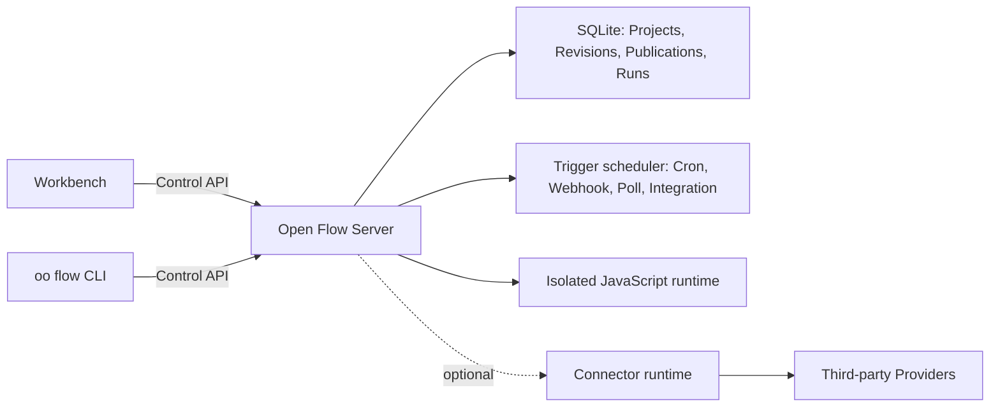

<div align="center">

# Open Flow

**Build workflows you can see, code, run, and own.**

[English](README.md) | [简体中文](README.zh-CN.md)

[](https://github.com/oomol-lab/open-flow/actions/workflows/ci.yaml)
[](https://www.npmjs.com/package/@oomol-lab/open-flow)
[](LICENSE)


</div>

Open Flow is an open-source workflow automation platform for building on a visual canvas without
giving up code. Connect typed steps, write JavaScript or TypeScript where it belongs, run flows
interactively, and publish them for continuous execution on a deployment you control.

<p align="center">
  <picture>
    <source media="(prefers-color-scheme: dark)" srcset="./docs/assets/dark.png">
    <source media="(prefers-color-scheme: light)" srcset="./docs/assets/light.png">
    
  </picture>
</p>

> [!IMPORTANT]
> Open Flow is in alpha. Its contracts are versioned, but the product has not reached its first
> stable release.

## Why Open Flow

- **Design visually, extend with code.** Compose typed nodes and Subflows on the canvas, then use
  Script and CodeModule nodes for logic that should stay explicit. The code remains code, with real
  TypeScript instead of expressions hidden in form fields.
- **Run and debug in one place.** Validate inputs and the Flow structure before execution, inspect
  node progress and outputs, and follow the complete event history of every Run.
- **Publish long-running automation.** Start Flows manually or from Cron schedules, Webhooks,
  polling sources, and Provider events.
- **Keep operational state together.** Projects, immutable Revisions, Publications, Live versions,
  Runs, and Trigger state belong to one selected deployment instead of being split across local
  files and hidden services.
- **Run untrusted code safely.** The Server executes every code Task in a fresh V8 isolate inside a
  long-lived Executor process, with only the Capabilities that Task declared.
- **Choose where it runs.** Use the included self-hosted Server, or connect the same Workbench and
  CLI to another implementation of the versioned Control API.

Open Flow is built for workflows that outgrow a no-code prototype but should not become an opaque
collection of scripts and infrastructure. The graph remains understandable, the code remains
code, and the deployment remains under your control.

## How It Works



The Workbench and CLI only talk to one selected deployment through the versioned Control API. The
deployment owns validation, execution, persistence, and Trigger admission. Provider credentials
never enter Open Flow: Connector-backed Actions, Provider Triggers, and proxies go through a
Connector runtime such as [OpenConnector](https://github.com/oomol-lab/open-connector), and Open Flow
only stores opaque Connection identities.

## Quick Start

You need [Docker](https://docs.docker.com/get-docker/) and OpenSSL. Clone the repository, create an
operator token, and start the self-hosted Server:

```bash
git clone https://github.com/oomol-lab/open-flow.git
cd open-flow

export OPEN_FLOW_TOKEN="$(openssl rand -hex 32)"
docker build --file apps/server/Dockerfile --tag open-flow-server:dev .
docker run --rm \
  --publish 3000:3000 \
  --env OPEN_FLOW_TOKEN="$OPEN_FLOW_TOKEN" \
  --volume open-flow-data:/data/open-flow \
  open-flow-server:dev
```

Open [http://127.0.0.1:3000](http://127.0.0.1:3000) and sign in with the value of
`OPEN_FLOW_TOKEN`. The same value works as a Bearer token for machine clients of the Control API.
Projects and Run history are persisted in the `open-flow-data` Docker volume.

The Server is useful without external services. Connector-backed Actions, Provider Triggers, and
LLM Tasks fail closed until the corresponding host capability is configured; nothing falls back to
an undisclosed service.

For production configuration, TLS, health checks, persistence, backup, and resource limits, see the
[Server deployment guide](docs/server/container-delivery.md) and the hardening checklist in
[SECURITY.md](SECURITY.md#hardening-your-deployment).

## Connect a Connector

To run Actions and Provider Triggers against services such as GitHub, Gmail, Slack, or Notion,
point the Server at a Connector runtime. Both a self-hosted
[OpenConnector](https://github.com/oomol-lab/open-connector) and the OOMOL-hosted Connector expose
the required runtime API.

```dotenv
OPEN_FLOW_CONNECTOR_ORIGIN=http://open-connector:3000
OPEN_FLOW_CONNECTOR_TOKEN=replace-with-a-scoped-runtime-token
OPEN_FLOW_CONNECTOR_CONSOLE_ORIGIN=https://connector.example.com
```

The runtime origin is where the Server reaches the Connector; the console origin is where users'
browsers open the Connector Console to authorize accounts. Provider Trigger definitions ship with
Open Flow and need no registration. See the
[configuration reference](docs/server/container-delivery.md#4-配置) for Integration callback
settings and the constraints on each origin.

## One Product, Portable Deployments

The Workbench and CLI speak a versioned Control API rather than depending on a particular database
or cloud runtime. A deployment owns execution and persistence; clients do not create a second local
project format or silently switch to another backend.

This repository contains:

- [`packages/open-flow`](packages/open-flow): the public `@oomol-lab/open-flow` npm package with
  authoring, execution, Trigger, Control API, conformance, and Workbench runtime entries;
- [`packages/command`](packages/command): the `oo flow` command runtime and the immutable Command
  Artifact consumed by the [oo CLI](https://github.com/oomol-lab/oo-cli);
- [`apps/server`](apps/server): the self-hosted Workbench, Control API, SQLite persistence, Trigger
  scheduler, and isolated JavaScript runtime.

Read the [product and architecture boundaries](docs/architecture.md) for the durable model, or the
[Control API reference](docs/control/contracts/control-api.md) for the HTTP contract.

## Develop From Source

Open Flow uses [Bun](https://bun.sh/) for the workspace and Node.js for the Server. Use the
versions pinned in `.bun-version` and `.node-version`.

```bash
bun install --frozen-lockfile
bun run dev
```

Open the development Workbench at
[http://127.0.0.1:5173](http://127.0.0.1:5173). Its API requests are proxied to the Server at
`http://127.0.0.1:3000`.

The first development run creates an operator token at
`apps/server/.open-flow-dev/operator-token`. Later runs reuse it, so restarting the development
server does not invalidate the current Workbench session. Set `OPEN_FLOW_TOKEN` to use an explicit
token instead.

Before submitting a change, run:

```bash
bun run check
bun run test
bun run build
```

Add `bun run test:package` when touching the published package or CLI, and `bun run test:docker`
when Docker is available to verify the release image, isolated runtime, Workbench, graceful
shutdown, and SQLite volume recovery. Do not run `bun test` at the repository root; it bypasses the
workspace test scripts. See [CONTRIBUTING.md](CONTRIBUTING.md) for the full development rules.

## Documentation

Start with the [documentation index](docs/README.md). The most useful references are:

- [Product and architecture boundaries](docs/architecture.md)
- [Control API](docs/control/contracts/control-api.md)
- [Command Artifact distribution](docs/distribution/command-artifact.md)
- [Workbench and Designer frontend notes](docs/authoring/frontend-ui.md)
- [Server deployment](docs/server/container-delivery.md)
- [Contributing](CONTRIBUTING.md)
- [Code of Conduct](CODE_OF_CONDUCT.md)
- [Security](SECURITY.md)

## Related Projects

- [OpenConnector](https://github.com/oomol-lab/open-connector): open-source connector gateway that
  provides the Provider catalog, credentials, and Action execution behind Connector-backed nodes.
- [oo CLI](https://github.com/oomol-lab/oo-cli): local agent toolkit that hosts the `oo flow`
  command built from this repository.

## Contributing

Issues and pull requests are welcome. Read [CONTRIBUTING.md](CONTRIBUTING.md) for the development
setup, repository rules, and checks to run before opening a pull request. Participation in this
project is governed by [CODE_OF_CONDUCT.md](CODE_OF_CONDUCT.md).

## Security

Please report vulnerabilities privately through
[GitHub private vulnerability reporting](https://github.com/oomol-lab/open-flow/security/advisories/new)
rather than public issues. [SECURITY.md](SECURITY.md) describes the supported versions, the
disclosure process, what is in scope, and how to harden a self-hosted deployment.

## License

[Apache-2.0](LICENSE). Third-party notices for bundled assets are listed in [NOTICE](NOTICE).
