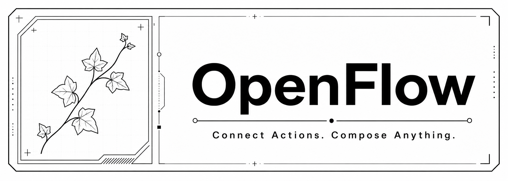
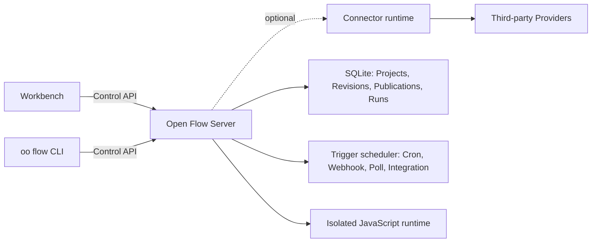

<div align="center">



[English](README.md) | [简体中文](docs/README.zh-CN.md) | [繁體中文](docs/README.zh-TW.md) | [日本語](docs/README.ja.md) | [한국어](docs/README.ko.md) | [Русский](docs/README.ru.md) | [Français](docs/README.fr.md)

[](https://github.com/oomol-lab/open-flow/actions/workflows/ci.yaml)
[](https://www.npmjs.com/package/@oomol-lab/open-flow)
[](LICENSE)


</div>

Open Flow is an open-source workflow automation platform where AI Agents and people build the same
Flow. Ask Codex, Claude Code, or another terminal Agent to create, check, run, and publish a typed
workflow through [`oo flow`](https://github.com/oomol-lab/oo-cli), then inspect and edit that exact
Flow visually in the Workbench.

Use typed nodes for structure, keep custom logic as JavaScript, and run the resulting automation on
OOMOL Hosted or infrastructure you control. The graph remains understandable, the code remains
code, and the deployment remains under your control.

<p align="center">
  <a href="https://www.youtube.com/watch?v=CIF5I11VpLM">
    
  </a>
</p>

<p align="center">
  <a href="https://www.youtube.com/watch?v=CIF5I11VpLM"><strong>▶ Watch the 1-minute Open Flow demo</strong></a>
</p>

> [!IMPORTANT]
> Open Flow is in alpha. Its contracts are versioned, but the product has not reached its first
> stable release.

## Build Workflows with an AI Agent

`oo flow` exposes the authoring lifecycle as versioned, machine-readable commands. An Agent that can
use a terminal can:

- discover exact Connector Actions and Provider Triggers;
- create and edit typed Nodes, Edges, Code Tasks, and Trigger bindings;
- check a Draft, run it, and inspect the result;
- publish it to Live or open the same Flow in the Workbench when you ask.

> **Example request:** “Build a workflow that reads unread Gmail messages, formats them, and sends
> them to Feishu.”

The Agent creates a real Draft in the selected Open Flow deployment, not a disposable local config.
The CLI and Workbench use the same Control API, so an AI-authored change appears in the same visual
graph and remains editable by both people and Agents.

<p align="center">
  
</p>

[Install the `oo` CLI](https://github.com/oomol-lab/oo-cli) to author Open Flow from Codex, Claude
Code, or another terminal Agent.

## Choose How to Run Open Flow

Use the same Open Flow product and Workbench through any supported path.

<table>
  <tr>
    <td width="33%" align="center"><strong>☁️ OOMOL Hosted</strong></td>
    <td width="33%" align="center"><strong>🐳 Docker Self-hosted</strong></td>
    <td width="33%" align="center"><strong>Fly.io Self-hosted</strong></td>
  </tr>
  <tr>
    <td width="33%" valign="top">Ready to use without provisioning, patching, or monitoring a server. OOMOL operates the deployment and provides managed OAuth apps for supported integrations, so you avoid fixed server costs and separate OAuth app setup.</td>
    <td width="33%" valign="top">Run on your own infrastructure with the included Docker image. You manage deployment, storage, backups, upgrades, networking, and any Connector or OAuth app setup.</td>
    <td width="33%" valign="top">Run the same Docker image on Fly.io without operating a server yourself. Fly builds the image, terminates TLS, and keeps SQLite on a persistent volume; you manage secrets, backups, upgrades, and any Connector or OAuth app setup.</td>
  </tr>
  <tr>
    <td width="33%" align="center">🚀 <a href="https://oomol.com"><strong>Use OOMOL Hosted</strong></a></td>
    <td width="33%" align="center"><a href="#quick-start"><strong>Self-host with Docker</strong></a></td>
    <td width="33%" align="center"><a href="docs/server/fly-io/README.md"><strong>Deploy to Fly.io</strong></a></td>
  </tr>
</table>

## Why Open Flow

- **Build with an AI Agent.** Use `oo flow` from Codex, Claude Code, or another terminal Agent to
  create, check, run, and publish the same Flow you see in the Workbench.
- **Make data dependencies explicit.** Every Task declares named, typed inputs and outputs. Each
  edge binds a specific output value to a specific input, so the graph is the data dependency model
  used by the runtime.
- **Design visually, add code when needed.** Compose typed nodes on the canvas, and use Code Tasks
  for custom JavaScript. Code stays visible instead of being hidden in form fields.
- **Run and debug in one place.** Validate inputs and the Flow structure before execution, inspect
  node progress and outputs, and follow the complete event history of every Run.
- **Publish long-running automation.** Start Flows manually or from Cron schedules, Webhooks,
  polling sources, and Provider events.
- **Keep operational state together.** Projects, immutable Revisions, Publications, Live versions,
  Runs, and Trigger state belong to one selected deployment instead of being split across local
  files and hidden services.
- **Run untrusted code safely.** The Server executes every code Task in a fresh V8 isolate inside a
  long-lived Executor process, with only the Capabilities that Task declared.
- **Choose where it runs.** Use OOMOL Hosted, or run the included Server with Docker on your own
  infrastructure.

Open Flow is built for workflows that outgrow a no-code prototype but should not become an opaque
collection of scripts and infrastructure.

## The Graph Is the Runtime Contract

Every Task declares named, typed inputs and outputs. An edge carries a value from a specific output
to a specific input, and the runtime starts a node when its inputs are ready.

The graph shows the data dependencies the runtime actually uses: ordinary Flow data cannot be
pulled from arbitrary nodes through a hidden runtime store. Independent branches can run
concurrently, and canvas position never changes execution behavior.

### Typed visual authoring

Detailed view keeps each input, output, type, nullable constraint, and connection explicit on the
canvas.

<p align="center">
  
</p>

### Code where it belongs

Code Tasks place custom JavaScript directly in the graph, with typed inputs and outputs.

<p align="center">
  
</p>

## How It Works



The Workbench and CLI only talk to one selected deployment through the versioned Control API. The
deployment owns validation, execution, persistence, and Trigger admission. Provider credentials
never enter Open Flow: Connector-backed Actions, Provider Triggers, and proxies go through a
Connector runtime such as [OpenConnector](https://github.com/oomol-lab/open-connector), and Open Flow
only stores opaque Connection identities.

## Quick Start

You need [Docker](https://docs.docker.com/get-docker/) and OpenSSL. Clone the repository, create an
operator token, and start the self-hosted Server:

```bash
git clone https://github.com/oomol-lab/open-flow.git
cd open-flow

export OPEN_FLOW_TOKEN="$(openssl rand -hex 32)"
docker build --file apps/server/Dockerfile --tag open-flow-server:dev .
docker run --rm \
  --publish 3000:3000 \
  --env OPEN_FLOW_TOKEN="$OPEN_FLOW_TOKEN" \
  --volume open-flow-data:/data/open-flow \
  open-flow-server:dev
```

Open [http://127.0.0.1:3000](http://127.0.0.1:3000) and sign in with the value of
`OPEN_FLOW_TOKEN`. The same value works as a Bearer token for machine clients of the Control API.
Projects and Run history are persisted in the `open-flow-data` Docker volume.

The Server is useful without external services. Connector-backed Actions, Provider Triggers, and
LLM Tasks fail closed until the corresponding host capability is configured; nothing falls back to
an undisclosed service.

For production configuration, TLS, health checks, persistence, backup, and resource limits, see the
[Server deployment guide](docs/server/container-delivery.md) and the hardening checklist in
[SECURITY.md](SECURITY.md#hardening-your-deployment).

## Deploy to Fly.io

The same image runs on Fly.io. The repository ships a `fly.toml` that builds
`apps/server/Dockerfile`, keeps one machine running for Cron and Poll Triggers, and persists SQLite
on a Fly volume. See [docs/server/fly-io/README.md](docs/server/fly-io/README.md) for app creation, volumes,
secrets, deployment, custom domains, and scaling limits.

## Connect a Connector

To run Actions and Provider Triggers against services such as GitHub, Gmail, Slack, or Notion,
point the Server at a Connector runtime. Both a self-hosted
[OpenConnector](https://github.com/oomol-lab/open-connector) and the OOMOL-hosted Connector expose
the required runtime API.

<p align="center">
  
</p>

```dotenv
OPEN_FLOW_CONNECTOR_ORIGIN=http://open-connector:3000
# Optional when the local Connector has runtime authentication disabled.
OPEN_FLOW_CONNECTOR_TOKEN=replace-with-a-scoped-runtime-token
OPEN_FLOW_CONNECTOR_CONSOLE_ORIGIN=https://connector.example.com
```

The runtime origin is where the Server reaches the Connector; the console origin is where users'
browsers open the Connector Console to authorize accounts. Provider Trigger definitions ship with
Open Flow and need no registration. See the
[configuration reference](docs/server/container-delivery.md#4-配置) for Integration callback
settings and the constraints on each origin.

## One Product, Portable Deployments

The Workbench and CLI speak a versioned Control API rather than depending on a particular database
or cloud runtime. A deployment owns execution and persistence; clients do not create a second local
project format or silently switch to another backend.

This repository contains:

- [`packages/open-flow`](packages/open-flow): the public `@oomol-lab/open-flow` npm package with
  authoring, execution, Trigger, Control API, conformance, and Workbench runtime entries;
- [`packages/command`](packages/command): the `oo flow` command runtime and the immutable Command
  Artifact consumed by the [oo CLI](https://github.com/oomol-lab/oo-cli);
- [`apps/server`](apps/server): the self-hosted Workbench, Control API, SQLite persistence, Trigger
  scheduler, and isolated JavaScript runtime.

Read the [product and architecture boundaries](docs/architecture.md) for the durable model, or the
[Control API reference](docs/control/contracts/control-api.md) for the HTTP contract.

## Develop From Source

Open Flow uses [Bun](https://bun.sh/) for the workspace and Node.js for the Server. Use the
versions pinned in `.bun-version` and `.node-version`.

```bash
bun install --frozen-lockfile
bun run dev
```

Open the development Workbench at
[http://localhost:5174](http://localhost:5174). Its API requests are proxied to the Server at
`http://127.0.0.1:3001`. Development uses `http://localhost:3000` as the Connector origin by default;
set `OPEN_FLOW_CONNECTOR_ORIGIN` to override it. The Connector token remains optional.

The first development run creates an operator token at
`apps/server/.open-flow-dev/operator-token`. Later runs reuse it, so restarting the development
server does not invalidate the current Workbench session. Set `OPEN_FLOW_TOKEN` to use an explicit
token instead.

Before submitting a change, run:

```bash
bun run check
bun run test
bun run build
```

Add `bun run test:package` when touching the published package or CLI, and `bun run test:docker`
when Docker is available to verify the release image, isolated runtime, Workbench, graceful
shutdown, and SQLite volume recovery. Do not run `bun test` at the repository root; it bypasses the
workspace test scripts. See [CONTRIBUTING.md](CONTRIBUTING.md) for the full development rules.

## Documentation

Start with the [documentation index](docs/README.md). The most useful references are:

- [Product and architecture boundaries](docs/architecture.md)
- [Control API](docs/control/contracts/control-api.md)
- [Command Artifact distribution](docs/distribution/command-artifact.md)
- [Workbench and Designer frontend notes](docs/authoring/frontend-ui.md)
- [Server deployment](docs/server/container-delivery.md)
- [Fly.io deployment](docs/server/fly-io/README.md)
- [Contributing](CONTRIBUTING.md)
- [Code of Conduct](CODE_OF_CONDUCT.md)
- [Security](SECURITY.md)

## Related Projects

- [OpenConnector](https://github.com/oomol-lab/open-connector): open-source connector gateway that
  provides the Provider catalog, credentials, and Action execution behind Connector-backed nodes.
- [oo CLI](https://github.com/oomol-lab/oo-cli): local agent toolkit that hosts the `oo flow`
  command built from this repository.

## Contributing

Issues and pull requests are welcome. Read [CONTRIBUTING.md](CONTRIBUTING.md) for the development
setup, repository rules, and checks to run before opening a pull request. Participation in this
project is governed by [CODE_OF_CONDUCT.md](CODE_OF_CONDUCT.md).

## Security

Please report vulnerabilities privately through
[GitHub private vulnerability reporting](https://github.com/oomol-lab/open-flow/security/advisories/new)
rather than public issues. [SECURITY.md](SECURITY.md) describes the supported versions, the
disclosure process, what is in scope, and how to harden a self-hosted deployment.

## License

[Apache-2.0](LICENSE). Third-party notices for bundled assets are listed in [NOTICE](NOTICE).

## Contributors

Thanks to everyone who has helped build Open Flow. Want to join them? See
[CONTRIBUTING.md](CONTRIBUTING.md).

[](https://github.com/oomol-lab/open-flow/graphs/contributors)

## Star History

<!-- star-history:start -->
<picture>
  <source media="(prefers-color-scheme: dark)" srcset="assets/star-history/star-history-dark.svg">
  
</picture>
<!-- star-history:end -->
