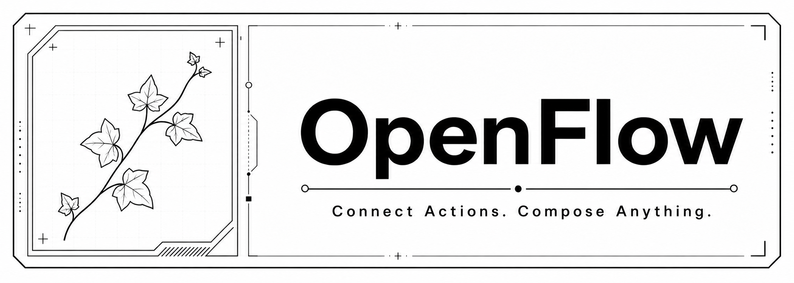
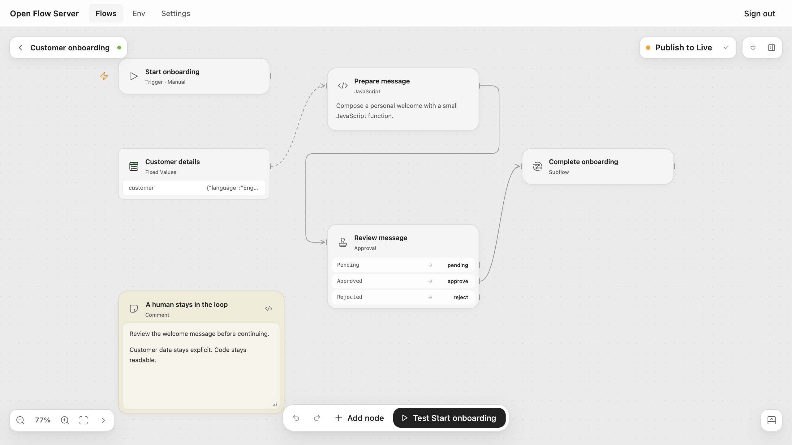
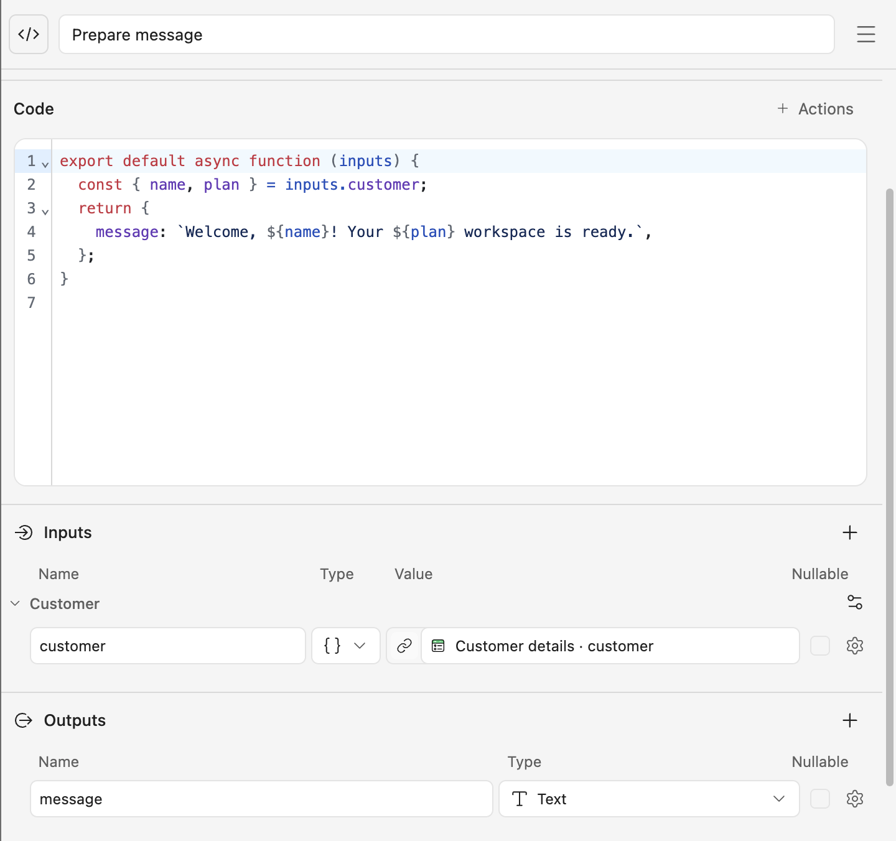
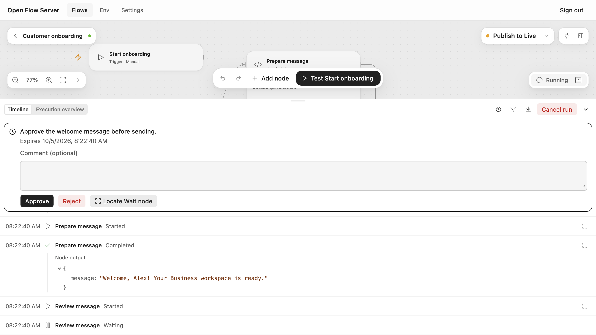
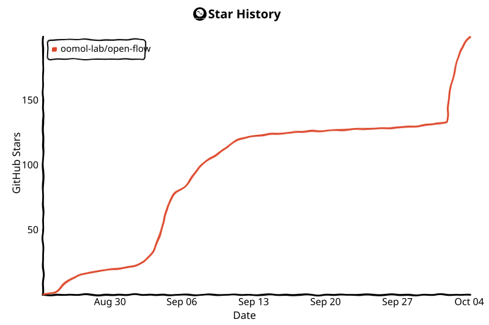

<div align="center">



[English](README.md) | [简体中文](docs/README.zh-CN.md) | [繁體中文](docs/README.zh-TW.md) | [日本語](docs/README.ja.md) | [한국어](docs/README.ko.md) | [Русский](docs/README.ru.md) | [Français](docs/README.fr.md)

[](https://github.com/oomol-lab/open-flow/actions/workflows/ci.yaml)
[](https://www.npmjs.com/package/@oomol-lab/open-flow)
[](LICENSE)


</div>

**Build automation with your AI agent. See exactly what will run.**

Open Flow is an open-source workflow platform for people who want the speed of AI-assisted building
and the clarity of a visual workflow. Ask Codex, Claude Code, or another agent to build a Flow, open
it in the Workbench, and keep refining the same workflow together.

Combine JavaScript, connected apps, AI, branching, and human approval in one canvas. Inspect the
inputs, follow the execution, and decide which version goes live. Run on OOMOL Hosted or on your
own infrastructure.

[Explore the interactive demo](https://openflow.run) · [Use OOMOL Hosted](https://oomol.com) ·
[Self-host with Docker](#run-it-your-way)



> [!IMPORTANT]
> Open Flow is in beta. The product and its versioned contracts are still evolving.

## Your agent builds. You stay in control.

Describe the work you need done:

> “Read new support emails, classify each request, draft a reply, and ask me to approve it before
> sending.”

Through [`oo flow`](https://github.com/oomol-lab/oo-cli), a terminal agent can discover integrations,
create and edit nodes, check a draft, run it, inspect results, and publish when you ask. Its changes
appear in the same Workbench you use to review the graph and edit the code. There is no separate
AI-generated project to translate or keep in sync.

The Server also exposes [MCP authoring and run tools](docs/server/mcp.md) for compatible clients.
Both interfaces work against the selected deployment's saved Flows, revisions, and runs.

Use an agent for the repetitive wiring. Keep the decisions that matter visible.

## Put every step where you can inspect it

A workflow should still make sense after the conversation that created it is gone.

- **JavaScript for precise work.** Transform data, format messages, or write custom logic in Code
  Tasks with named, typed inputs and outputs.
- **Explicit input sources.** See where a value comes from in the property panel. Control
  connections determine what executes next; input mappings determine what data a step receives.
- **Branches and reusable subflows.** Route work with conditions and give repeated logic a clear
  interface of its own.
- **Notes alongside the work.** Explain a decision directly on the canvas so the next person can
  understand the intent.



## Give AI a job with boundaries

Use LLM Tasks to classify, extract, or summarize. Use Agent Tasks when a job needs several tool
calls. Surround them with ordinary code, conditions, and approvals where you need predictable
behavior.

An Agent Task has a configured model, declared tools, and execution limits. Its tool configuration
specifies the actions, accounts, and approval policy available to the model. You can require human
approval for a tool call, or place an Approval node in the workflow before the next step proceeds.

Approval and Wait nodes persist their waiting state. Work can resume after a decision without
replaying the steps already completed in that run.

## See what happened. Choose what goes live.

Test a draft from a chosen trigger and follow its execution in the Workbench. Inspect node results,
logs, errors, and pending approvals instead of reconstructing a run from the final message alone.
Run history keeps the execution tied to the revision that produced it.



Publishing creates a versioned snapshot for Live automation. Continue editing the draft while the
published version runs, inspect earlier Publications, and roll back when needed.

Start work manually, on a schedule, through a webhook, or from supported provider events and
polling sources. The same deployment owns the workflow, its Live version, and its execution state.

## Connect apps without putting credentials in the graph

Open Flow uses a Connector runtime such as
[OpenConnector](https://github.com/oomol-lab/open-connector) to discover and execute actions for
services including Gmail, Slack, GitHub, and Notion. Account credentials stay with the Connector;
workflows refer to Connection identities.

OOMOL Hosted provides managed OAuth apps for supported integrations. With a self-hosted stack,
you choose the Connector deployment and manage the required provider configuration and account
authorizations. Workflow logic and account access remain separate concerns.

See [Open Flow with OpenConnector and the oo CLI](docs/server/self-hosted-stack/README.md) for a
complete setup, including authorizing an account and building a first Flow.

## Run it your way

| Option           | What you manage                                                                      | Get started                                      |
| ---------------- | ------------------------------------------------------------------------------------ | ------------------------------------------------ |
| **OOMOL Hosted** | Your workflows and connected accounts; OOMOL operates the deployment.                | [Open OOMOL](https://oomol.com)                  |
| **Docker**       | Your deployment, storage, backups, upgrades, and integrations.                       | Commands below                                   |
| **Fly.io**       | Your app, persistent volume, secrets, backups, and upgrades on Fly's infrastructure. | [Deployment guide](docs/server/fly-io/README.md) |

For a local self-hosted instance, install Docker and OpenSSL, then run:

```bash
git clone https://github.com/oomol-lab/open-flow.git
cd open-flow

export OPEN_FLOW_TOKEN="$(openssl rand -hex 32)"
docker build --file apps/server/Dockerfile --tag open-flow-server:dev .
docker run --rm \
  --publish 3000:3000 \
  --env OPEN_FLOW_TOKEN="$OPEN_FLOW_TOKEN" \
  --volume open-flow-data:/data/open-flow \
  open-flow-server:dev
```

Open [http://127.0.0.1:3000](http://127.0.0.1:3000) and sign in with `OPEN_FLOW_TOKEN`. Flows and run
history are stored in the Docker volume. The operator token also authenticates CLI and API access.

Prefer a prebuilt image? Follow the [GHCR image guide](docs/server/docker-ghcr/README.md) and select
an explicit release tag during beta. The `latest` tag is reserved for stable releases.

Connector actions and LLM Tasks need their corresponding services configured. The Server does not
silently fall back to another provider. Before exposing a deployment publicly, follow the
[deployment guide](docs/server/container-delivery.md) and
[hardening checklist](SECURITY.md#hardening-your-deployment).

## Build on Open Flow

Open Flow is Apache-2.0 licensed. The repository includes the workflow contracts and runtime,
Workbench, CLI command package, and self-hosted Server. The versioned Control API keeps clients
independent of the deployment's storage and execution implementation.

Use the versions of Bun and Node.js pinned in `.bun-version` and `.node-version`:

```bash
bun install --frozen-lockfile
bun run dev
```

The development Workbench opens at [http://localhost:5174](http://localhost:5174). The first run
creates an operator token in `apps/server/.open-flow-dev/operator-token`. See
[CONTRIBUTING.md](CONTRIBUTING.md) for configuration, checks, and the component Lab.

| Learn more                           | Reference                                                                                                                          |
| ------------------------------------ | ---------------------------------------------------------------------------------------------------------------------------------- |
| Product model and runtime boundaries | [Architecture](docs/architecture.md)                                                                                               |
| Integrate your own clients           | [Control API](docs/control/contracts/control-api.md) · [MCP](docs/server/mcp.md)                                                   |
| Run and operate a deployment         | [Server](docs/server/container-delivery.md) · [Docker](docs/server/docker-ghcr/README.md) · [Fly.io](docs/server/fly-io/README.md) |
| Connect apps and an AI coding agent  | [OpenConnector + oo CLI](docs/server/self-hosted-stack/README.md)                                                                  |
| Browse all documentation             | [Documentation index](docs/README.md)                                                                                              |

## Related Projects

- [OpenConnector](https://github.com/oomol-lab/open-connector): open-source connector gateway that
  provides the Provider catalog, credentials, and Action execution behind Connector-backed nodes.
- [oo CLI](https://github.com/oomol-lab/oo-cli): local agent toolkit that hosts the `oo flow`
  command built from this repository.

## Contributing

Issues and pull requests are welcome. Read [CONTRIBUTING.md](CONTRIBUTING.md) for the development
setup, repository rules, and checks to run before opening a pull request. Participation in this
project is governed by [CODE_OF_CONDUCT.md](CODE_OF_CONDUCT.md).

## Security

Please report vulnerabilities privately through
[GitHub private vulnerability reporting](https://github.com/oomol-lab/open-flow/security/advisories/new)
rather than public issues. [SECURITY.md](SECURITY.md) describes the supported versions, the
disclosure process, what is in scope, and how to harden a self-hosted deployment.

## License

[Apache-2.0](LICENSE). Third-party notices for bundled assets are listed in [NOTICE](NOTICE).

## Contributors

Thanks to everyone who has helped build Open Flow. Want to join them? See
[CONTRIBUTING.md](CONTRIBUTING.md).

[](https://github.com/oomol-lab/open-flow/graphs/contributors)

## Star History

<!-- star-history:start -->
<picture>
  <source media="(prefers-color-scheme: dark)" srcset="assets/star-history/star-history-dark.svg">
  
</picture>
<!-- star-history:end -->
