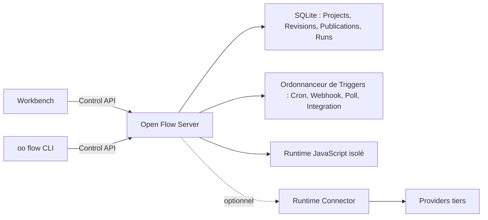

<div align="center">

# Open Flow

**Construisez des workflows que vous pouvez voir, coder, exécuter et posséder.**

[English](../README.md) | [简体中文](README.zh-CN.md) | [繁體中文](README.zh-TW.md) | [日本語](README.ja.md) | [한국어](README.ko.md) | [Русский](README.ru.md) | [Français](README.fr.md)

[](https://github.com/oomol-lab/open-flow/actions/workflows/ci.yaml)
[](https://www.npmjs.com/package/@oomol-lab/open-flow)
[](../LICENSE)


</div>

Open Flow est une plateforme open source d'automatisation de workflows qui permet de construire sur un
canevas visuel sans renoncer au code. Connectez des étapes typées, écrivez du JavaScript ou du
TypeScript là où c'est pertinent, exécutez vos Flows de manière interactive et publiez-les pour une
exécution continue sur un déploiement que vous contrôlez.

<p align="center">
  <picture>
    <source media="(prefers-color-scheme: dark)" srcset="assets/dark.png">
    <source media="(prefers-color-scheme: light)" srcset="assets/light.png">
    
  </picture>
</p>

> [!IMPORTANT]
> Open Flow est en phase alpha. Ses contrats sont versionnés, mais le produit n'a pas encore atteint
> sa première version stable.

## Pourquoi Open Flow

- **Concevez visuellement, étendez avec du code.** Composez des nœuds typés et des Subflows sur le
  canevas, puis utilisez des nœuds Script et CodeModule pour la logique qui doit rester explicite. Le
  code reste du code, avec du vrai TypeScript plutôt que des expressions cachées dans des champs de
  formulaire.
- **Exécutez et déboguez au même endroit.** Validez les entrées et la structure du Flow avant
  l'exécution, inspectez la progression et les sorties de chaque nœud, et suivez l'historique complet
  des événements de chaque Run.
- **Publiez des automatisations de longue durée.** Démarrez les Flows manuellement ou à partir de
  planifications Cron, de Webhooks, de sources de polling et d'événements de Provider.
- **Gardez l'état opérationnel au même endroit.** Les Projects, les Revisions immuables, les
  Publications, les versions Live, les Runs et l'état des Triggers appartiennent à un seul déploiement
  sélectionné, au lieu d'être répartis entre des fichiers locaux et des services cachés.
- **Exécutez du code non fiable en toute sécurité.** Le Server exécute chaque Task de code dans un
  isolate V8 neuf, au sein d'un processus Executor de longue durée, avec uniquement les Capabilities
  déclarées par cette Task.
- **Choisissez où cela s'exécute.** Utilisez le Server auto-hébergé inclus, ou connectez le même
  Workbench et la même CLI à une autre implémentation de la Control API versionnée.

Open Flow est conçu pour les workflows qui dépassent le stade du prototype no-code mais ne doivent
pas devenir un ensemble opaque de scripts et d'infrastructure. Le graphe reste compréhensible, le
code reste du code, et le déploiement reste sous votre contrôle.

## Fonctionnement



Le Workbench et la CLI ne communiquent qu'avec un seul déploiement sélectionné, via la Control API
versionnée. Le déploiement est responsable de la validation, de l'exécution, de la persistance et de
l'admission des Triggers. Les identifiants des Providers n'entrent jamais dans Open Flow : les Actions
adossées à un Connector, les Triggers de Provider et les proxys passent par un runtime Connector tel
que [OpenConnector](https://github.com/oomol-lab/open-connector), et Open Flow ne conserve que des
identités de Connection opaques.

## Démarrage rapide

Vous avez besoin de [Docker](https://docs.docker.com/get-docker/) et d'OpenSSL. Clonez le dépôt, créez
un token opérateur et démarrez le Server auto-hébergé :

```bash
git clone https://github.com/oomol-lab/open-flow.git
cd open-flow

export OPEN_FLOW_TOKEN="$(openssl rand -hex 32)"
docker build --file apps/server/Dockerfile --tag open-flow-server:dev .
docker run --rm \
  --publish 3000:3000 \
  --env OPEN_FLOW_TOKEN="$OPEN_FLOW_TOKEN" \
  --volume open-flow-data:/data/open-flow \
  open-flow-server:dev
```

Ouvrez [http://127.0.0.1:3000](http://127.0.0.1:3000) et connectez-vous avec la valeur de
`OPEN_FLOW_TOKEN`. La même valeur sert de Bearer token pour les clients machine de la Control API.
Les Projects et l'historique des Runs sont persistés dans le volume Docker `open-flow-data`.

Le Server est utile sans services externes. Les Actions adossées à un Connector, les Triggers de
Provider et les Tasks LLM échouent de manière sûre (fail closed) tant que la capacité hôte
correspondante n'est pas configurée ; rien ne bascule vers un service non déclaré.

Pour la configuration de production, TLS, les health checks, la persistance, les sauvegardes et les
limites de ressources, consultez le [guide de déploiement du Server](server/container-delivery.md) et
la liste de durcissement dans [SECURITY.md](../SECURITY.md#hardening-your-deployment).

## Connecter un Connector

Pour exécuter des Actions et des Triggers de Provider auprès de services tels que GitHub, Gmail, Slack
ou Notion, pointez le Server vers un runtime Connector. Un
[OpenConnector](https://github.com/oomol-lab/open-connector) auto-hébergé comme le Connector hébergé
par OOMOL exposent tous deux l'API runtime requise.

```dotenv
OPEN_FLOW_CONNECTOR_ORIGIN=http://open-connector:3000
OPEN_FLOW_CONNECTOR_TOKEN=replace-with-a-scoped-runtime-token
OPEN_FLOW_CONNECTOR_CONSOLE_ORIGIN=https://connector.example.com
```

L'origine runtime est l'adresse à laquelle le Server joint le Connector ; l'origine console est celle
que les navigateurs des utilisateurs ouvrent pour autoriser des comptes dans la Connector Console. Les
définitions de Triggers de Provider sont livrées avec Open Flow et ne nécessitent aucun
enregistrement. Consultez la [référence de configuration](server/container-delivery.md#4-配置) pour
les paramètres de callback d'Integration et les contraintes applicables à chaque origine.

## Un seul produit, des déploiements portables

Le Workbench et la CLI parlent une Control API versionnée plutôt que de dépendre d'une base de données
ou d'un runtime cloud particulier. Un déploiement est responsable de l'exécution et de la
persistance ; les clients ne créent pas de second format de projet local et ne basculent pas
silencieusement vers un autre backend.

Ce dépôt contient :

- [`packages/open-flow`](../packages/open-flow) : le paquet npm public `@oomol-lab/open-flow`, avec
  les points d'entrée d'authoring, d'exécution, de Trigger, de Control API, de conformité et de
  runtime Workbench ;
- [`packages/command`](../packages/command) : le runtime de la commande `oo flow` et le Command
  Artifact immuable consommé par la [oo CLI](https://github.com/oomol-lab/oo-cli) ;
- [`apps/server`](../apps/server) : le Workbench auto-hébergé, la Control API, la persistance SQLite,
  l'ordonnanceur de Triggers et le runtime JavaScript isolé.

Lisez les [limites du produit et de l'architecture](architecture.md) pour le modèle durable, ou la
[référence de la Control API](control/contracts/control-api.md) pour le contrat HTTP.

## Développer à partir des sources

Open Flow utilise [Bun](https://bun.sh/) pour l'espace de travail et Node.js pour le Server. Utilisez
les versions épinglées dans `.bun-version` et `.node-version`.

```bash
bun install --frozen-lockfile
bun run dev
```

Ouvrez le Workbench de développement à l'adresse
[http://127.0.0.1:5173](http://127.0.0.1:5173). Ses requêtes API sont relayées vers le Server sur
`http://127.0.0.1:3000`.

Le premier lancement en développement crée un token opérateur dans
`apps/server/.open-flow-dev/operator-token`. Les lancements suivants le réutilisent, de sorte que
redémarrer le serveur de développement n'invalide pas la session Workbench en cours. Définissez
`OPEN_FLOW_TOKEN` pour utiliser un token explicite à la place.

Avant de soumettre une modification, exécutez :

```bash
bun run check
bun run test
bun run build
```

Ajoutez `bun run test:package` lorsque vous touchez au paquet publié ou à la CLI, et
`bun run test:docker` lorsque Docker est disponible, afin de vérifier l'image de release, le runtime
isolé, le Workbench, l'arrêt propre et la récupération du volume SQLite. N'exécutez pas `bun test` à
la racine du dépôt : cela contourne les scripts de test de l'espace de travail. Consultez
[CONTRIBUTING.md](../CONTRIBUTING.md) pour l'ensemble des règles de développement.

## Documentation

Commencez par l'[index de la documentation](README.md). Les références les plus utiles sont :

- [Limites du produit et de l'architecture](architecture.md)
- [Control API](control/contracts/control-api.md)
- [Distribution du Command Artifact](distribution/command-artifact.md)
- [Notes sur le frontend du Workbench et du Designer](authoring/frontend-ui.md)
- [Déploiement du Server](server/container-delivery.md)
- [Contribuer](../CONTRIBUTING.md)
- [Code de conduite](../CODE_OF_CONDUCT.md)
- [Sécurité](../SECURITY.md)

## Projets liés

- [OpenConnector](https://github.com/oomol-lab/open-connector) : passerelle de connecteurs open source
  qui fournit le catalogue de Providers, les identifiants et l'exécution des Actions derrière les nœuds
  adossés à un Connector.
- [oo CLI](https://github.com/oomol-lab/oo-cli) : boîte à outils d'agent local qui héberge la commande
  `oo flow` construite à partir de ce dépôt.

## Contribuer

Les issues et les pull requests sont les bienvenues. Lisez [CONTRIBUTING.md](../CONTRIBUTING.md) pour
la configuration de développement, les règles du dépôt et les vérifications à exécuter avant d'ouvrir
une pull request. La participation à ce projet est régie par
[CODE_OF_CONDUCT.md](../CODE_OF_CONDUCT.md).

## Sécurité

Veuillez signaler les vulnérabilités de manière privée via le
[signalement privé de vulnérabilités GitHub](https://github.com/oomol-lab/open-flow/security/advisories/new)
plutôt que par des issues publiques. [SECURITY.md](../SECURITY.md) décrit les versions prises en
charge, le processus de divulgation, le périmètre couvert et la manière de durcir un déploiement
auto-hébergé.

## Licence

[Apache-2.0](../LICENSE). Les mentions relatives aux ressources tierces embarquées figurent dans
[NOTICE](../NOTICE).

## Contributeurs

Merci à toutes les personnes qui ont contribué à Open Flow. Vous souhaitez les rejoindre ?
Consultez le [guide de contribution](../CONTRIBUTING.md).

[](https://github.com/oomol-lab/open-flow/graphs/contributors)

## Historique des Stars

<picture>
  <source media="(prefers-color-scheme: dark)" srcset="../assets/star-history/star-history-dark.svg">
  
</picture>
