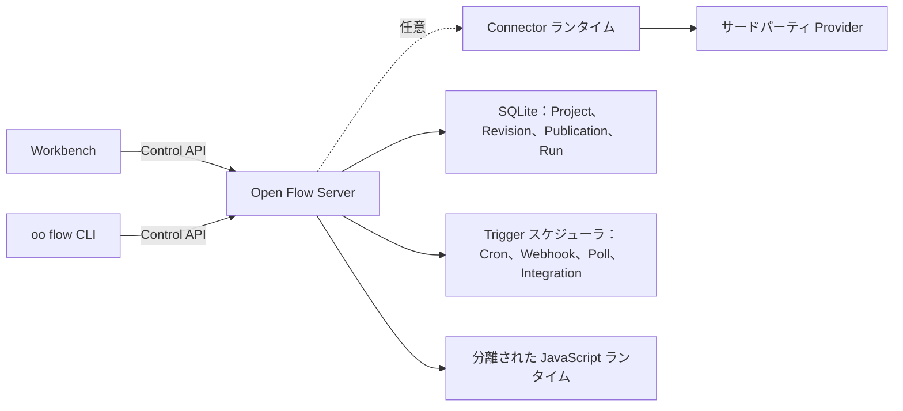

<div align="center">

# Open Flow

**見える、書ける、動かせる、そして自分のものにできるワークフローを構築する。**

[English](../README.md) | [简体中文](README.zh-CN.md) | [繁體中文](README.zh-TW.md) | [日本語](README.ja.md) | [한국어](README.ko.md) | [Русский](README.ru.md) | [Français](README.fr.md)

[](https://github.com/oomol-lab/open-flow/actions/workflows/ci.yaml)
[](https://www.npmjs.com/package/@oomol-lab/open-flow)
[](../LICENSE)


</div>

Open Flow は、コードを手放すことなくビジュアルキャンバス上で構築できるオープンソースのワークフロー自動化プラットフォームです。
型付けされたステップを接続し、必要な場所で JavaScript または TypeScript を記述し、Flow を対話的に実行し、自分で管理するデプロイメント上で
継続的に実行されるように公開できます。

<p align="center">
  <picture>
    <source media="(prefers-color-scheme: dark)" srcset="assets/dark.png">
    <source media="(prefers-color-scheme: light)" srcset="assets/light.png">
    
  </picture>
</p>

> [!IMPORTANT]
> Open Flow は現在 Alpha 段階です。公開されている契約（contract）はバージョン管理されていますが、プロダクトとしての最初の安定版はまだリリースされていません。

## Open Flow を選ぶ理由

- **ビジュアルで設計し、コードで拡張する。** キャンバス上で型付けされたノードと Subflow を組み合わせ、明示的に残すべきロジックには Script ノードや
  CodeModule ノードを使います。コードはあくまでコードのままで、フォーム項目に隠された式ではなく、本物の TypeScript を書けます。
- **実行とデバッグを一か所で。** 実行前に入力と Flow の構造を検証し、各ノードの進行状況と出力を確認し、すべての Run の完全なイベント履歴を追跡できます。
- **長時間動作する自動化を公開する。** Flow は手動で開始できるほか、Cron スケジュール、Webhook、ポーリングソース、Provider のイベントから起動できます。
- **運用状態をまとめて管理する。** Project、不変の Revision、Publication、Live バージョン、Run、Trigger の状態は、ローカルファイルと隠れたサービスに
  分散することなく、選択された一つのデプロイメントに属します。
- **信頼できないコードを安全に実行する。** Server は、長時間稼働する Executor プロセス内で、コードの Task ごとに新しい V8 isolate を作成し、
  その Task が宣言した Capability だけを公開します。
- **実行場所を選べる。** 同梱のセルフホスト Server を使うことも、同じ Workbench と CLI をバージョン管理された Control API の別の実装に接続することもできます。

Open Flow は、ノーコードのプロトタイプでは収まらなくなったものの、不透明なスクリプトとインフラの寄せ集めにはしたくないワークフローのために作られています。
グラフは理解しやすいまま、コードはコードのまま、そしてデプロイメントは自分の管理下に残ります。

## 仕組み



Workbench と CLI は、バージョン管理された Control API を通じて、選択された一つのデプロイメントとだけ通信します。デプロイメント側が検証、実行、永続化、
Trigger の受け入れを担当します。Provider の認証情報が Open Flow に入ることはありません。Connector を利用する Action、Provider Trigger、proxy は
[OpenConnector](https://github.com/oomol-lab/open-connector) のような Connector ランタイムを経由し、Open Flow は不透明な Connection の識別子だけを保存します。

## クイックスタート

[Docker](https://docs.docker.com/get-docker/) と OpenSSL が必要です。リポジトリをクローンし、オペレーター Token を作成して、セルフホストの Server を起動します。

```bash
git clone https://github.com/oomol-lab/open-flow.git
cd open-flow

export OPEN_FLOW_TOKEN="$(openssl rand -hex 32)"
docker build --file apps/server/Dockerfile --tag open-flow-server:dev .
docker run --rm \
  --publish 3000:3000 \
  --env OPEN_FLOW_TOKEN="$OPEN_FLOW_TOKEN" \
  --volume open-flow-data:/data/open-flow \
  open-flow-server:dev
```

[http://127.0.0.1:3000](http://127.0.0.1:3000) を開き、`OPEN_FLOW_TOKEN` の値でサインインします。同じ値は、Control API を利用するマシンクライアントの
Bearer Token としても使えます。Project と Run の履歴は `open-flow-data` Docker volume に永続化されます。

Server は外部サービスなしでも利用できます。Connector を利用する Action、Provider Trigger、LLM Task は、対応するホストの Capability が設定されるまで
フェイルクローズで動作し、非公開のサービスにフォールバックすることはありません。

本番環境の設定、TLS、ヘルスチェック、永続化、バックアップ、リソース制限については、[Server デプロイガイド](server/container-delivery.md) と
[SECURITY.md](../SECURITY.md#hardening-your-deployment) の強化チェックリストを参照してください。

## Connector を接続する

GitHub、Gmail、Slack、Notion などのサービスに対して Action や Provider Trigger を実行するには、Server を Connector ランタイムに向けます。
セルフホストの [OpenConnector](https://github.com/oomol-lab/open-connector) と OOMOL がホストする Connector のどちらも、必要なランタイム API を提供しています。

```dotenv
OPEN_FLOW_CONNECTOR_ORIGIN=http://open-connector:3000
OPEN_FLOW_CONNECTOR_TOKEN=replace-with-a-scoped-runtime-token
OPEN_FLOW_CONNECTOR_CONSOLE_ORIGIN=https://connector.example.com
```

runtime origin は Server が Connector に到達するためのアドレスで、console origin はユーザーのブラウザがアカウント認可のために Connector Console を開く
アドレスです。Provider Trigger の定義は Open Flow に同梱されており、登録は不要です。Integration callback の設定と各 origin の制約については
[設定リファレンス](server/container-delivery.md#4-配置) を参照してください。

## 一つのプロダクト、ポータブルなデプロイメント

Workbench と CLI は、特定のデータベースやクラウドランタイムに依存するのではなく、バージョン管理された Control API で通信します。デプロイメントが実行と
永続化を所有し、クライアントは第二のローカル Project 形式を作ったり、暗黙のうちに別のバックエンドへ切り替えたりしません。

このリポジトリには次が含まれます。

- [`packages/open-flow`](../packages/open-flow)：公開 npm パッケージ `@oomol-lab/open-flow`。Authoring、Execution、Trigger、Control API、Conformance、
  Workbench Runtime の各エントリを提供します。
- [`packages/command`](../packages/command)：`oo flow` コマンドのランタイムと、[oo CLI](https://github.com/oomol-lab/oo-cli) が利用する不変の
  Command Artifact。
- [`apps/server`](../apps/server)：セルフホスト可能な Workbench、Control API、SQLite 永続化、Trigger スケジューラ、分離された JavaScript ランタイム。

永続的なモデルについては[プロダクトとアーキテクチャの境界](architecture.md)を、HTTP の契約については
[Control API リファレンス](control/contracts/control-api.md)を参照してください。

## ソースから開発する

Open Flow はワークスペースに [Bun](https://bun.sh/) を、Server に Node.js を使用します。`.bun-version` と `.node-version` で固定されたバージョンを使ってください。

```bash
bun install --frozen-lockfile
bun run dev
```

開発用の Workbench は [http://127.0.0.1:5173](http://127.0.0.1:5173) で開きます。その API リクエストは `http://127.0.0.1:3000` の Server にプロキシされます。

初回の開発実行時に、オペレーター Token が `apps/server/.open-flow-dev/operator-token` に作成されます。以降の実行ではこの Token が再利用されるため、
開発サーバーを再起動しても現在の Workbench セッションは無効になりません。明示的な Token を使いたい場合は `OPEN_FLOW_TOKEN` を設定してください。

変更を提出する前に、次を実行してください。

```bash
bun run check
bun run test
bun run build
```

公開パッケージや CLI に触れる場合は `bun run test:package` を追加し、Docker が利用できる場合は `bun run test:docker` を実行して、リリースイメージ、
分離ランタイム、Workbench、graceful shutdown、SQLite volume の復旧を検証してください。リポジトリのルートで `bun test` を直接実行しないでください。
ワークスペースのテストスクリプトを迂回してしまいます。開発ルールの全文は [CONTRIBUTING.md](../CONTRIBUTING.md) を参照してください。

## ドキュメント

[ドキュメント索引](README.md)から始めてください。特によく参照されるものは次のとおりです。

- [プロダクトとアーキテクチャの境界](architecture.md)
- [Control API](control/contracts/control-api.md)
- [Command Artifact の配布契約](distribution/command-artifact.md)
- [Workbench と Designer のフロントエンドに関する注意](authoring/frontend-ui.md)
- [Server のデプロイ](server/container-delivery.md)
- [コントリビューション](../CONTRIBUTING.md)
- [行動規範](../CODE_OF_CONDUCT.md)
- [セキュリティ](../SECURITY.md)

## 関連プロジェクト

- [OpenConnector](https://github.com/oomol-lab/open-connector)：Connector を利用するノードの背後で Provider カタログ、認証情報、Action の実行を提供する
  オープンソースの Connector ゲートウェイ。
- [oo CLI](https://github.com/oomol-lab/oo-cli)：このリポジトリからビルドされる `oo flow` コマンドをホストするローカル Agent ツールキット。

## コントリビューション

Issue と Pull Request を歓迎します。開発環境のセットアップ、リポジトリのルール、Pull Request を作成する前に実行すべきチェックについては
[CONTRIBUTING.md](../CONTRIBUTING.md) を参照してください。このプロジェクトへの参加は [CODE_OF_CONDUCT.md](../CODE_OF_CONDUCT.md) に従います。

## セキュリティ

脆弱性は公開 Issue ではなく、[GitHub のプライベート脆弱性報告](https://github.com/oomol-lab/open-flow/security/advisories/new)を通じて非公開で報告してください。
[SECURITY.md](../SECURITY.md) には、サポート対象のバージョン、開示プロセス、報告の範囲、セルフホストデプロイメントの強化方法が記載されています。

## ライセンス

[Apache-2.0](../LICENSE)。同梱アセットに関するサードパーティの通知は [NOTICE](../NOTICE) に記載されています。

## コントリビューター

Open Flow の開発にご協力いただいたすべての皆さまに感謝します。参加方法については
[コントリビューションガイド](../CONTRIBUTING.md) をご覧ください。

[](https://github.com/oomol-lab/open-flow/graphs/contributors)

## Star 履歴

<picture>
  <source media="(prefers-color-scheme: dark)" srcset="../assets/star-history/star-history-dark.svg">
  
</picture>
