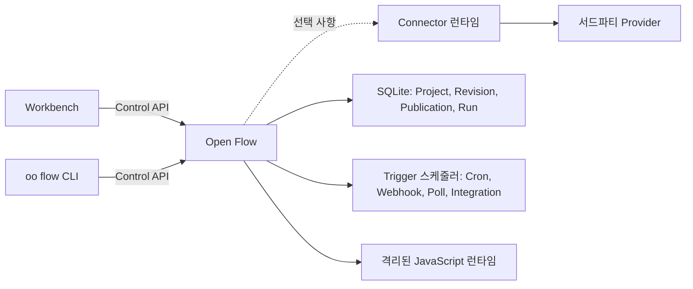

<div align="center">

# Open Flow

**보고, 코딩하고, 실행하고, 직접 소유하는 워크플로를 만드세요.**

[English](../README.md) | [简体中文](README.zh-CN.md) | [繁體中文](README.zh-TW.md) | [日本語](README.ja.md) | [한국어](README.ko.md) | [Русский](README.ru.md) | [Français](README.fr.md)

[](https://github.com/oomol-lab/open-flow/actions/workflows/ci.yaml)
[](https://www.npmjs.com/package/@oomol-lab/open-flow)
[](../LICENSE)


</div>

Open Flow는 AI Agent와 사람이 동일한 Flow를 함께 구축하는 오픈소스 워크플로 자동화 플랫폼입니다. Codex, Claude Code 또는 다른 터미널
Agent에게 [`oo flow`](https://github.com/oomol-lab/oo-cli)를 통해 타입이 지정된 워크플로를 생성, 검사, 실행, 게시하도록 요청한 다음, 바로 그 Flow를 Workbench에서 시각적으로 확인하고 계속 편집할 수 있습니다.

타입이 지정된 노드로 구조를 정의하고, 사용자 정의 로직은 JavaScript로 유지하며, OOMOL Hosted 또는 직접 관리하는 인프라에서 자동화를 실행할 수 있습니다.
그래프는 계속 이해할 수 있는 상태로, 코드는 계속 코드로, 배포는 계속 여러분의 통제 아래 남습니다.

<p align="center">
  <a href="https://www.youtube.com/watch?v=CIF5I11VpLM">
    
  </a>
</p>

<p align="center">
  <a href="https://www.youtube.com/watch?v=CIF5I11VpLM"><strong>▶ 1분 Open Flow 데모 보기</strong></a>
</p>

> [!IMPORTANT]
> Open Flow는 현재 알파 단계입니다. 공개 계약은 버전 관리되지만, 제품은 아직 첫 안정 버전에 도달하지 않았습니다.

## AI Agent로 워크플로 구축

`oo flow`는 작성 수명 주기를 버전이 지정된 기계 판독 가능 명령으로 제공합니다. 터미널을 사용할 수 있는 Agent는 다음 작업을 수행할 수 있습니다.

- 정확한 Connector Action과 Provider Trigger 탐색
- 타입이 지정된 Node, Edge, Code Task 및 Trigger binding 생성과 편집
- Draft 검사, 실행 및 결과 확인
- 명시적으로 요청된 경우 Live에 게시하거나 동일한 Flow를 Workbench에서 열기

> **요청 예시:** “읽지 않은 Gmail 메시지를 읽고, 형식을 정리한 다음 Feishu로 보내는 워크플로를 만들어 줘.”

Agent는 일회용 로컬 설정이 아니라 선택한 Open Flow 배포 안에 실제 Draft를 만듭니다. CLI와 Workbench는 동일한 Control API를 사용하므로 AI가 만든 변경 사항은 동일한 시각적 그래프에 표시되며 사람과 Agent 모두 계속 편집할 수 있습니다.

<p align="center">
  
</p>

[Codex, Claude Code 또는 다른 터미널 Agent에서 Open Flow를 작성하려면 `oo` CLI를 설치하세요.](https://github.com/oomol-lab/oo-cli)

직접 실행 중인 Open Flow를 사용한다면 Agent를 실행하는 셸에 `OO_OPEN_FLOW_URL`과 `OO_OPEN_FLOW_TOKEN`을 설정하세요.
[OpenConnector와 oo CLI로 Open Flow 사용하기](server/self-hosted-stack/README.ko.md)를 참고하세요.

## Open Flow 실행 방식 선택

지원되는 세 방식 모두 동일한 Open Flow 제품과 Workbench를 사용합니다.

<table>
  <tr>
    <td width="33%" align="center"><strong>☁️ OOMOL Hosted</strong></td>
    <td width="33%" align="center"><strong>🐳 Docker Self-hosted</strong></td>
    <td width="33%" align="center"><strong>Fly.io Self-hosted</strong></td>
  </tr>
  <tr>
    <td width="33%" valign="top">서버를 준비하거나 패치하고 모니터링할 필요 없이 바로 사용할 수 있습니다. OOMOL이 배포를 운영하고 지원되는 연동에 관리형 OAuth App을 제공하므로 고정 서버 비용과 별도의 OAuth App 설정을 줄일 수 있습니다.</td>
    <td width="33%" valign="top">포함된 Docker 이미지로 자체 인프라에서 실행합니다. 배포, 스토리지, 백업, 업그레이드, 네트워크와 Connector 또는 OAuth App 설정을 직접 관리합니다.</td>
    <td width="33%" valign="top">같은 Docker 이미지를 Fly.io에서 실행하며 서버를 직접 운영할 필요가 없습니다. Fly가 이미지 빌드, TLS 종료, 영구 volume의 SQLite를 담당하고, secret, 백업, 업그레이드와 Connector 또는 OAuth App 설정은 직접 관리합니다.</td>
  </tr>
  <tr>
    <td width="33%" align="center">🚀 <a href="https://oomol.com"><strong>OOMOL Hosted 사용</strong></a></td>
    <td width="33%" align="center"><a href="#빠른-시작"><strong>Docker로 셀프 호스팅</strong></a></td>
    <td width="33%" align="center"><a href="server/fly-io/README.ko.md"><strong>Fly.io에 배포</strong></a></td>
  </tr>
</table>

## 왜 Open Flow인가

- **AI Agent로 구축합니다.** Codex, Claude Code 또는 다른 터미널 Agent에서 `oo flow`를 사용해 Workbench에 표시되는 동일한 Flow를 생성, 검사, 실행, 게시할 수 있습니다.
- **데이터 의존성을 명시적으로 표현합니다.** 모든 Task는 이름과 타입이 있는 입력과 출력을 선언합니다. 각 에지는 특정 출력값을 특정 입력에 연결하므로 그래프가 런타임에서 사용하는 데이터 의존성 모델이 됩니다.
- **시각적으로 설계하고, 필요할 때 코드를 추가합니다.** 캔버스에서 타입이 지정된 노드를 조합하고 사용자 정의 JavaScript에는 Code Task를 사용합니다. 코드는 폼 필드에 숨겨지지 않고 항상 보이는 상태로 유지됩니다.
- **한 곳에서 실행하고 디버깅합니다.** 실행 전에 입력과 Flow 구조를 검증하고, 노드의 진행 상황과 출력을 확인하며,
  모든 Run의 전체 이벤트 이력을 따라갈 수 있습니다.
- **장기 실행 자동화를 게시합니다.** Flow는 수동으로 시작할 수도 있고 Cron 일정, Webhook, 폴링 소스, Provider
  이벤트로 시작할 수도 있습니다.
- **운영 상태를 한데 모읍니다.** Project, 불변 Revision, Publication, Live 버전, Run, Trigger 상태는 로컬 파일과
  숨겨진 서비스에 흩어지지 않고 선택된 하나의 배포에 속합니다.
- **신뢰할 수 없는 코드를 안전하게 실행합니다.** Server는 오래 유지되는 Executor 프로세스 안에서 코드 Task마다 새
  V8 isolate를 만들고, 해당 Task가 선언한 Capability만 제공합니다.
- **실행 위치를 직접 선택합니다.** OOMOL Hosted를 사용하거나, 포함된 Server를 Docker로 자체 인프라에서 실행할 수
  있습니다.

Open Flow는 노코드 프로토타입 수준을 넘어섰지만 불투명한 스크립트와 인프라 더미가 되어서는 안 되는 워크플로를
위해 만들어졌습니다.

## 그래프가 곧 런타임 계약입니다

모든 Task는 이름과 타입이 있는 입력과 출력을 선언합니다. 에지는 특정 출력에서 특정 입력으로 값을 전달하며, 입력이 준비되면 런타임이 노드를 시작합니다.

그래프에는 런타임이 실제로 사용하는 데이터 의존성이 그대로 나타납니다. 일반 Flow 데이터는 숨겨진 런타임 저장소를 통해 임의의 노드에서 가져올 수 없습니다. 서로 독립적인 브랜치는 동시에 실행할 수 있으며, 캔버스에서 노드의 위치가 실행 동작을 바꾸지 않습니다.

### 타입이 명확한 시각적 작성

상세 보기에서는 각 입력, 출력, 타입, nullable 제약 조건과 연결 관계를 캔버스에 명확하게 표시합니다.

<p align="center">
  
</p>

### 필요한 곳에 작성하는 코드

Code Task는 사용자 정의 JavaScript를 그래프에 직접 배치하고 타입이 지정된 입력과 출력을 유지합니다.

<p align="center">
  
</p>

## 동작 방식



Workbench와 CLI는 버전 관리되는 Control API를 통해 선택된 하나의 배포와만 통신합니다. 배포는 검증, 실행, 영속화,
Trigger 승인을 담당합니다. Provider 자격 증명은 Open Flow에 들어오지 않습니다. Connector 기반 Action, Provider
Trigger, 프록시는 [OpenConnector](https://github.com/oomol-lab/open-connector) 같은 Connector 런타임을 거치며,
Open Flow는 불투명한 Connection 식별자만 저장합니다.

## 빠른 시작

[Docker](https://docs.docker.com/get-docker/)와 OpenSSL이 필요합니다. 저장소를 클론하고, 운영자 토큰을 만든 뒤,
자체 호스팅 Server를 시작합니다.

```bash
git clone https://github.com/oomol-lab/open-flow.git
cd open-flow

export OPEN_FLOW_TOKEN="$(openssl rand -hex 32)"
docker build --file apps/server/Dockerfile --tag open-flow-server:dev .
docker run --rm \
  --publish 3000:3000 \
  --env OPEN_FLOW_TOKEN="$OPEN_FLOW_TOKEN" \
  --volume open-flow-data:/data/open-flow \
  open-flow-server:dev
```

[http://127.0.0.1:3000](http://127.0.0.1:3000)을 열고 `OPEN_FLOW_TOKEN` 값으로 로그인합니다. 같은 값은 Control
API의 머신 클라이언트를 위한 Bearer 토큰으로도 사용할 수 있습니다. Project와 Run 이력은 `open-flow-data` Docker
볼륨에 저장됩니다.

Server는 외부 서비스 없이도 유용하게 사용할 수 있습니다. Connector 기반 Action, Provider Trigger, LLM Task는 해당
호스트 Capability가 구성될 때까지 실행을 거부하며, 어떤 것도 공개되지 않은 서비스로 대체되지 않습니다.

프로덕션 구성, TLS, 헬스 체크, 영속화, 백업, 리소스 제한은 [Server 배포 가이드](server/container-delivery.md)와
[SECURITY.md](../SECURITY.md#hardening-your-deployment)의 강화 체크리스트를 참고하세요.

## Fly.io에 배포

같은 이미지를 Fly.io에서도 실행할 수 있습니다. 저장소에 포함된 `fly.toml`은 `apps/server/Dockerfile`로 이미지를 빌드하고, Cron과 Poll
Trigger를 위해 machine 한 대를 항상 실행 상태로 유지하며, SQLite를 Fly volume에 영속화합니다. Fly app 생성, volume, secret, 배포,
custom domain, 스케일링 제한은 [Fly.io 배포](server/fly-io/README.ko.md)를 참고하세요.

## Connector 연결

GitHub, Gmail, Slack, Notion 같은 서비스에 대해 Action과 Provider Trigger를 실행하려면 Server가 Connector 런타임을
가리키도록 설정합니다. 자체 호스팅한 [OpenConnector](https://github.com/oomol-lab/open-connector)와 OOMOL이 호스팅하는
Connector 모두 필요한 런타임 API를 제공합니다.

<p align="center">
  
</p>

```dotenv
OPEN_FLOW_CONNECTOR_ORIGIN=http://open-connector:3000
OPEN_FLOW_CONNECTOR_TOKEN=replace-with-a-scoped-runtime-token
OPEN_FLOW_CONNECTOR_CONSOLE_ORIGIN=https://connector.example.com
```

runtime origin은 Server가 Connector에 접근하는 주소이고, console origin은 사용자의 브라우저가 계정을 승인하기 위해
Connector Console을 여는 주소입니다. Provider Trigger 정의는 Open Flow에 내장되어 있으므로 별도 등록이 필요 없습니다.
Integration 콜백 설정과 각 origin의 제약은 [구성 참조](server/container-delivery.md#4-配置)를 참고하세요.

OpenConnector와 Open Flow를 함께 시작하고, runtime token을 만들고, 계정을 연결한 뒤, `oo flow`로 첫 Flow를
만드는 방법은 [OpenConnector와 oo CLI로 Open Flow 사용하기](server/self-hosted-stack/README.ko.md)를 참고하세요.

## 하나의 제품, 이식 가능한 배포

Workbench와 CLI는 특정 데이터베이스나 클라우드 런타임에 의존하지 않고 버전 관리되는 Control API로 통신합니다.
배포가 실행과 영속화를 담당하며, 클라이언트는 두 번째 로컬 Project 형식을 만들거나 다른 백엔드로 조용히 전환하지
않습니다.

이 저장소에는 다음이 포함되어 있습니다.

- [`packages/open-flow`](../packages/open-flow): Authoring, Execution, Trigger, Control API, Conformance,
  Workbench Runtime 진입점을 제공하는 공개 `@oomol-lab/open-flow` npm 패키지
- [`packages/command`](../packages/command): `oo flow` 명령 런타임과
  [oo CLI](https://github.com/oomol-lab/oo-cli)가 사용하는 불변 Command Artifact
- [`apps/server`](../apps/server): 자체 호스팅 가능한 Workbench, Control API, SQLite 영속화, Trigger 스케줄러,
  격리된 JavaScript 런타임

지속되는 제품 모델은 [제품 및 아키텍처 경계](architecture.md)에서, HTTP 계약은
[Control API 참조](control/contracts/control-api.md)에서 확인할 수 있습니다.

## 소스에서 개발하기

Open Flow는 워크스페이스에 [Bun](https://bun.sh/)을, Server에 Node.js를 사용합니다. `.bun-version`과
`.node-version`에 고정된 버전을 사용하세요.

```bash
bun install --frozen-lockfile
bun run dev
```

개발용 Workbench는 [http://127.0.0.1:5173](http://127.0.0.1:5173)에서 열 수 있습니다. API 요청은
`http://127.0.0.1:3000`의 Server로 프록시됩니다.

첫 개발 실행 시 운영자 토큰이 `apps/server/.open-flow-dev/operator-token`에 생성됩니다. 이후 실행에서는 같은 토큰을
재사용하므로 개발 서버를 재시작해도 현재 Workbench 세션이 무효화되지 않습니다. 명시적인 토큰을 사용하려면
`OPEN_FLOW_TOKEN`을 설정하세요.

변경 사항을 제출하기 전에 다음을 실행합니다.

```bash
bun run check
bun run test
bun run build
```

게시되는 패키지나 CLI를 수정할 때는 `bun run test:package`를 추가로 실행하고, Docker를 사용할 수 있다면
`bun run test:docker`로 릴리스 이미지, 격리 런타임, Workbench, 정상 종료, SQLite 볼륨 복구를 검증하세요. 저장소
루트에서 `bun test`를 직접 실행하지 마세요. 워크스페이스 테스트 스크립트를 우회하게 됩니다. 전체 개발 규칙은
[CONTRIBUTING.md](../CONTRIBUTING.md)를 참고하세요.

## 문서

[문서 색인](README.md)에서 시작하세요. 가장 유용한 참조는 다음과 같습니다.

- [제품 및 아키텍처 경계](architecture.md)
- [Control API](control/contracts/control-api.md)
- [Command Artifact 배포 계약](distribution/command-artifact.md)
- [Workbench 및 Designer 프런트엔드 참고 사항](authoring/frontend-ui.md)
- [Server 배포](server/container-delivery.md)
- [Fly.io 배포](server/fly-io/README.ko.md)
- [OpenConnector와 oo CLI로 Open Flow 사용하기](server/self-hosted-stack/README.ko.md)
- [기여 안내](../CONTRIBUTING.md)
- [행동 강령](../CODE_OF_CONDUCT.md)
- [보안 정책](../SECURITY.md)

## 관련 프로젝트

- [OpenConnector](https://github.com/oomol-lab/open-connector): Connector 기반 노드 뒤에서 Provider 카탈로그, 자격
  증명, Action 실행을 제공하는 오픈소스 Connector 게이트웨이
- [oo CLI](https://github.com/oomol-lab/oo-cli): 이 저장소에서 빌드된 `oo flow` 명령을 호스팅하는 로컬 Agent 툴킷

## 기여하기

Issue와 Pull Request를 환영합니다. 개발 환경 설정, 저장소 규칙, Pull Request를 열기 전에 실행할 검사는
[CONTRIBUTING.md](../CONTRIBUTING.md)를 참고하세요. 이 프로젝트 참여는 [CODE_OF_CONDUCT.md](../CODE_OF_CONDUCT.md)를
따릅니다.

## 보안

취약점은 공개 Issue 대신
[GitHub 비공개 취약점 보고](https://github.com/oomol-lab/open-flow/security/advisories/new)를 통해 비공개로 보고해
주세요. [SECURITY.md](../SECURITY.md)에 지원되는 버전, 공개 절차, 보고 범위, 자체 호스팅 배포 강화 방법이 설명되어
있습니다.

## 라이선스

[Apache-2.0](../LICENSE). 번들된 자산의 서드파티 고지는 [NOTICE](../NOTICE)에 정리되어 있습니다.

## 기여자

Open Flow를 함께 만들어 주신 모든 기여자께 감사드립니다.
[기여 안내](../CONTRIBUTING.md)를 확인하고 함께해 주세요.

[](https://github.com/oomol-lab/open-flow/graphs/contributors)

## Star 히스토리

<picture>
  <source media="(prefers-color-scheme: dark)" srcset="../assets/star-history/star-history-dark.svg">
  
</picture>
