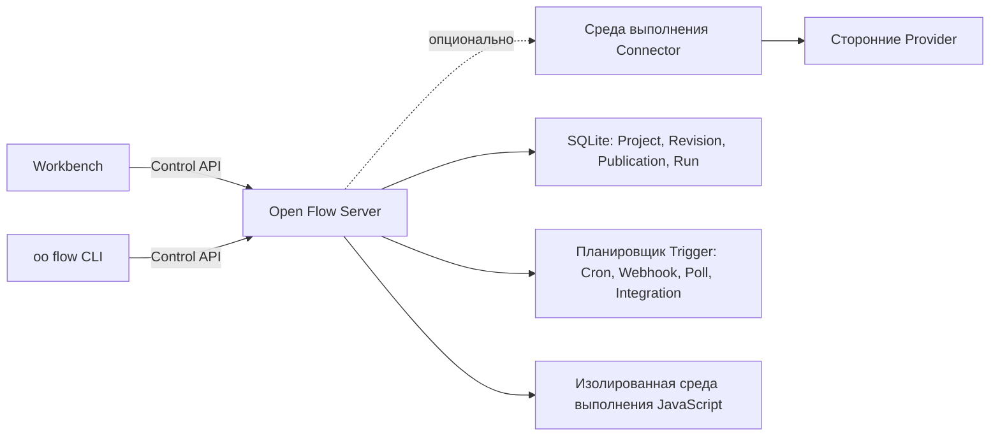

<div align="center">

# Open Flow

**Создавайте workflow, которые можно увидеть, написать кодом, запустить и полностью контролировать.**

[English](../README.md) | [简体中文](README.zh-CN.md) | [繁體中文](README.zh-TW.md) | [日本語](README.ja.md) | [한국어](README.ko.md) | [Русский](README.ru.md) | [Français](README.fr.md)

[](https://github.com/oomol-lab/open-flow/actions/workflows/ci.yaml)
[](https://www.npmjs.com/package/@oomol-lab/open-flow)
[](../LICENSE)


</div>

Open Flow — это open-source платформа автоматизации workflow, изначально предназначенная для Agent.
Опишите Codex, Claude Code или другому терминальному Agent, что нужно автоматизировать: через
[`oo flow`](https://github.com/oomol-lab/oo-cli) он сможет найти Actions и Triggers, создать
типизированный workflow, написать код, проверить, запустить и опубликовать его.

Тот же Flow остаётся видимым и редактируемым в Workbench. Соединяйте типизированные шаги на визуальном
холсте, оставляйте JavaScript или TypeScript там, где он нужен, и запускайте автоматизацию на
deployment под вашим контролем.

<p align="center">
  
</p>

> [!IMPORTANT]
> Open Flow находится на стадии alpha. Его контракты версионируются, но продукт ещё не достиг первого
> стабильного релиза.

## Создавайте workflow с помощью AI Agent

`oo flow` предоставляет жизненный цикл создания в виде версионированных машиночитаемых команд. Agent с доступом к терминалу может:

- находить точные Connector Actions и Provider Triggers;
- создавать и редактировать типизированные Nodes, Edges, Code Tasks и Trigger bindings;
- проверять Draft, запускать его и получать результат;
- по вашему явному запросу публиковать в Live или открывать тот же Flow в Workbench.

> **Пример запроса:** «Создай workflow, который читает непрочитанные сообщения Gmail, форматирует их и отправляет в Feishu».

Agent создаёт настоящий Draft в выбранном deployment Open Flow, а не одноразовую локальную конфигурацию. CLI и Workbench используют один Control API, поэтому изменения, созданные AI, появляются в том же визуальном графе и остаются доступными для редактирования как людям, так и Agent.

[Установите `oo` CLI](https://github.com/oomol-lab/oo-cli), чтобы создавать Open Flow из Codex, Claude Code или другого терминального Agent.

## Выберите способ запуска Open Flow

Оба поддерживаемых варианта используют один и тот же продукт Open Flow и Workbench.

<table>
  <tr>
    <td width="50%" align="center"><strong>☁️ OOMOL Hosted</strong></td>
    <td width="50%" align="center"><strong>🐳 Docker Self-hosted</strong></td>
  </tr>
  <tr>
    <td width="50%" valign="top">Готово к работе без подготовки, обновления и мониторинга сервера. OOMOL управляет deployment и предоставляет управляемые OAuth App для поддерживаемых интеграций, поэтому вам не нужны постоянные расходы на сервер и отдельная настройка OAuth App.</td>
    <td width="50%" valign="top">Запускайте на своей инфраструктуре с помощью включённого Docker image. Вы управляете deployment, хранилищем, резервным копированием, обновлениями, сетью и настройкой Connector или OAuth App.</td>
  </tr>
  <tr>
    <td width="50%" align="center">🚀 <a href="https://oomol.com"><strong>Использовать OOMOL Hosted</strong></a></td>
    <td width="50%" align="center"><a href="#быстрый-старт"><strong>Развернуть самостоятельно с Docker</strong></a></td>
  </tr>
</table>

## Почему Open Flow

- **Создавайте с помощью AI Agent.** Используйте `oo flow` из Codex, Claude Code или другого терминального Agent, чтобы создавать, проверять, запускать и публиковать тот же Flow, который отображается в Workbench.
- **Проектируйте визуально, расширяйте кодом.** Собирайте типизированные узлы и Subflow на холсте, а
  логику, которая должна оставаться явной, выносите в узлы Script и CodeModule. Код остаётся кодом:
  это настоящий TypeScript, а не выражения, спрятанные в полях формы.
- **Запускайте и отлаживайте в одном месте.** Проверяйте входные данные и структуру Flow до
  выполнения, следите за прогрессом и выводом узлов и просматривайте полную историю событий каждого
  Run.
- **Публикуйте долгоживущую автоматизацию.** Запускайте Flow вручную либо по расписанию Cron, через
  Webhook, источники polling и события Provider.
- **Держите операционное состояние вместе.** Project, неизменяемые Revision, Publication, версии
  Live, Run и состояние Trigger принадлежат одному выбранному deployment, а не разбросаны между
  локальными файлами и скрытыми сервисами.
- **Безопасно выполняйте недоверенный код.** Server выполняет каждый кодовый Task в новом V8 isolate
  внутри долгоживущего процесса Executor и предоставляет только те Capability, которые объявил этот
  Task.
- **Выбирайте, где всё работает.** Используйте OOMOL Hosted или запускайте входящий в комплект Server
  с Docker на собственной инфраструктуре.

Open Flow создан для workflow, которые переросли no-code прототип, но не должны превращаться в
непрозрачный набор скриптов и инфраструктуры. Граф остаётся понятным, код остаётся кодом, а
deployment остаётся под вашим контролем.

### Визуальное создание с типами

В подробном представлении каждый вход, выход, тип, nullable-ограничение и соединение явно показаны
на холсте.

<p align="center">
  
</p>

### Код там, где он нужен

Code Task показывает пользовательский JavaScript или TypeScript рядом с соединёнными узлами,
сохраняя типизированные входы и выходы.

<p align="center">
  
</p>

## Как это работает



Workbench и CLI общаются только с одним выбранным deployment через версионированный Control API.
Deployment отвечает за валидацию, выполнение, персистентность и допуск Trigger. Учётные данные
Provider никогда не попадают в Open Flow: Action на базе Connector, Trigger от Provider и proxy
проходят через среду выполнения Connector, например
[OpenConnector](https://github.com/oomol-lab/open-connector), а Open Flow хранит только непрозрачные
идентификаторы Connection.

## Быстрый старт

Вам понадобятся [Docker](https://docs.docker.com/get-docker/) и OpenSSL. Клонируйте репозиторий,
создайте токен оператора и запустите self-hosted Server:

```bash
git clone https://github.com/oomol-lab/open-flow.git
cd open-flow

export OPEN_FLOW_TOKEN="$(openssl rand -hex 32)"
docker build --file apps/server/Dockerfile --tag open-flow-server:dev .
docker run --rm \
  --publish 3000:3000 \
  --env OPEN_FLOW_TOKEN="$OPEN_FLOW_TOKEN" \
  --volume open-flow-data:/data/open-flow \
  open-flow-server:dev
```

Откройте [http://127.0.0.1:3000](http://127.0.0.1:3000) и войдите, указав значение
`OPEN_FLOW_TOKEN`. То же значение работает как Bearer token для машинных клиентов Control API.
Project и история Run сохраняются в Docker volume `open-flow-data`.

Server полезен и без внешних сервисов. Action на базе Connector, Trigger от Provider и LLM Task
отказывают безопасно (fail closed), пока не настроена соответствующая host capability; ничто не
переключается на нераскрытый сервис.

Конфигурация для production, TLS, health check, персистентность, резервное копирование и лимиты
ресурсов описаны в [руководстве по развёртыванию Server](server/container-delivery.md) и в чеклисте
по усилению защиты в [SECURITY.md](../SECURITY.md#hardening-your-deployment).

## Подключение Connector

Чтобы выполнять Action и Trigger от Provider для таких сервисов, как GitHub, Gmail, Slack или Notion,
укажите Server среду выполнения Connector. Необходимый runtime API предоставляют как self-hosted
[OpenConnector](https://github.com/oomol-lab/open-connector), так и Connector, размещённый OOMOL.

<p align="center">
  
</p>

```dotenv
OPEN_FLOW_CONNECTOR_ORIGIN=http://open-connector:3000
OPEN_FLOW_CONNECTOR_TOKEN=replace-with-a-scoped-runtime-token
OPEN_FLOW_CONNECTOR_CONSOLE_ORIGIN=https://connector.example.com
```

Runtime origin определяет, где Server обращается к Connector; console origin определяет, где браузеры
пользователей открывают Connector Console для авторизации аккаунтов. Определения Trigger от Provider
поставляются вместе с Open Flow и не требуют регистрации. Настройки Integration callback и
ограничения для каждого origin см. в [справочнике по конфигурации](server/container-delivery.md#4-配置).

## Один продукт, переносимые deployment

Workbench и CLI используют версионированный Control API и не зависят от конкретной базы данных или
облачной среды выполнения. Deployment владеет выполнением и персистентностью; клиенты не создают
второй локальный формат проекта и не переключаются молча на другой backend.

Этот репозиторий содержит:

- [`packages/open-flow`](../packages/open-flow): публичный npm-пакет `@oomol-lab/open-flow` с
  точками входа для authoring, execution, Trigger, Control API, conformance и Workbench runtime;
- [`packages/command`](../packages/command): среду выполнения команды `oo flow` и неизменяемый
  Command Artifact, который использует [oo CLI](https://github.com/oomol-lab/oo-cli);
- [`apps/server`](../apps/server): self-hosted Workbench, Control API, персистентность на SQLite,
  планировщик Trigger и изолированную среду выполнения JavaScript.

Долгосрочная модель продукта описана в [границах продукта и архитектуры](architecture.md), а HTTP
контракт в [справочнике Control API](control/contracts/control-api.md).

## Разработка из исходного кода

Open Flow использует [Bun](https://bun.sh/) для workspace и Node.js для Server. Используйте версии,
зафиксированные в `.bun-version` и `.node-version`.

```bash
bun install --frozen-lockfile
bun run dev
```

Откройте Workbench для разработки по адресу [http://127.0.0.1:5173](http://127.0.0.1:5173). Его
API-запросы проксируются на Server по адресу `http://127.0.0.1:3000`.

При первом запуске в режиме разработки создаётся токен оператора в
`apps/server/.open-flow-dev/operator-token`. Последующие запуски используют его повторно, поэтому
перезапуск сервера разработки не сбрасывает текущую сессию Workbench. Чтобы задать токен явно,
установите `OPEN_FLOW_TOKEN`.

Перед отправкой изменений выполните:

```bash
bun run check
bun run test
bun run build
```

Добавьте `bun run test:package`, если затрагиваете публикуемый пакет или CLI, и `bun run test:docker`,
если доступен Docker, чтобы проверить релизный образ, изолированную среду выполнения, Workbench,
корректное завершение работы и восстановление SQLite volume. Не запускайте `bun test` в корне
репозитория: это обходит тестовые скрипты workspace. Полные правила разработки см. в
[CONTRIBUTING.md](../CONTRIBUTING.md).

## Документация

Начните с [индекса документации](README.md). Наиболее полезные справочники:

- [Границы продукта и архитектуры](architecture.md)
- [Control API](control/contracts/control-api.md)
- [Дистрибуция Command Artifact](distribution/command-artifact.md)
- [Заметки по frontend Workbench и Designer](authoring/frontend-ui.md)
- [Развёртывание Server](server/container-delivery.md)
- [Участие в разработке](../CONTRIBUTING.md)
- [Кодекс поведения](../CODE_OF_CONDUCT.md)
- [Безопасность](../SECURITY.md)

## Связанные проекты

- [OpenConnector](https://github.com/oomol-lab/open-connector): шлюз коннекторов с открытым исходным
  кодом, который предоставляет каталог Provider, учётные данные и выполнение Action для узлов на базе
  Connector.
- [oo CLI](https://github.com/oomol-lab/oo-cli): локальный набор инструментов для агентов, в котором
  размещается команда `oo flow`, собранная из этого репозитория.

## Участие в разработке

Issue и pull request приветствуются. Настройка окружения, правила репозитория и проверки перед
открытием pull request описаны в [CONTRIBUTING.md](../CONTRIBUTING.md). Участие в проекте
регулируется [CODE_OF_CONDUCT.md](../CODE_OF_CONDUCT.md).

## Безопасность

Сообщайте об уязвимостях приватно через
[приватные отчёты об уязвимостях GitHub](https://github.com/oomol-lab/open-flow/security/advisories/new),
а не через публичные issue. В [SECURITY.md](../SECURITY.md) описаны поддерживаемые версии, процесс
раскрытия, область действия и способы усиления защиты self-hosted deployment.

## Лицензия

[Apache-2.0](../LICENSE). Уведомления о сторонних компонентах для включённых ресурсов перечислены в
[NOTICE](../NOTICE).

## Участники

Спасибо всем, кто помогает развивать Open Flow. Хотите присоединиться? Ознакомьтесь с
[руководством по участию](../CONTRIBUTING.md).

[](https://github.com/oomol-lab/open-flow/graphs/contributors)

## История звёзд

<picture>
  <source media="(prefers-color-scheme: dark)" srcset="../assets/star-history/star-history-dark.svg">
  
</picture>
