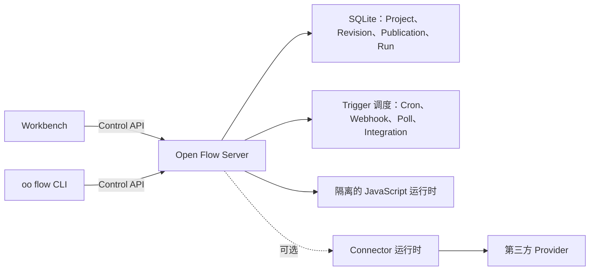

<div align="center">

# Open Flow

**在画布上搭工作流，需要时直接写代码，最后部署到自己的环境。**

[English](../README.md) | [简体中文](README.zh-CN.md) | [繁體中文](README.zh-TW.md) | [日本語](README.ja.md) | [한국어](README.ko.md) | [Русский](README.ru.md) | [Français](README.fr.md)

[](https://github.com/oomol-lab/open-flow/actions/workflows/ci.yaml)
[](https://www.npmjs.com/package/@oomol-lab/open-flow)
[](../LICENSE)


</div>

Open Flow 是一个开源的工作流自动化平台。你可以在画布上连接有类型约束的节点，在合适的位置编写 JavaScript 或
TypeScript，直接运行和调试 Flow，再把它发布成持续工作的自动化流程，并部署在自己控制的环境中。

<p align="center">
  <picture>
    <source media="(prefers-color-scheme: dark)" srcset="assets/dark.png">
    <source media="(prefers-color-scheme: light)" srcset="assets/light.png">
    
  </picture>
</p>

> [!IMPORTANT]
> Open Flow 目前处于 Alpha 阶段。公开协议有版本管理，但产品还没有发布第一个稳定版本。

## 为什么选择 Open Flow

- **可视化设计，用代码扩展。** 在画布上组合有类型约束的节点和 Subflow；遇到更适合代码的逻辑，直接使用 Script 或 CodeModule
  节点，写的是真正的 TypeScript，而不是藏在表单里的表达式。
- **运行和调试在同一处。** 运行前检查输入和 Flow 结构，运行时查看每个节点的进度、输出和完整事件记录。
- **发布为长期运行的自动化。** Flow 可以手动启动，也可以由 Cron、Webhook、轮询数据源或 Provider Event 触发。
- **运行状态集中管理。** Project、不可变 Revision、Publication、Live 版本、Run 和 Trigger 状态都由当前部署管理，不会散落在本地文件和隐藏服务中。
- **安全地执行用户代码。** Server 在长驻的 Executor 进程中为每次代码 Task 调用创建全新的 V8 isolate，只暴露该 Task 明确声明的 Capability。
- **自由选择运行环境。** 可以使用仓库自带的 Server 自行部署，也可以让同一套 Workbench 和 CLI 连接其他兼容 Control API 的实现。

Open Flow 适合已经超过简单无代码原型，但又不想变成一堆脚本和基础设施的工作流。流程图仍然容易理解，需要写的代码也保留为正常代码，运行环境由你选择。

## 工作原理



Workbench 和 CLI 只通过有版本的 Control API 与当前选定的一个部署通信。部署端负责 validation、执行、持久化和 Trigger 准入。Provider
凭据不会进入 Open Flow：Connector Action、Provider Trigger 和 proxy 都经由
[OpenConnector](https://github.com/oomol-lab/open-connector) 这类 Connector 运行时完成，Open Flow 只保存不透明的 Connection 标识。

## 快速开始

准备好 [Docker](https://docs.docker.com/get-docker/) 和 OpenSSL，然后克隆仓库、生成管理员 Token 并启动 Server：

```bash
git clone https://github.com/oomol-lab/open-flow.git
cd open-flow

export OPEN_FLOW_TOKEN="$(openssl rand -hex 32)"
docker build --file apps/server/Dockerfile --tag open-flow-server:dev .
docker run --rm \
  --publish 3000:3000 \
  --env OPEN_FLOW_TOKEN="$OPEN_FLOW_TOKEN" \
  --volume open-flow-data:/data/open-flow \
  open-flow-server:dev
```

打开 [http://127.0.0.1:3000](http://127.0.0.1:3000)，使用 `OPEN_FLOW_TOKEN` 的值登录。同一个值也可以作为 Control API 的 Bearer Token
供机器客户端使用。Project 和 Run 历史会保存在 `open-flow-data` Docker volume 中。

不接外部服务时，Server 仍然可以独立使用。Connector Action、Provider Trigger 和 LLM Task 在没有配置对应 Host Capability
时会拒绝执行，不会退回到来源不明的服务。

生产环境所需的配置、TLS、健康检查、数据持久化、备份和资源限制，参见
[Server 部署文档](server/container-delivery.md) 和 [SECURITY.md](../SECURITY.md#hardening-your-deployment) 中的加固清单。

## 接入 Connector

要对 GitHub、Gmail、Slack、Notion 等服务执行 Action 和 Provider Trigger，需要把 Server 指向一个 Connector 运行时。自行部署的
[OpenConnector](https://github.com/oomol-lab/open-connector) 和 OOMOL 托管的 Connector 都提供所需的运行时 API。

```dotenv
OPEN_FLOW_CONNECTOR_ORIGIN=http://open-connector:3000
# 本地 Connector 未启用 runtime 认证时可以省略。
OPEN_FLOW_CONNECTOR_TOKEN=replace-with-a-scoped-runtime-token
OPEN_FLOW_CONNECTOR_CONSOLE_ORIGIN=https://connector.example.com
```

runtime origin 是 Server 访问 Connector 的地址，console origin 是用户浏览器打开 Connector Console 授权账号的地址。Provider Trigger
定义随 Open Flow 内置，不需要额外注册。Integration callback 的配置和各 origin 的约束参见
[配置说明](server/container-delivery.md#4-配置)。

## 一套产品，多种部署

Workbench 和 CLI 通过有版本的 Control API 工作，不依赖特定数据库或云运行时。部署端负责执行和持久化；客户端不会创建第二套本地
Project 格式，也不会在请求失败时暗中切换后端。

仓库主要包含：

- [`packages/open-flow`](../packages/open-flow)：公开的 `@oomol-lab/open-flow` npm 包，提供 Authoring、Execution、Trigger、Control
  API、Conformance 和 Workbench Runtime 入口；
- [`packages/command`](../packages/command)：`oo flow` 命令运行时和交付给 [oo CLI](https://github.com/oomol-lab/oo-cli) 的不可变
  Command Artifact；
- [`apps/server`](../apps/server)：可自行部署的 Workbench、Control API、SQLite 存储、Trigger Scheduler 和隔离的 JavaScript Runtime。

长期成立的产品模型记录在[产品与架构边界](architecture.md)中，HTTP 接口定义参见
[Control API 文档](control/contracts/control-api.md)。

## 从源码开发

Open Flow 的工作区使用 [Bun](https://bun.sh/)，Server 运行在 Node.js 上。请使用 `.bun-version` 和 `.node-version` 中固定的版本。

```bash
bun install --frozen-lockfile
bun run dev
```

开发环境的 Workbench 位于 [http://localhost:5174](http://localhost:5174)，API 请求会代理到
`http://127.0.0.1:3001` 上的 Server。开发环境默认使用 `http://localhost:3000` 作为 Connector origin；可以通过
`OPEN_FLOW_CONNECTOR_ORIGIN` 覆盖，Connector token 仍然可选。

第一次启动开发环境时，Server 会把管理员 Token 写入 `apps/server/.open-flow-dev/operator-token`，后续启动继续使用同一个
Token，因此重启开发服务不会让当前 Workbench 登录态失效。如果需要指定 Token，可以设置 `OPEN_FLOW_TOKEN`。

提交代码前运行：

```bash
bun run check
bun run test
bun run build
```

改动发布包或 CLI 时加跑 `bun run test:package`；本机有 Docker 时运行 `bun run test:docker`，检查发布镜像、隔离运行时、Workbench、正常退出和
SQLite volume 恢复。不要在仓库根目录直接运行 `bun test`，它会绕过各工作区的测试脚本。完整的开发规则见 [CONTRIBUTING.md](../CONTRIBUTING.md)。

## 文档

可以从[文档索引](README.md)开始，常用内容包括：

- [产品与架构边界](architecture.md)
- [Control API](control/contracts/control-api.md)
- [Command Artifact 分发合同](distribution/command-artifact.md)
- [Workbench 与 Designer 前端注意事项](authoring/frontend-ui.md)
- [Server 部署](server/container-delivery.md)
- [参与贡献](../CONTRIBUTING.md)
- [行为准则](../CODE_OF_CONDUCT.md)
- [安全政策](../SECURITY.md)

## 相关项目

- [OpenConnector](https://github.com/oomol-lab/open-connector)：开源的 Connector 网关，为 Connector 节点提供 Provider 目录、凭据管理和
  Action 执行。
- [oo CLI](https://github.com/oomol-lab/oo-cli)：本地 Agent 工具集，承载由本仓库构建的 `oo flow` 命令。

## 参与贡献

欢迎提交 Issue 和 Pull Request。开发环境、仓库规则和提交前需要运行的检查见 [CONTRIBUTING.md](../CONTRIBUTING.md)。参与本项目需遵守
[CODE_OF_CONDUCT.md](../CODE_OF_CONDUCT.md)。

## 安全

请通过 [GitHub 私密漏洞报告](https://github.com/oomol-lab/open-flow/security/advisories/new) 报告安全问题，不要提交公开
Issue。[SECURITY.md](../SECURITY.md) 说明了受支持的版本、披露流程、报告范围以及自行部署时的加固建议。

## 许可证

[Apache-2.0](../LICENSE)。打包资源涉及的第三方声明见 [NOTICE](../NOTICE)。

## 贡献者

感谢每一位参与建设 Open Flow 的贡献者。欢迎查看 [贡献指南](../CONTRIBUTING.md)，加入我们。

[](https://github.com/oomol-lab/open-flow/graphs/contributors)

## Star 历史

<picture>
  <source media="(prefers-color-scheme: dark)" srcset="../assets/star-history/star-history-dark.svg">
  
</picture>
