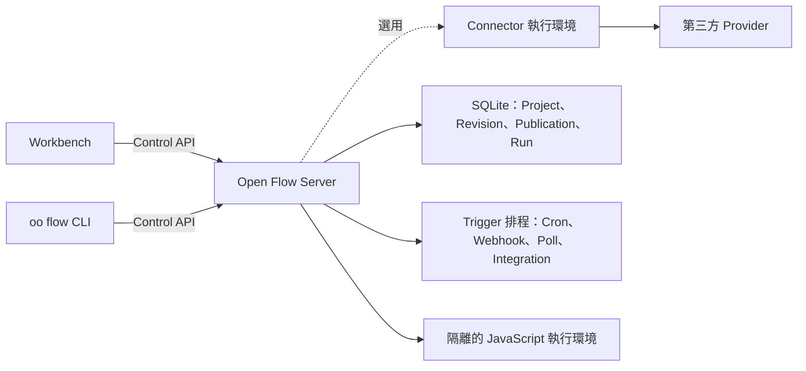

<div align="center">

# Open Flow

**在畫布上建立工作流程，需要時直接寫程式碼，最後部署到自己的環境。**

[English](../README.md) | [简体中文](README.zh-CN.md) | [繁體中文](README.zh-TW.md) | [日本語](README.ja.md) | [한국어](README.ko.md) | [Русский](README.ru.md) | [Français](README.fr.md)

[](https://github.com/oomol-lab/open-flow/actions/workflows/ci.yaml)
[](https://www.npmjs.com/package/@oomol-lab/open-flow)
[](../LICENSE)


</div>

Open Flow 是一個開源的工作流程自動化平台。你可以在畫布上連接具型別約束的節點，在合適的位置撰寫 JavaScript 或
TypeScript，直接執行和偵錯 Flow，再把它發布成持續運作的自動化流程，並部署在自己掌控的環境中。

<p align="center">
  <picture>
    <source media="(prefers-color-scheme: dark)" srcset="assets/dark.png">
    <source media="(prefers-color-scheme: light)" srcset="assets/light.png">
    
  </picture>
</p>

> [!IMPORTANT]
> Open Flow 目前處於 Alpha 階段。公開協定有版本管理，但產品尚未發布第一個穩定版本。

## 為什麼選擇 Open Flow

- **視覺化設計，用程式碼擴充。** 在畫布上組合具型別約束的節點和 Subflow；遇到更適合用程式碼處理的邏輯，直接使用 Script 或 CodeModule
  節點，寫的是真正的 TypeScript，而不是藏在表單裡的運算式。
- **執行和偵錯在同一處。** 執行前檢查輸入和 Flow 結構，執行時查看每個節點的進度、輸出和完整事件記錄。
- **發布為長期執行的自動化。** Flow 可以手動啟動，也可以由 Cron、Webhook、輪詢資料來源或 Provider Event 觸發。
- **執行狀態集中管理。** Project、不可變的 Revision、Publication、Live 版本、Run 和 Trigger 狀態都由目前的部署管理，不會散落在本機檔案和隱藏服務中。
- **安全地執行使用者程式碼。** Server 在常駐的 Executor 程序中為每次程式碼 Task 呼叫建立全新的 V8 isolate，只開放該 Task 明確宣告的 Capability。
- **自由選擇執行環境。** 可以使用儲存庫內建的 Server 自行部署，也可以讓同一套 Workbench 和 CLI 連接其他相容 Control API 的實作。

Open Flow 適合已經超出簡單無程式碼原型，但又不想變成一堆腳本和基礎設施的工作流程。流程圖仍然容易理解，需要撰寫的程式碼也保留為正常的程式碼，執行環境由你決定。

## 運作方式



Workbench 和 CLI 只透過有版本的 Control API 與目前選定的一個部署通訊。部署端負責 validation、執行、持久化和 Trigger 准入。Provider
憑證不會進入 Open Flow：Connector Action、Provider Trigger 和 proxy 都經由
[OpenConnector](https://github.com/oomol-lab/open-connector) 這類 Connector 執行環境完成，Open Flow 只保存不透明的 Connection 識別。

## 快速開始

準備好 [Docker](https://docs.docker.com/get-docker/) 和 OpenSSL，然後複製儲存庫、產生管理員 Token 並啟動 Server：

```bash
git clone https://github.com/oomol-lab/open-flow.git
cd open-flow

export OPEN_FLOW_TOKEN="$(openssl rand -hex 32)"
docker build --file apps/server/Dockerfile --tag open-flow-server:dev .
docker run --rm \
  --publish 3000:3000 \
  --env OPEN_FLOW_TOKEN="$OPEN_FLOW_TOKEN" \
  --volume open-flow-data:/data/open-flow \
  open-flow-server:dev
```

開啟 [http://127.0.0.1:3000](http://127.0.0.1:3000)，使用 `OPEN_FLOW_TOKEN` 的值登入。同一個值也可以作為 Control API 的 Bearer Token
供機器用戶端使用。Project 和 Run 歷史會儲存在 `open-flow-data` Docker volume 中。

不接外部服務時，Server 仍然可以獨立使用。Connector Action、Provider Trigger 和 LLM Task 在沒有設定對應 Host Capability
時會拒絕執行，不會退回到來源不明的服務。

正式環境所需的設定、TLS、健康檢查、資料持久化、備份和資源限制，請參閱
[Server 部署文件](server/container-delivery.md) 和 [SECURITY.md](../SECURITY.md#hardening-your-deployment) 中的強化清單。

## 接入 Connector

要對 GitHub、Gmail、Slack、Notion 等服務執行 Action 和 Provider Trigger，需要把 Server 指向一個 Connector 執行環境。自行部署的
[OpenConnector](https://github.com/oomol-lab/open-connector) 和 OOMOL 託管的 Connector 都提供所需的執行環境 API。

```dotenv
OPEN_FLOW_CONNECTOR_ORIGIN=http://open-connector:3000
OPEN_FLOW_CONNECTOR_TOKEN=replace-with-a-scoped-runtime-token
OPEN_FLOW_CONNECTOR_CONSOLE_ORIGIN=https://connector.example.com
```

runtime origin 是 Server 存取 Connector 的位址，console origin 是使用者瀏覽器開啟 Connector Console 授權帳號的位址。Provider Trigger
定義隨 Open Flow 內建，不需要額外註冊。Integration callback 的設定和各 origin 的限制請參閱
[設定說明](server/container-delivery.md#4-配置)。

## 一套產品，多種部署

Workbench 和 CLI 透過有版本的 Control API 運作，不依賴特定資料庫或雲端執行環境。部署端負責執行和持久化；用戶端不會建立第二套本機
Project 格式，也不會在請求失敗時暗中切換後端。

儲存庫主要包含：

- [`packages/open-flow`](../packages/open-flow)：公開的 `@oomol-lab/open-flow` npm 套件，提供 Authoring、Execution、Trigger、Control
  API、Conformance 和 Workbench Runtime 進入點；
- [`packages/command`](../packages/command)：`oo flow` 命令執行環境和交付給 [oo CLI](https://github.com/oomol-lab/oo-cli) 的不可變
  Command Artifact；
- [`apps/server`](../apps/server)：可自行部署的 Workbench、Control API、SQLite 儲存、Trigger Scheduler 和隔離的 JavaScript Runtime。

長期成立的產品模型記錄在[產品與架構邊界](architecture.md)中，HTTP 介面定義請參閱
[Control API 文件](control/contracts/control-api.md)。

## 從原始碼開發

Open Flow 的工作區使用 [Bun](https://bun.sh/)，Server 執行在 Node.js 上。請使用 `.bun-version` 和 `.node-version` 中固定的版本。

```bash
bun install --frozen-lockfile
bun run dev
```

開發環境的 Workbench 位於 [http://127.0.0.1:5173](http://127.0.0.1:5173)，API 請求會代理到
`http://127.0.0.1:3000` 上的 Server。

第一次啟動開發環境時，Server 會把管理員 Token 寫入 `apps/server/.open-flow-dev/operator-token`，後續啟動繼續使用同一個
Token，因此重新啟動開發服務不會讓目前的 Workbench 登入狀態失效。如果需要指定 Token，可以設定 `OPEN_FLOW_TOKEN`。

提交程式碼前請執行：

```bash
bun run check
bun run test
bun run build
```

修改發布套件或 CLI 時加跑 `bun run test:package`；本機有 Docker 時執行 `bun run test:docker`，檢查發布映像檔、隔離執行環境、Workbench、正常結束和
SQLite volume 復原。不要在儲存庫根目錄直接執行 `bun test`，它會繞過各工作區的測試腳本。完整的開發規則請參閱 [CONTRIBUTING.md](../CONTRIBUTING.md)。

## 文件

可以從[文件索引](README.md)開始，常用內容包括：

- [產品與架構邊界](architecture.md)
- [Control API](control/contracts/control-api.md)
- [Command Artifact 發布合約](distribution/command-artifact.md)
- [Workbench 與 Designer 前端注意事項](authoring/frontend-ui.md)
- [Server 部署](server/container-delivery.md)
- [參與貢獻](../CONTRIBUTING.md)
- [行為準則](../CODE_OF_CONDUCT.md)
- [安全政策](../SECURITY.md)

## 相關專案

- [OpenConnector](https://github.com/oomol-lab/open-connector)：開源的 Connector 閘道，為 Connector 節點提供 Provider 目錄、憑證管理和
  Action 執行。
- [oo CLI](https://github.com/oomol-lab/oo-cli)：本機 Agent 工具組，承載由本儲存庫建置的 `oo flow` 命令。

## 參與貢獻

歡迎提交 Issue 和 Pull Request。開發環境、儲存庫規則和提交前需要執行的檢查請參閱 [CONTRIBUTING.md](../CONTRIBUTING.md)。參與本專案需遵守
[CODE_OF_CONDUCT.md](../CODE_OF_CONDUCT.md)。

## 安全

請透過 [GitHub 私密漏洞回報](https://github.com/oomol-lab/open-flow/security/advisories/new) 回報安全問題，不要提交公開
Issue。[SECURITY.md](../SECURITY.md) 說明了受支援的版本、揭露流程、回報範圍以及自行部署時的強化建議。

## 授權條款

[Apache-2.0](../LICENSE)。打包資源涉及的第三方聲明請參閱 [NOTICE](../NOTICE)。

## 貢獻者

感謝每一位參與建設 Open Flow 的貢獻者。歡迎參閱 [貢獻指南](../CONTRIBUTING.md)，加入我們。

[](https://github.com/oomol-lab/open-flow/graphs/contributors)

## Star 歷史

<picture>
  <source media="(prefers-color-scheme: dark)" srcset="../assets/star-history/star-history-dark.svg">
  
</picture>
