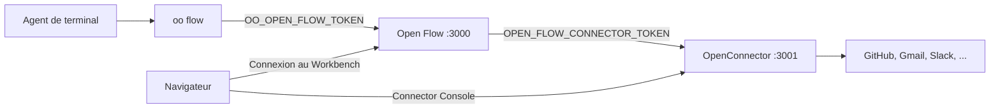

# Utiliser Open Flow avec OpenConnector et oo CLI

[English](README.md) | [简体中文](README.zh-CN.md) | [繁體中文](README.zh-TW.md) | [日本語](README.ja.md) | [한국어](README.ko.md) | [Русский](README.ru.md) | [Français](README.fr.md)

Open Flow peut fonctionner seul. Deux fonctions ont besoin d'autres projets OOMOL :

- Les Actions et les Provider Triggers qui appellent GitHub, Gmail, Slack et des services
  semblables ont besoin d'un Connector. Un
  [OpenConnector](https://github.com/oomol-lab/open-connector) auto-hébergé stocke les identifiants
  des Providers, exécute les Actions et sert la Connector Console où les utilisateurs autorisent
  des comptes.
- Pour créer des Flows depuis un Agent de terminal tel que Codex ou Claude Code, il faut
  `oo flow`. La [oo CLI](https://github.com/oomol-lab/oo-cli) fournit `oo flow` et l'envoie à la
  Control API d'un Open Flow.

Ce guide démarre les trois sur une seule machine avec Docker, les relie et construit un premier
Flow depuis le terminal. Les variables d'environnement sont les mêmes que dans la
[référence de livraison en conteneur](../container-delivery.md#4-配置). Ce guide n'ajoute que
l'ordre des étapes et les valeurs qui doivent correspondre entre les projets.



Définissez ces quatre valeurs :

| Usage                                   | Où la définir                                               | Valeur                                                                    |
| --------------------------------------- | ----------------------------------------------------------- | ------------------------------------------------------------------------- |
| `oo flow` vers la Control API           | `OO_OPEN_FLOW_URL` et `OO_OPEN_FLOW_TOKEN` dans le shell    | Origine de cet Open Flow et la même valeur que son `OPEN_FLOW_TOKEN`      |
| Open Flow vers le runtime Connector     | `OPEN_FLOW_CONNECTOR_ORIGIN` et `OPEN_FLOW_CONNECTOR_TOKEN` | Origine runtime joignable par Open Flow et un runtime token OpenConnector |
| Navigateur vers la Connector Console    | `OPEN_FLOW_CONNECTOR_CONSOLE_ORIGIN`                        | Origine publique de la Web Console OpenConnector                          |
| Navigateur et API admin vers la Console | `OOMOL_CONNECT_ADMIN_TOKEN` sur OpenConnector               | Token admin que les utilisateurs saisissent dans la Console               |

## Prérequis

- [Docker](https://docs.docker.com/get-docker/) et OpenSSL.
- La CLI `oo`. Sur macOS ou Linux :

  ```bash
  curl -fsSL https://cli.oomol.com/install.sh | bash
  ```

  Voir le [README de oo CLI](https://github.com/oomol-lab/oo-cli#install) pour Windows et les
  autres modes d'installation. Votre propre Open Flow n'a besoin ni de `oo login` ni d'un compte
  OOMOL.

- Pour les Providers OAuth tels que Gmail ou Slack, les identifiants de client OAuth des
  applications que vous enregistrez chez ces Providers. GitHub fonctionne avec un personal access
  token et est le premier Provider le plus rapide. Les déploiements Connector hébergés par OOMOL
  incluent des applications OAuth gérées ; un OpenConnector auto-hébergé n'en a pas.

Les exemples publient OpenConnector sur le port hôte `3001` et Open Flow sur le port hôte `3000`,
et placent les deux conteneurs sur un même réseau Docker pour qu'Open Flow joigne le Connector par
nom de conteneur.

## 1. Démarrer OpenConnector

```bash
docker network create oomol

export OOMOL_CONNECT_ADMIN_TOKEN="$(openssl rand -hex 32)"
export OOMOL_CONNECT_ENCRYPTION_KEY="$(openssl rand -hex 32)"

docker run -d \
  --name open-connector \
  --network oomol \
  --publish 3001:3000 \
  --volume open-connector-data:/app/data \
  --env OOMOL_CONNECT_ORIGIN="http://localhost:3001" \
  --env OOMOL_CONNECT_ADMIN_TOKEN="$OOMOL_CONNECT_ADMIN_TOKEN" \
  --env OOMOL_CONNECT_ENCRYPTION_KEY="$OOMOL_CONNECT_ENCRYPTION_KEY" \
  ghcr.io/oomol-lab/open-connector:latest

curl http://localhost:3001/health
```

- `OOMOL_CONNECT_ORIGIN` est l'origine que les navigateurs utilisent pour joindre OpenConnector.
  Les URL de redirection OAuth en sont dérivées, elle doit donc correspondre au port publié.
- `OOMOL_CONNECT_ADMIN_TOKEN` protège l'API admin, `/docs` et la Web Console. Sans lui, quiconque
  peut joindre le port `3001` peut lire et modifier les identifiants.
- `OOMOL_CONNECT_ENCRYPTION_KEY` chiffre les identifiants stockés sur le disque.

Ouvrez `http://localhost:3001`, saisissez le token admin et vérifiez que la Web Console se charge.
La
[référence de configuration OpenConnector](https://github.com/oomol-lab/open-connector/blob/main/docs/configuration.md)
couvre PostgreSQL, le stockage de transit et les autres variables.

## 2. Créer un runtime token pour Open Flow

Open Flow appelle l'API runtime d'OpenConnector sous `/v1` : le catalogue de Providers et
d'Actions, la liste des Connections, l'exécution d'Actions, et `POST /v1/proxy/:service` pour les
Triggers Poll et Integration. Donnez-lui un runtime token de longue durée, pas le token admin. Créez-le
sur la page Access de la Web Console, ou via l'API admin :

```bash
curl -s -X POST http://localhost:3001/api/runtime-tokens \
  -H "authorization: Bearer $OOMOL_CONNECT_ADMIN_TOKEN" \
  -H 'content-type: application/json' \
  -d '{"name":"open-flow","allowedActions":[],"blockedActions":[],"allowedProxies":["*"]}'
```

L'autorisation proxy `*` est pour ce parcours local. En production, listez seulement les Providers
dont vous avez besoin.

La réponse contient le token une seule fois, dans `token`. Enregistrez-le comme
`OPEN_FLOW_CONNECTOR_TOKEN` :

```bash
export OPEN_FLOW_CONNECTOR_TOKEN="<token issu de la réponse>"
```

Règles de token qui comptent pour Open Flow :

- `allowedProxies` est vide par défaut. Un token de longue durée sans droit proxy ne peut pas appeler
  `/v1/proxy/:service`, donc les Triggers Poll et Integration échouent. Autorisez `*`, ou listez
  les Providers dont vous prévoyez d'utiliser les Provider Triggers, par exemple
  `["gmail","github"]`.
- `allowedActions` et `blockedActions` limitent les Actions qu'Open Flow peut exécuter. Des
  listes vides autorisent toutes les Actions permises par la politique de déploiement.
- Laissez `allowedConnections` non défini, sauf si vous voulez limiter Open Flow à des Connections
  précises. Un Connector Node lié à une Connection hors de cette liste échoue avec
  `connector.connection-required`.

Dès qu'un token de longue durée existe, OpenConnector exige un runtime token sur chaque requête `/v1` et
`/mcp`. Les autres appelants du même OpenConnector, comme `oo connector` ou les hôtes MCP, ont
alors besoin de leurs propres tokens.

## 3. Démarrer Open Flow

Construisez l'image depuis la racine du dépôt et démarrez-la sur le même réseau :

```bash
git clone https://github.com/oomol-lab/open-flow.git
cd open-flow

export OPEN_FLOW_TOKEN="$(openssl rand -hex 32)"
docker build --file apps/server/Dockerfile --tag open-flow-server:dev .

docker run -d \
  --name open-flow \
  --network oomol \
  --publish 3000:3000 \
  --volume open-flow-data:/data/open-flow \
  --env OPEN_FLOW_TOKEN="$OPEN_FLOW_TOKEN" \
  --env OPEN_FLOW_CONNECTOR_ORIGIN="http://open-connector:3000" \
  --env OPEN_FLOW_CONNECTOR_TOKEN="$OPEN_FLOW_CONNECTOR_TOKEN" \
  --env OPEN_FLOW_CONNECTOR_CONSOLE_ORIGIN="http://localhost:3001" \
  open-flow-server:dev

ready=0
for i in 1 2 3 4 5 6 7 8 9 10; do
  if curl -sf --max-time 2 http://localhost:3000/readyz; then
    ready=1
    break
  fi
  sleep 1
done
[ "$ready" -eq 1 ]
```

- `OPEN_FLOW_CONNECTOR_ORIGIN` est l'adresse utilisée par le processus Open Flow. Dans le réseau
  `oomol`, c'est le nom du conteneur et le port du conteneur, pas le port publié sur l'hôte.
- `OPEN_FLOW_CONNECTOR_CONSOLE_ORIGIN` est l'adresse qu'ouvrent les navigateurs des utilisateurs.
  Le Workbench pointe vers `<console origin>/providers/<service>` quand un Connector Node ou un
  Provider Trigger a besoin d'un compte. Seuls les hôtes loopback peuvent utiliser HTTP en clair ;
  tout le reste doit être une origine HTTPS sans chemin.
- `/readyz` renvoie `{"status":"ready"}` seulement lorsque Open Flow tourne et que le Connector
  configuré répond à son health check. Un 503 pendant quelques secondes après `docker run -d` est
  normal. S'il persiste, l'origine runtime est en général fausse ou le conteneur n'est pas sur le
  même réseau.

Ouvrez `http://localhost:3000` et connectez-vous avec `OPEN_FLOW_TOKEN`. Le catalogue du Workbench
liste alors les Providers et Actions d'OpenConnector.

## 4. Autoriser un compte

Les Connections vivent dans OpenConnector, pas dans Open Flow. Open Flow ne stocke que des ID de
Connection et ne voit jamais les identifiants des Providers.

Pour GitHub, enregistrez un personal access token via la page GitHub de la Console à
`http://localhost:3001/providers/github`, ou via l'API admin. Après `read -s`, collez le token et
appuyez sur Entrée. Il ne s'affiche pas :

```bash
read -s GITHUB_PAT
curl -s -X PUT http://localhost:3001/api/connections/github \
  -H "authorization: Bearer $OOMOL_CONNECT_ADMIN_TOKEN" \
  -H 'content-type: application/json' \
  --data-binary @- <<EOF
{"authType":"api_key","values":{"apiKey":"${GITHUB_PAT}"}}
EOF
unset GITHUB_PAT
```

Pour les Providers OAuth, configurez d'abord le client OAuth dans la Console, puis autorisez le
compte depuis la page du Provider. Voir le
[guide des identifiants OpenConnector](https://github.com/oomol-lab/open-connector/blob/main/docs/credentials.md)
pour les clients OAuth, les Connections nommées et le renouvellement des tokens.

Vérifiez qu'Open Flow voit la Connection :

```bash
export OO_OPEN_FLOW_URL="http://localhost:3000"
export OO_OPEN_FLOW_TOKEN="$OPEN_FLOW_TOKEN"

oo flow connector connections github
```

## 5. Connecter oo CLI à Open Flow

`oo flow` choisit un Open Flow d'après l'environnement :

- Avec `OO_OPEN_FLOW_URL` et `OO_OPEN_FLOW_TOKEN` tous deux définis, `oo flow` se connecte
  directement à cet Open Flow. Il ne lit ni compte OOMOL, ni Team, ni `OO_ENDPOINT`.
- `OO_OPEN_FLOW_TOKEN` doit égaler l'`OPEN_FLOW_TOKEN` de cet Open Flow. La CLI l'envoie uniquement
  comme Bearer token vers `/v1/` de l'origine choisie.
- Définir une seule des deux variables est une erreur. Désactivez les deux pour revenir à OOMOL
  Hosted.

```bash
export OO_OPEN_FLOW_URL="http://localhost:3000"
export OO_OPEN_FLOW_TOKEN="$OPEN_FLOW_TOKEN"

oo flow --help
oo flow list
```

Pour qu'un Agent IA construise des Flows, démarrez Codex, Claude Code ou un autre Agent de
terminal dans un shell où les deux variables sont exportées. Le skill `oo` fourni avec la CLI
apprend à l'Agent quand et comment appeler `oo flow`. Vous n'avez pas besoin de l'URL d'Open Flow
ni du token dans le prompt.

La liste complète des commandes et les variables d'environnement sont dans la
[référence des commandes oo CLI](https://github.com/oomol-lab/oo-cli/blob/main/docs/commands.md#open-flow).

## 6. Construire un Flow depuis le terminal

Les Flows peuvent être désignés par ID ou par nom exact. Les commandes ci-dessous créent un Draft,
ajoutent un Connector Node lié à la Connection GitHub, le vérifient, l'exécutent et le publient :

```bash
oo flow create "GitHub digest"
oo flow connector search "current user"
oo flow connector add "GitHub digest" github.get_current_user --name me
oo flow check "GitHub digest"
oo flow run "GitHub digest" --wait
oo flow publish "GitHub digest"
oo flow open "GitHub digest"
```

- `connector add` lie la Connection par défaut de l'Action lorsque `--connection` est omis. Passez
  `--connection <alias>` pour choisir une Connection nommée.
- `check` valide la Revision. Que les identifiants fonctionnent, et que le Provider exécute
  vraiment l'Action, n'est testé que par `run`.
- `run --wait` exécute le Draft via OpenConnector et affiche le résultat.
  `oo flow runs events <run>` montre l'historique complet des événements.
- `open` affiche l'URL Workbench du Flow et l'ouvre dans le navigateur. Le token opérateur n'est
  pas placé dans l'URL. Le navigateur se connecte avec sa propre session.

Ajoutez `--json` à n'importe quelle commande pour une sortie machine versionnée. `oo flow node add`,
`oo flow connect`, `oo flow trigger add` et `oo flow apply --file` couvrent les Code Tasks, Edges,
Triggers, et l'écriture d'un Flow depuis un fichier. Voir `oo flow --help`.

## 7. Optionnel : réutiliser le même OpenConnector depuis oo connector

Le même OpenConnector peut aussi servir les commandes `oo connector` hors d'Open Flow. Il faut un
runtime token distinct. Ne réutilisez pas le token Open Flow :

```bash
oo connector login http://localhost:3001 --token <un-autre-runtime-token>
oo connector search "send an email"
```

`oo connector login` n'affecte que les commandes connector et est stocké à part des réglages
`oo flow`. Voir le
[guide du connector auto-hébergé](https://github.com/oomol-lab/oo-cli/blob/main/docs/self-hosted-connector.md).

## Notes pour la production

- Placez la terminaison TLS devant les deux services. `OPEN_FLOW_CONNECTOR_CONSOLE_ORIGIN` et
  `OOMOL_CONNECT_ORIGIN` doivent être l'origine HTTPS publique de la Console, et les deux doivent
  être la même origine, car les redirections OAuth et les liens Workbench l'utilisent. L'origine
  runtime peut rester sur un réseau privé en HTTP. Lorsqu'elle traverse un réseau non fiable,
  protégez le bearer token avec TLS.
- Définissez `OPEN_FLOW_SESSION_COOKIE_SECURE=true` derrière TLS.
- Les Integration Triggers (callbacks de Provider) ont aussi besoin de
  `OPEN_FLOW_INTEGRATION_PUBLIC_ORIGIN` et `OPEN_FLOW_INTEGRATION_CALLBACK_KEY`. Sans eux, Publish
  échoue.
- Injectez chaque token via des secrets ou un fichier env lisible seulement par le déployeur.
  Lorsque vous renouvelez le runtime token OpenConnector depuis la page Access, mettez à jour
  `OPEN_FLOW_CONNECTOR_TOKEN` en même temps.
- Chaque service possède ses propres données : `/data/open-flow` pour Open Flow et `/app/data`
  pour OpenConnector. Sauvegardez-les séparément. Voir la
  [référence de livraison en conteneur](../container-delivery.md#6-持久化与恢复).
- Sur Fly.io, exécutez OpenConnector et Open Flow comme deux apps dans une organisation et
  utilisez le réseau privé Fly pour l'origine runtime, par exemple
  `http://my-open-connector.internal:3000`. Voir le
  [guide de déploiement Fly.io](../fly-io/README.fr.md) et le
  [guide Fly.io d'OpenConnector](https://github.com/oomol-lab/open-connector/blob/main/docs/fly-io.md).

## Dépannage

| Symptôme                                                                    | Cause probable                                                                                                                     |
| --------------------------------------------------------------------------- | ---------------------------------------------------------------------------------------------------------------------------------- |
| `connector.unavailable` dans le Workbench ou la CLI                         | `OPEN_FLOW_CONNECTOR_ORIGIN` est injoignable depuis le conteneur Open Flow, ou OpenConnector a rejeté `OPEN_FLOW_CONNECTOR_TOKEN`. |
| `/readyz` renvoie 503 alors que `/healthz` renvoie 200                      | Le health check du Connector a échoué. Vérifiez `docker logs open-flow` et que les deux conteneurs partagent le réseau.            |
| `connector.connection-required` à l'exécution                               | La Connection est absente, inactive, ou exclue par `allowedConnections` du token. Réautorisez dans la Console.                     |
| Poll ou Integration Trigger échoue alors que les Actions manuelles marchent | Le runtime token n'a pas de droit `allowedProxies` pour ce Provider, ou `OOMOL_CONNECT_BLOCKED_PROXIES` le bloque.                 |
| `oo flow` demande une connexion OOMOL                                       | `OO_OPEN_FLOW_URL` ou `OO_OPEN_FLOW_TOKEN` manque. Les deux doivent être définis dans le même shell.                               |
| `oo flow` renvoie 401                                                       | `OO_OPEN_FLOW_TOKEN` diffère de l'`OPEN_FLOW_TOKEN` de cet Open Flow.                                                              |
| Le lien Workbench vers la Console ouvre un mauvais hôte                     | `OPEN_FLOW_CONNECTOR_CONSOLE_ORIGIN` pointe vers l'adresse du conteneur au lieu de l'origine joignable par les navigateurs.        |
| L'autorisation OAuth revient vers la mauvaise URL                           | `OOMOL_CONNECT_ORIGIN` ne correspond pas à l'origine utilisée par le navigateur pour ouvrir la Console.                            |
