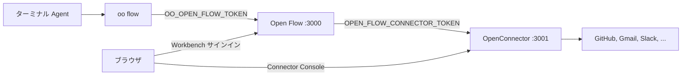

# OpenConnector と oo CLI で Open Flow を使う

[English](README.md) | [简体中文](README.zh-CN.md) | [繁體中文](README.zh-TW.md) | [日本語](README.ja.md) | [한국어](README.ko.md) | [Русский](README.ru.md) | [Français](README.fr.md)

Open Flow は単体でも動作します。次の 2 つの機能には、ほかの OOMOL プロジェクトが必要です。

- GitHub、Gmail、Slack などのサービスを呼び出す Action と Provider Trigger には Connector が必要です。セルフホストの
  [OpenConnector](https://github.com/oomol-lab/open-connector) が Provider の認証情報を保存し、Action を実行し、
  ユーザーがアカウントを認可する Connector Console を提供します。
- Codex や Claude Code などのターミナル Agent から Flow を作るには `oo flow` を使います。`oo flow` は
  [oo CLI](https://github.com/oomol-lab/oo-cli) が提供し、1 つの Open Flow の Control API に接続します。

このガイドでは、Docker を使って 3 つすべてを 1 台のマシンで起動し、それらを接続して、ターミナルから最初の Flow を
作ります。環境変数は[コンテナ配布リファレンス](../container-delivery.md#4-配置)と同じです。このガイドが追加するのは、
操作の順序と、プロジェクト間で一致させなければならない値だけです。



次の 4 つの値を設定してください。

| 用途                                  | 設定場所                                                    | 値                                                                      |
| ------------------------------------- | ----------------------------------------------------------- | ----------------------------------------------------------------------- |
| `oo flow` から Control API へ         | シェルの `OO_OPEN_FLOW_URL` と `OO_OPEN_FLOW_TOKEN`         | Open Flow の origin と、その Open Flow の `OPEN_FLOW_TOKEN` と同じ値    |
| Open Flow から Connector ランタイムへ | `OPEN_FLOW_CONNECTOR_ORIGIN` と `OPEN_FLOW_CONNECTOR_TOKEN` | Open Flow が到達できる runtime origin と OpenConnector の runtime token |
| ブラウザから Connector Console へ     | `OPEN_FLOW_CONNECTOR_CONSOLE_ORIGIN`                        | OpenConnector Web Console の公開 origin                                 |
| ブラウザと admin API から Console へ  | OpenConnector の `OOMOL_CONNECT_ADMIN_TOKEN`                | ユーザーが Console で入力する admin token                               |

## 前提条件

- [Docker](https://docs.docker.com/get-docker/) と OpenSSL。
- `oo` CLI。macOS または Linux では次のとおりです。

  ```bash
  curl -fsSL https://cli.oomol.com/install.sh | bash
  ```

  Windows やその他のインストール方法については [oo CLI README](https://github.com/oomol-lab/oo-cli#install) を
  参照してください。自分で動かしている Open Flow には `oo login` も OOMOL アカウントも必要ありません。

- Gmail や Slack などの OAuth Provider を使う場合は、それらの Provider に登録したアプリの OAuth クライアント認証情報。
  GitHub は personal access token で動作し、最初の Provider として最も手軽です。OOMOL がホストする Connector
  には管理された OAuth アプリが含まれますが、セルフホストの OpenConnector には含まれません。

この例では、OpenConnector をホストのポート `3001` に、Open Flow をホストのポート `3000` に公開し、Open Flow がコンテナ名で
Connector に到達できるよう、両方のコンテナを 1 つの Docker ネットワークに配置します。

## 1. OpenConnector を起動する

```bash
docker network create oomol

export OOMOL_CONNECT_ADMIN_TOKEN="$(openssl rand -hex 32)"
export OOMOL_CONNECT_ENCRYPTION_KEY="$(openssl rand -hex 32)"

docker run -d \
  --name open-connector \
  --network oomol \
  --publish 3001:3000 \
  --volume open-connector-data:/app/data \
  --env OOMOL_CONNECT_ORIGIN="http://localhost:3001" \
  --env OOMOL_CONNECT_ADMIN_TOKEN="$OOMOL_CONNECT_ADMIN_TOKEN" \
  --env OOMOL_CONNECT_ENCRYPTION_KEY="$OOMOL_CONNECT_ENCRYPTION_KEY" \
  ghcr.io/oomol-lab/open-connector:latest

curl http://localhost:3001/health
```

- `OOMOL_CONNECT_ORIGIN` は、ブラウザが OpenConnector に到達するために使う origin です。OAuth のリダイレクト URL は
  ここから作られるため、公開しているポートと一致していなければなりません。
- `OOMOL_CONNECT_ADMIN_TOKEN` は admin API、`/docs`、および Web Console を保護します。これがないと、ポート `3001` に
  到達できる誰もが認証情報を読み取り、変更できてしまいます。
- `OOMOL_CONNECT_ENCRYPTION_KEY` はディスクに保存する認証情報を暗号化します。

`http://localhost:3001` を開き、admin token を入力して、Web Console が読み込まれることを確認します。PostgreSQL、転送用
ストレージ、その他の変数については
[OpenConnector 設定リファレンス](https://github.com/oomol-lab/open-connector/blob/main/docs/configuration.md)
を参照してください。

## 2. Open Flow 用の runtime token を作成する

Open Flow は `/v1` 配下の OpenConnector runtime API を呼び出します。具体的には、Provider と Action のカタログ、
Connection の一覧、Action の実行、そして Poll Trigger と Integration Trigger のための `POST /v1/proxy/:service` です。
admin token ではなく、長く使う runtime token を Open Flow に渡してください。Web Console の Access ページ、または admin API で
作成します。

```bash
curl -s -X POST http://localhost:3001/api/runtime-tokens \
  -H "authorization: Bearer $OOMOL_CONNECT_ADMIN_TOKEN" \
  -H 'content-type: application/json' \
  -d '{"name":"open-flow","allowedActions":[],"blockedActions":[],"allowedProxies":["*"]}'
```

`*` の proxy 許可はこのローカル手順用です。本番では実際に使う Provider だけを列挙してください。

レスポンスには token が `token` として 1 回だけ含まれます。これを `OPEN_FLOW_CONNECTOR_TOKEN` として保存します。

```bash
export OPEN_FLOW_CONNECTOR_TOKEN="<レスポンスに含まれる token>"
```

Open Flow に関係する token の規則は次のとおりです。

- `allowedProxies` はデフォルトで空です。proxy の許可がない長期 token は `/v1/proxy/:service` を呼び出せません。
  その場合、Poll Trigger と Integration Trigger は失敗します。`*` を許可するか、Provider Trigger を使う予定の Provider を
  列挙してください。たとえば `["gmail","github"]` のようにします。
- `allowedActions` と `blockedActions` は、Open Flow が実行できる Action を制限します。空のリストは、デプロイの
  ポリシーが許可するすべての Action を許可します。
- Open Flow を特定の Connection に限定したい場合を除き、`allowedConnections` は設定しないでください。許可範囲外の
  Connection にバインドされた Connector Node は `connector.connection-required` で失敗します。

長期 token を 1 つでも作ると、OpenConnector はすべての `/v1` と `/mcp` リクエストに runtime token を要求します。
`oo connector` や MCP ホストなど、同じ OpenConnector を使う他の呼び出し元は、それ以降それぞれ独自の token が必要になります。

## 3. Open Flow を起動する

リポジトリのルートからイメージをビルドし、同じネットワーク上で起動します。

```bash
git clone https://github.com/oomol-lab/open-flow.git
cd open-flow

export OPEN_FLOW_TOKEN="$(openssl rand -hex 32)"
docker build --file apps/server/Dockerfile --tag open-flow-server:dev .

docker run -d \
  --name open-flow \
  --network oomol \
  --publish 3000:3000 \
  --volume open-flow-data:/data/open-flow \
  --env OPEN_FLOW_TOKEN="$OPEN_FLOW_TOKEN" \
  --env OPEN_FLOW_CONNECTOR_ORIGIN="http://open-connector:3000" \
  --env OPEN_FLOW_CONNECTOR_TOKEN="$OPEN_FLOW_CONNECTOR_TOKEN" \
  --env OPEN_FLOW_CONNECTOR_CONSOLE_ORIGIN="http://localhost:3001" \
  open-flow-server:dev

ready=0
for i in 1 2 3 4 5 6 7 8 9 10; do
  if curl -sf --max-time 2 http://localhost:3000/readyz; then
    ready=1
    break
  fi
  sleep 1
done
[ "$ready" -eq 1 ]
```

- `OPEN_FLOW_CONNECTOR_ORIGIN` は Open Flow プロセスが使うアドレスです。`oomol` ネットワーク内では、公開されたホストの
  ポートではなく、コンテナ名とコンテナのポートになります。
- `OPEN_FLOW_CONNECTOR_CONSOLE_ORIGIN` はユーザーのブラウザが開くアドレスです。Connector Node や Provider Trigger が
  アカウントを必要とするとき、Workbench は `<console origin>/providers/<service>` にリンクします。平文の HTTP を使えるのは
  loopback ホストだけで、それ以外はパスを含まない HTTPS origin でなければなりません。
- `/readyz` が `{"status":"ready"}` を返すのは、Open Flow が動作しており、設定された Connector がヘルスチェックに応答する
  場合だけです。`docker run -d` の直後に数秒 503 が返るのは普通です。それが続く場合、通常は runtime origin が誤っているか、
  コンテナが同じネットワークにありません。

`http://localhost:3000` を開き、`OPEN_FLOW_TOKEN` でサインインします。Workbench のカタログに OpenConnector の Provider と
Action が表示されるようになります。

## 4. アカウントを認可する

Connection は Open Flow ではなく OpenConnector にあります。Open Flow が保存するのは Connection の ID だけで、
Provider の認証情報を見ることはありません。

GitHub の場合は、Console の GitHub ページ `http://localhost:3001/providers/github`、または admin API から personal access
token を保存します。`read -s` のあと token を貼り付けて Enter を押してください。画面には表示されません。

```bash
read -s GITHUB_PAT
curl -s -X PUT http://localhost:3001/api/connections/github \
  -H "authorization: Bearer $OOMOL_CONNECT_ADMIN_TOKEN" \
  -H 'content-type: application/json' \
  --data-binary @- <<EOF
{"authType":"api_key","values":{"apiKey":"${GITHUB_PAT}"}}
EOF
unset GITHUB_PAT
```

OAuth Provider の場合は、まず Console で OAuth クライアントを設定し、その後 Provider ページからアカウントを認可します。
OAuth クライアント、名前付き Connection、token の更新については
[OpenConnector 認証情報ガイド](https://github.com/oomol-lab/open-connector/blob/main/docs/credentials.md)
を参照してください。

Open Flow から Connection が見えることを確認します。

```bash
export OO_OPEN_FLOW_URL="http://localhost:3000"
export OO_OPEN_FLOW_TOKEN="$OPEN_FLOW_TOKEN"

oo flow connector connections github
```

## 5. oo CLI を Open Flow に向ける

`oo flow` は環境変数から Open Flow を選びます。

- `OO_OPEN_FLOW_URL` と `OO_OPEN_FLOW_TOKEN` の両方が設定されている場合、`oo flow` はその Open Flow に直接
  接続します。OOMOL アカウント、Team、`OO_ENDPOINT` は読み取りません。
- `OO_OPEN_FLOW_TOKEN` はその Open Flow の `OPEN_FLOW_TOKEN` と同じ値でなければなりません。CLI はこれを、選択した origin の
  `/v1/` への Bearer token としてのみ送信します。
- 2 つの変数のうち片方だけを設定するとエラーになります。両方を解除すると OOMOL Hosted に戻ります。

```bash
export OO_OPEN_FLOW_URL="http://localhost:3000"
export OO_OPEN_FLOW_TOKEN="$OPEN_FLOW_TOKEN"

oo flow --help
oo flow list
```

AI Agent に Flow を作らせるには、両方の変数がエクスポートされたシェルで Codex、Claude Code、または他のターミナル Agent を
起動します。CLI に同梱されている `oo` skill が、いつどのように `oo flow` を呼び出すかを Agent に教えるため、プロンプトに
Open Flow の URL や token を含める必要はありません。

コマンドの全一覧と環境変数は
[oo CLI コマンドリファレンス](https://github.com/oomol-lab/oo-cli/blob/main/docs/commands.md#open-flow) にあります。

## 6. ターミナルから Flow を作る

Flow は ID または正確な名前で参照できます。次のコマンドは Draft を作成し、GitHub の Connection にバインドされた Connector
Node を追加し、確認し、実行し、公開します。

```bash
oo flow create "GitHub digest"
oo flow connector search "current user"
oo flow connector add "GitHub digest" github.get_current_user --name me
oo flow check "GitHub digest"
oo flow run "GitHub digest" --wait
oo flow publish "GitHub digest"
oo flow open "GitHub digest"
```

- `connector add` は、`--connection` を省略すると Action のデフォルトの Connection をバインドします。名前付きの Connection を
  選ぶには `--connection <alias>` を渡します。
- `check` は Revision が正しいかを確認します。認証情報が使えるか、Provider 側で実際に実行されるかは、`run` でのみ分かります。
- `run --wait` は OpenConnector に対して Draft を実行し、結果を出力します。`oo flow runs events <run>` で完全なイベント履歴を
  確認できます。
- `open` は Flow の Workbench URL を出力し、ブラウザで開きます。operator token は URL に含まれず、ブラウザは自身のセッションで
  サインインします。

任意のコマンドに `--json` を追加すると、バージョン付きの機械可読出力が得られます。`oo flow node add`、`oo flow connect`、
`oo flow trigger add`、`oo flow apply --file` は Code Task、Edge、Trigger、およびファイルからの Flow 作成に使います。
`oo flow --help` を参照してください。

## 7. 任意: oo connector から同じ OpenConnector を使う

同じ OpenConnector は、Open Flow の外でも `oo connector` コマンドに利用できます。別の runtime token が必要です。
Open Flow の token は再利用しないでください。

```bash
oo connector login http://localhost:3001 --token <別の runtime token>
oo connector search "send an email"
```

`oo connector login` は connector コマンドにのみ影響し、`oo flow` の設定とは別に保存されます。
[セルフホスト Connector ガイド](https://github.com/oomol-lab/oo-cli/blob/main/docs/self-hosted-connector.md) を参照してください。

## 本番環境に関する注意

- 両方のサービスの前段で TLS を終端します。`OPEN_FLOW_CONNECTOR_CONSOLE_ORIGIN` と `OOMOL_CONNECT_ORIGIN` は Console の公開
  HTTPS origin でなければならず、OAuth のリダイレクトと Workbench のリンクがこれを使うため、両方が同じ origin である必要が
  あります。runtime origin はプライベートネットワーク内で HTTP のままでも構いません。信頼できないネットワークを越える場合は
  bearer token を TLS で保護してください。
- TLS の背後では `OPEN_FLOW_SESSION_COOKIE_SECURE=true` を設定します。
- Integration Trigger (Provider の callback) には、さらに `OPEN_FLOW_INTEGRATION_PUBLIC_ORIGIN` と
  `OPEN_FLOW_INTEGRATION_CALLBACK_KEY` が必要です。これらがないと Publish は失敗します。
- すべての token は、secret またはデプロイ担当者だけが読める env ファイルを通じて渡してください。OpenConnector の runtime
  token を Access ページで更新するときは、`OPEN_FLOW_CONNECTOR_TOKEN` も合わせて更新します。
- 各サービスはそれぞれ独自のデータを持ちます。Open Flow は `/data/open-flow`、OpenConnector は `/app/data` です。
  それぞれ別々にバックアップしてください。[コンテナ配布リファレンス](../container-delivery.md#6-持久化与恢复) を参照してください。
- Fly.io では、OpenConnector と Open Flow を 1 つの organization 内の 2 つの app として実行し、runtime origin には Fly の
  プライベートネットワーク、たとえば `http://my-open-connector.internal:3000` を使用します。
  [Fly.io デプロイガイド](../fly-io/README.ja.md) と
  [OpenConnector Fly.io ガイド](https://github.com/oomol-lab/open-connector/blob/main/docs/fly-io.md) を参照してください。

## トラブルシューティング

| 症状                                                                            | 考えられる原因                                                                                                                             |
| ------------------------------------------------------------------------------- | ------------------------------------------------------------------------------------------------------------------------------------------ |
| Workbench または CLI で `connector.unavailable` が出る                          | Open Flow コンテナから `OPEN_FLOW_CONNECTOR_ORIGIN` に到達できないか、OpenConnector が `OPEN_FLOW_CONNECTOR_TOKEN` を拒否しました。        |
| `/readyz` が 503 を返し、`/healthz` は 200 を返す                               | Connector のヘルスチェックが失敗しました。`docker logs open-flow` を確認し、両方のコンテナが同じネットワークにあることを確認してください。 |
| 実行時に `connector.connection-required` が出る                                 | Connection が存在しないか、無効か、token の `allowedConnections` によって除外されています。Console で再認可してください。                  |
| 手動の Action は動作するのに Poll Trigger または Integration Trigger が失敗する | runtime token にその Provider の `allowedProxies` 許可がないか、`OOMOL_CONNECT_BLOCKED_PROXIES` がブロックしています。                     |
| `oo flow` が OOMOL へのログインを求める                                         | `OO_OPEN_FLOW_URL` または `OO_OPEN_FLOW_TOKEN` がありません。両方を同じシェルで設定する必要があります。                                    |
| `oo flow` が 401 を返す                                                         | `OO_OPEN_FLOW_TOKEN` がその Open Flow の `OPEN_FLOW_TOKEN` と異なります。                                                                  |
| Workbench から Console へのリンクが誤ったホストを開く                           | `OPEN_FLOW_CONNECTOR_CONSOLE_ORIGIN` が、ブラウザが到達できる origin ではなくコンテナのアドレスを指しています。                            |
| OAuth 認可が誤った URL に戻る                                                   | `OOMOL_CONNECT_ORIGIN` が、ブラウザが Console を開くときに使った origin と一致していません。                                               |
