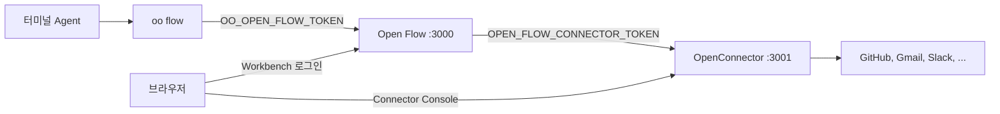

# OpenConnector와 oo CLI로 Open Flow 사용하기

[English](README.md) | [简体中文](README.zh-CN.md) | [繁體中文](README.zh-TW.md) | [日本語](README.ja.md) | [한국어](README.ko.md) | [Русский](README.ru.md) | [Français](README.fr.md)

Open Flow는 단독으로 실행할 수 있습니다. 다음 두 기능에는 다른 OOMOL 프로젝트가 필요합니다.

- GitHub, Gmail, Slack 같은 서비스를 호출하는 Action과 Provider Trigger에는 Connector가 필요합니다. 자체 호스팅한
  [OpenConnector](https://github.com/oomol-lab/open-connector)가 Provider 자격 증명을 보관하고, Action을
  실행하며, 사용자가 계정을 연결하는 Connector Console을 제공합니다.
- Codex나 Claude Code 같은 터미널 Agent에서 Flow를 만들려면 `oo flow`를 사용합니다. `oo flow`는
  [oo CLI](https://github.com/oomol-lab/oo-cli)가 제공하며 하나의 Open Flow의 Control API에 연결합니다.

이 가이드는 Docker로 한 대의 컴퓨터에서 세 가지를 모두 시작하고, 서로 연결한 뒤, 터미널에서 첫 Flow를 만듭니다.
환경 변수는 [컨테이너 배포 참조](../container-delivery.md#4-配置)와 동일합니다. 이 가이드는 작업 순서와
프로젝트 간에 일치해야 하는 값만 추가로 설명합니다.



다음 네 값을 설정하세요.

| 용도                               | 설정 위치                                                  | 값                                                                      |
| ---------------------------------- | ---------------------------------------------------------- | ----------------------------------------------------------------------- |
| `oo flow`에서 Control API로        | 셸의 `OO_OPEN_FLOW_URL`과 `OO_OPEN_FLOW_TOKEN`             | Open Flow origin과 그 Open Flow의 `OPEN_FLOW_TOKEN`과 같은 값           |
| Open Flow에서 Connector 런타임으로 | `OPEN_FLOW_CONNECTOR_ORIGIN`과 `OPEN_FLOW_CONNECTOR_TOKEN` | Open Flow가 접근할 수 있는 runtime origin과 OpenConnector runtime token |
| 브라우저에서 Connector Console로   | `OPEN_FLOW_CONNECTOR_CONSOLE_ORIGIN`                       | OpenConnector Web Console의 공개 origin                                 |
| 브라우저와 admin API에서 Console로 | OpenConnector의 `OOMOL_CONNECT_ADMIN_TOKEN`                | 사용자가 Console에 입력하는 admin token                                 |

## 사전 요구 사항

- [Docker](https://docs.docker.com/get-docker/)와 OpenSSL.
- `oo` CLI. macOS 또는 Linux에서는 다음과 같이 설치합니다.

  ```bash
  curl -fsSL https://cli.oomol.com/install.sh | bash
  ```

  Windows와 그 밖의 설치 방법은 [oo CLI README](https://github.com/oomol-lab/oo-cli#install)를 참고하세요.
  직접 실행 중인 Open Flow에는 `oo login`이나 OOMOL 계정이 필요 없습니다.

- Gmail이나 Slack 같은 OAuth Provider를 사용하려면 해당 Provider에 등록한 앱의 OAuth 클라이언트 자격 증명이
  필요합니다. GitHub는 personal access token으로 동작하므로 첫 Provider로 가장 빠르게 시작할 수 있습니다.
  OOMOL이 호스팅하는 Connector에는 관리형 OAuth App이 포함되지만, 자체 호스팅 OpenConnector에는 포함되지
  않습니다.

예제에서는 OpenConnector를 호스트 포트 `3001`에, Open Flow를 호스트 포트 `3000`에 공개하고, Open Flow가 컨테이너
이름으로 Connector에 접근할 수 있도록 두 컨테이너를 하나의 Docker 네트워크에 넣습니다.

## 1. OpenConnector 시작하기

```bash
docker network create oomol

export OOMOL_CONNECT_ADMIN_TOKEN="$(openssl rand -hex 32)"
export OOMOL_CONNECT_ENCRYPTION_KEY="$(openssl rand -hex 32)"

docker run -d \
  --name open-connector \
  --network oomol \
  --publish 3001:3000 \
  --volume open-connector-data:/app/data \
  --env OOMOL_CONNECT_ORIGIN="http://localhost:3001" \
  --env OOMOL_CONNECT_ADMIN_TOKEN="$OOMOL_CONNECT_ADMIN_TOKEN" \
  --env OOMOL_CONNECT_ENCRYPTION_KEY="$OOMOL_CONNECT_ENCRYPTION_KEY" \
  ghcr.io/oomol-lab/open-connector:latest

curl http://localhost:3001/health
```

- `OOMOL_CONNECT_ORIGIN`은 브라우저가 OpenConnector에 접근할 때 쓰는 origin입니다. OAuth 리디렉션 URL이
  여기에서 만들어지므로 공개한 포트와 같아야 합니다.
- `OOMOL_CONNECT_ADMIN_TOKEN`은 admin API, `/docs`, Web Console을 보호합니다. 설정하지 않으면 포트 `3001`에
  접근할 수 있는 누구나 자격 증명을 읽고 바꿀 수 있습니다.
- `OOMOL_CONNECT_ENCRYPTION_KEY`는 디스크에 저장되는 자격 증명을 암호화합니다.

`http://localhost:3001`을 열고 admin token을 입력한 뒤 Web Console이 로드되는지 확인하세요. PostgreSQL, 전송
저장소, 나머지 변수는
[OpenConnector 구성 참조](https://github.com/oomol-lab/open-connector/blob/main/docs/configuration.md)를
참고하세요.

## 2. Open Flow용 runtime token 만들기

Open Flow는 `/v1` 아래의 OpenConnector runtime API를 호출합니다. Provider와 Action 목록, Connection
목록, Action 실행, Poll 및 Integration Trigger용 `POST /v1/proxy/:service`입니다. admin token 대신 오래 쓰는
runtime token을 주세요. Web Console의 Access 페이지나 admin API로 만들 수 있습니다.

```bash
curl -s -X POST http://localhost:3001/api/runtime-tokens \
  -H "authorization: Bearer $OOMOL_CONNECT_ADMIN_TOKEN" \
  -H 'content-type: application/json' \
  -d '{"name":"open-flow","allowedActions":[],"blockedActions":[],"allowedProxies":["*"]}'
```

`*` proxy 권한은 이 로컬 절차용입니다. 운영 환경에서는 실제로 쓰는 Provider만 나열하세요.

응답의 `token` 필드는 이번에만 반환됩니다. 이 값을 `OPEN_FLOW_CONNECTOR_TOKEN`으로 저장하세요.

```bash
export OPEN_FLOW_CONNECTOR_TOKEN="<응답에 포함된 token>"
```

Open Flow에 해당하는 token 규칙:

- `allowedProxies`는 기본적으로 비어 있습니다. proxy 권한이 없는 장기 token은 `/v1/proxy/:service`를 호출할 수
  없어 Poll과 Integration Trigger가 실패합니다. `*`을 허용하거나, Provider Trigger를 쓸 Provider를 나열하세요.
  예: `["gmail","github"]`.
- `allowedActions`와 `blockedActions`는 Open Flow가 실행할 수 있는 Action을 제한합니다. 빈 목록은 배포 정책이
  허용하는 모든 Action을 허용합니다.
- Open Flow를 특정 Connection으로 제한하려는 경우가 아니면 `allowedConnections`를 설정하지 마세요. 목록 밖
  Connection에 묶인 Connector Node는 `connector.connection-required`로 실패합니다.

장기 token을 하나라도 만들면 OpenConnector는 모든 `/v1`과 `/mcp` 요청에 runtime token을 요구합니다. 같은
OpenConnector를 쓰는 `oo connector`나 MCP 호스트도 이후에는 각자 token이 필요합니다.

## 3. Open Flow 시작하기

저장소 루트에서 이미지를 빌드하고 같은 네트워크에서 시작합니다.

```bash
git clone https://github.com/oomol-lab/open-flow.git
cd open-flow

export OPEN_FLOW_TOKEN="$(openssl rand -hex 32)"
docker build --file apps/server/Dockerfile --tag open-flow-server:dev .

docker run -d \
  --name open-flow \
  --network oomol \
  --publish 3000:3000 \
  --volume open-flow-data:/data/open-flow \
  --env OPEN_FLOW_TOKEN="$OPEN_FLOW_TOKEN" \
  --env OPEN_FLOW_CONNECTOR_ORIGIN="http://open-connector:3000" \
  --env OPEN_FLOW_CONNECTOR_TOKEN="$OPEN_FLOW_CONNECTOR_TOKEN" \
  --env OPEN_FLOW_CONNECTOR_CONSOLE_ORIGIN="http://localhost:3001" \
  open-flow-server:dev

ready=0
for i in 1 2 3 4 5 6 7 8 9 10; do
  if curl -sf --max-time 2 http://localhost:3000/readyz; then
    ready=1
    break
  fi
  sleep 1
done
[ "$ready" -eq 1 ]
```

- `OPEN_FLOW_CONNECTOR_ORIGIN`은 Open Flow 프로세스가 사용하는 주소입니다. `oomol` 네트워크 안에서는 호스트에 공개한
  포트가 아니라 컨테이너 이름과 컨테이너 포트입니다.
- `OPEN_FLOW_CONNECTOR_CONSOLE_ORIGIN`은 사용자 브라우저가 여는 주소입니다. Connector Node나 Provider Trigger가
  계정을 필요로 할 때 Workbench는 `<console origin>/providers/<service>`로 연결합니다. 평문 HTTP는 loopback
  호스트만 사용할 수 있으며, 그 외에는 path가 없는 HTTPS origin이어야 합니다.
- `/readyz`는 Open Flow가 실행 중이고 설정한 Connector가 헬스 체크에 응답할 때만 `{"status":"ready"}`를 반환합니다.
  `docker run -d` 직후 몇 초 동안 503이 나오는 것은 정상입니다. 계속되면 보통 runtime origin이 잘못되었거나 컨테이너가
  같은 네트워크에 없는 경우입니다.

`http://localhost:3000`을 열고 `OPEN_FLOW_TOKEN`으로 로그인하세요. Workbench 목록에 OpenConnector의 Provider와
Action이 나타납니다.

## 4. 계정 연결하기

Connection은 Open Flow가 아니라 OpenConnector에 저장됩니다. Open Flow는 Connection ID만 저장하며 Provider 자격
증명을 보지 않습니다.

GitHub의 경우 Console의 GitHub 페이지 `http://localhost:3001/providers/github` 또는 admin API로 personal access
token을 저장합니다. `read -s` 다음에 token을 붙여넣고 Enter를 누르세요. 화면에 표시되지 않습니다.

```bash
read -s GITHUB_PAT
curl -s -X PUT http://localhost:3001/api/connections/github \
  -H "authorization: Bearer $OOMOL_CONNECT_ADMIN_TOKEN" \
  -H 'content-type: application/json' \
  --data-binary @- <<EOF
{"authType":"api_key","values":{"apiKey":"${GITHUB_PAT}"}}
EOF
unset GITHUB_PAT
```

OAuth Provider는 먼저 Console에서 OAuth 클라이언트를 설정한 뒤 Provider 페이지에서 계정을 연결하세요. OAuth
클라이언트, 이름이 있는 Connection, token 갱신은
[OpenConnector 자격 증명 가이드](https://github.com/oomol-lab/open-connector/blob/main/docs/credentials.md)를
참고하세요.

Open Flow가 이 Connection을 볼 수 있는지 확인합니다.

```bash
export OO_OPEN_FLOW_URL="http://localhost:3000"
export OO_OPEN_FLOW_TOKEN="$OPEN_FLOW_TOKEN"

oo flow connector connections github
```

## 5. oo CLI를 Open Flow에 연결하기

`oo flow`는 환경 변수로 Open Flow를 고릅니다.

- `OO_OPEN_FLOW_URL`과 `OO_OPEN_FLOW_TOKEN`을 모두 설정하면 `oo flow`는 그 Open Flow에 직접 연결합니다.
  OOMOL 계정, Team, `OO_ENDPOINT`는 읽지 않습니다.
- `OO_OPEN_FLOW_TOKEN`은 그 Open Flow의 `OPEN_FLOW_TOKEN`과 같아야 합니다. CLI는 선택한 origin의 `/v1/`에 Bearer
  token으로만 보냅니다.
- 둘 중 하나만 설정하면 오류입니다. 둘 다 해제하면 OOMOL Hosted로 돌아갑니다.

```bash
export OO_OPEN_FLOW_URL="http://localhost:3000"
export OO_OPEN_FLOW_TOKEN="$OPEN_FLOW_TOKEN"

oo flow --help
oo flow list
```

AI Agent가 Flow를 만들게 하려면 두 변수가 내보내진 셸에서 Codex, Claude Code 또는 다른 터미널 Agent를 시작하세요.
CLI에 포함된 `oo` skill이 Agent에게 `oo flow`를 언제, 어떻게 호출할지 알려 주므로 prompt에 Open Flow URL이나 token을
넣을 필요가 없습니다.

전체 명령과 환경 변수는
[oo CLI 명령 참조](https://github.com/oomol-lab/oo-cli/blob/main/docs/commands.md#open-flow)에 있습니다.

## 6. 터미널에서 Flow 만들기

Flow는 ID 또는 정확한 이름으로 지정할 수 있습니다. 아래 명령은 Draft를 만들고, GitHub Connection에 묶인 Connector
Node를 추가한 뒤 검사, 실행, 게시합니다.

```bash
oo flow create "GitHub digest"
oo flow connector search "current user"
oo flow connector add "GitHub digest" github.get_current_user --name me
oo flow check "GitHub digest"
oo flow run "GitHub digest" --wait
oo flow publish "GitHub digest"
oo flow open "GitHub digest"
```

- `--connection`을 생략하면 `connector add`는 해당 Action의 기본 Connection을 묶습니다. 이름이 있는 Connection을
  고르려면 `--connection <alias>`를 넘기세요.
- `check`는 Revision이 올바른지 검사합니다. 자격 증명이 동작하는지, Provider에서 실제로 실행되는지는 `run`만
  확인합니다.
- `run --wait`는 OpenConnector를 통해 Draft를 실행하고 결과를 출력합니다. `oo flow runs events <run>`은 전체
  이벤트 기록을 보여 줍니다.
- `open`은 해당 Flow의 Workbench URL을 출력하고 브라우저에서 엽니다. operator token은 URL에 넣지 않으며, 브라우저는
  자신의 session으로 로그인합니다.

어떤 명령이든 `--json`을 붙이면 버전이 있는 기계 판독 출력을 얻습니다. `oo flow node add`, `oo flow connect`,
`oo flow trigger add`, `oo flow apply --file`은 Code Task, Edge, Trigger, 파일에서 Flow 쓰기에 사용합니다.
`oo flow --help`를 참고하세요.

## 7. 선택: oo connector에서 같은 OpenConnector 사용하기

같은 OpenConnector는 Open Flow 밖에서도 `oo connector` 명령에 쓸 수 있습니다. 별도의 runtime token이 필요합니다.
Open Flow token을 재사용하지 마세요.

```bash
oo connector login http://localhost:3001 --token <다른 runtime token>
oo connector search "send an email"
```

`oo connector login`은 connector 명령에만 영향을 주며 `oo flow` 설정과 따로 저장됩니다.
[자체 호스팅 connector 가이드](https://github.com/oomol-lab/oo-cli/blob/main/docs/self-hosted-connector.md)를
참고하세요.

## 운영 환경 참고 사항

- 두 서비스 앞에서 TLS를 종료하세요. `OPEN_FLOW_CONNECTOR_CONSOLE_ORIGIN`과 `OOMOL_CONNECT_ORIGIN`은 Console의
  공개 HTTPS origin이어야 하고, OAuth 리디렉션과 Workbench 링크가 이를 사용하므로 둘은 같은 origin이어야 합니다.
  runtime origin은 사설 네트워크에서 HTTP로 둘 수 있습니다. 신뢰할 수 없는 네트워크를 지날 때는 bearer token을
  TLS로 보호하세요.
- TLS 뒤에는 `OPEN_FLOW_SESSION_COOKIE_SECURE=true`를 설정하세요.
- Integration Trigger (Provider 콜백)에는 `OPEN_FLOW_INTEGRATION_PUBLIC_ORIGIN`과
  `OPEN_FLOW_INTEGRATION_CALLBACK_KEY`도 필요합니다. 없으면 Publish가 실패합니다.
- 모든 token은 secret 또는 배포자만 읽을 수 있는 env 파일로 넣으세요. Access 페이지에서 OpenConnector runtime
  token을 바꿀 때 `OPEN_FLOW_CONNECTOR_TOKEN`도 함께 갱신하세요.
- 각 서비스는 자신의 데이터를 가집니다. Open Flow는 `/data/open-flow`, OpenConnector는 `/app/data`입니다. 따로
  백업하세요. [컨테이너 배포 참조](../container-delivery.md#6-持久化与恢复)를 참고하세요.
- Fly.io에서는 OpenConnector와 Open Flow를 한 organization 안의 두 app으로 실행하고, runtime origin에는 Fly 사설
  네트워크를 사용하세요. 예: `http://my-open-connector.internal:3000`.
  [Fly.io 배포 가이드](../fly-io/README.ko.md)와
  [OpenConnector Fly.io 가이드](https://github.com/oomol-lab/open-connector/blob/main/docs/fly-io.md)를
  참고하세요.

## 문제 해결

| 증상                                                    | 가능한 원인                                                                                                                 |
| ------------------------------------------------------- | --------------------------------------------------------------------------------------------------------------------------- |
| Workbench 또는 CLI에서 `connector.unavailable`          | Open Flow 컨테이너가 `OPEN_FLOW_CONNECTOR_ORIGIN`에 닿지 않거나 OpenConnector가 `OPEN_FLOW_CONNECTOR_TOKEN`을 거절했습니다. |
| `/readyz`가 503을 반환하고 `/healthz`는 200             | Connector 헬스 체크가 실패했습니다. `docker logs open-flow`를 확인하고 두 컨테이너가 같은 네트워크에 있는지 확인하세요.     |
| 실행 시 `connector.connection-required`                 | Connection이 없거나, 비활성이거나, token의 `allowedConnections`에서 제외되었습니다. Console에서 다시 연결하세요.            |
| 수동 Action은 되는데 Poll 또는 Integration Trigger 실패 | runtime token에 해당 Provider의 `allowedProxies` 권한이 없거나 `OOMOL_CONNECT_BLOCKED_PROXIES`가 막고 있습니다.             |
| `oo flow`가 OOMOL 로그인을 요구함                       | `OO_OPEN_FLOW_URL` 또는 `OO_OPEN_FLOW_TOKEN`이 없습니다. 둘 다 같은 셸에서 설정해야 합니다.                                 |
| `oo flow`가 401을 반환함                                | `OO_OPEN_FLOW_TOKEN`이 그 Open Flow의 `OPEN_FLOW_TOKEN`과 다릅니다.                                                         |
| Workbench의 Console 링크가 잘못된 호스트를 엽니다       | `OPEN_FLOW_CONNECTOR_CONSOLE_ORIGIN`이 브라우저가 접근할 수 있는 origin이 아니라 컨테이너 주소를 가리킵니다.                |
| OAuth 인증이 잘못된 URL로 돌아옴                        | `OOMOL_CONNECT_ORIGIN`이 브라우저가 Console을 열 때 사용한 origin과 다릅니다.                                               |
