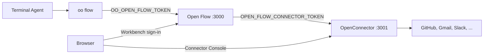

# Use Open Flow with OpenConnector and oo CLI

[English](README.md) | [简体中文](README.zh-CN.md) | [繁體中文](README.zh-TW.md) | [日本語](README.ja.md) | [한국어](README.ko.md) | [Русский](README.ru.md) | [Français](README.fr.md)

Open Flow can run on its own. Two features need other OOMOL projects:

- Actions and Provider Triggers that call GitHub, Gmail, Slack, and similar services need a
  Connector. A self-hosted
  [OpenConnector](https://github.com/oomol-lab/open-connector) stores provider credentials, runs
  Actions, and serves the Connector Console where users authorize accounts.
- Building Flows from a terminal Agent such as Codex or Claude Code goes through `oo flow`. The
  [oo CLI](https://github.com/oomol-lab/oo-cli) provides `oo flow` and sends it to the Control API of
  one Open Flow.

This guide starts all three on one machine with Docker, connects them, and builds a first Flow from
the terminal. The environment variables match the
[container delivery reference](../container-delivery.md#4-配置). This guide only adds the order of
steps and the values that must match across the projects.



Set these four values:

| What                                 | Where                                                        | Value                                                                     |
| ------------------------------------ | ------------------------------------------------------------ | ------------------------------------------------------------------------- |
| `oo flow` to the Control API         | `OO_OPEN_FLOW_URL` and `OO_OPEN_FLOW_TOKEN` in the shell     | Open Flow origin and the same value as that Open Flow's `OPEN_FLOW_TOKEN` |
| Open Flow to the Connector runtime   | `OPEN_FLOW_CONNECTOR_ORIGIN` and `OPEN_FLOW_CONNECTOR_TOKEN` | Runtime origin Open Flow can reach and an OpenConnector runtime token     |
| Browser to the Connector Console     | `OPEN_FLOW_CONNECTOR_CONSOLE_ORIGIN`                         | Public origin of the OpenConnector Web Console                            |
| Browser and admin API to the Console | `OOMOL_CONNECT_ADMIN_TOKEN` on OpenConnector                 | Admin token users enter in the Console                                    |

## Prerequisites

- [Docker](https://docs.docker.com/get-docker/) and OpenSSL.
- The `oo` CLI. On macOS or Linux:

  ```bash
  curl -fsSL https://cli.oomol.com/install.sh | bash
  ```

  See the [oo CLI README](https://github.com/oomol-lab/oo-cli#install) for Windows and other
  install paths. Your own Open Flow does not need `oo login` or an OOMOL account.

- For OAuth providers such as Gmail or Slack, OAuth client credentials from apps you register with
  those providers. GitHub works with a personal access token and is the quickest first provider.
  OOMOL-hosted Connector deployments include managed OAuth apps; self-hosted OpenConnector does not.

The examples publish OpenConnector on host port `3001` and Open Flow on host port `3000`, and put
both containers on one Docker network so Open Flow can reach the Connector by container name.

## 1. Start OpenConnector

```bash
docker network create oomol

export OOMOL_CONNECT_ADMIN_TOKEN="$(openssl rand -hex 32)"
export OOMOL_CONNECT_ENCRYPTION_KEY="$(openssl rand -hex 32)"

docker run -d \
  --name open-connector \
  --network oomol \
  --publish 3001:3000 \
  --volume open-connector-data:/app/data \
  --env OOMOL_CONNECT_ORIGIN="http://localhost:3001" \
  --env OOMOL_CONNECT_ADMIN_TOKEN="$OOMOL_CONNECT_ADMIN_TOKEN" \
  --env OOMOL_CONNECT_ENCRYPTION_KEY="$OOMOL_CONNECT_ENCRYPTION_KEY" \
  ghcr.io/oomol-lab/open-connector:latest

curl http://localhost:3001/health
```

- `OOMOL_CONNECT_ORIGIN` is the origin browsers use to reach OpenConnector. OAuth redirect URLs
  are derived from it, so it must match the published port.
- `OOMOL_CONNECT_ADMIN_TOKEN` protects the admin API, `/docs`, and the Web Console. Without it,
  anyone who can reach port `3001` can read and change credentials.
- `OOMOL_CONNECT_ENCRYPTION_KEY` encrypts stored credentials.

Open `http://localhost:3001`, enter the admin token, and confirm the Web Console loads. The
[OpenConnector configuration reference](https://github.com/oomol-lab/open-connector/blob/main/docs/configuration.md)
covers PostgreSQL, transit storage, and the remaining variables.

## 2. Create a runtime token for Open Flow

Open Flow calls the OpenConnector runtime API under `/v1`: the provider and Action catalog,
the Connection list, Action execution, and `POST /v1/proxy/:service` for Poll and Integration
Triggers. Give it a long-lived runtime token rather than the admin token. Create one on the Access
page of the Web Console, or through the admin API:

```bash
curl -s -X POST http://localhost:3001/api/runtime-tokens \
  -H "authorization: Bearer $OOMOL_CONNECT_ADMIN_TOKEN" \
  -H 'content-type: application/json' \
  -d '{"name":"open-flow","allowedActions":[],"blockedActions":[],"allowedProxies":["*"]}'
```

The `*` proxy grant is for this local walkthrough. In production, list only the providers you use.

The response contains the token once, as `token`. Store it as `OPEN_FLOW_CONNECTOR_TOKEN`:

```bash
export OPEN_FLOW_CONNECTOR_TOKEN="<token from the response>"
```

Token policy that matters for Open Flow:

- `allowedProxies` is empty by default. A long-lived token without a proxy grant cannot call
  `/v1/proxy/:service`, so Poll and Integration Triggers fail. Allow `*`, or list the providers
  whose Provider Triggers you plan to use, for example `["gmail","github"]`.
- `allowedActions` and `blockedActions` limit which Actions Open Flow can run. Empty lists allow
  every Action that the deployment policy allows.
- Leave `allowedConnections` unset unless you want to limit Open Flow to specific Connections. A
  Connector Node bound to a Connection outside that list fails with `connector.connection-required`.

Once any long-lived token exists, OpenConnector requires a runtime token on every `/v1` and `/mcp`
request. Other callers of the same OpenConnector, such as `oo connector` or MCP hosts, then need
their own tokens.

## 3. Start Open Flow

Build the image from the repository root and start it on the same network:

```bash
git clone https://github.com/oomol-lab/open-flow.git
cd open-flow

export OPEN_FLOW_TOKEN="$(openssl rand -hex 32)"
docker build --file apps/server/Dockerfile --tag open-flow-server:dev .

docker run -d \
  --name open-flow \
  --network oomol \
  --publish 3000:3000 \
  --volume open-flow-data:/data/open-flow \
  --env OPEN_FLOW_TOKEN="$OPEN_FLOW_TOKEN" \
  --env OPEN_FLOW_CONNECTOR_ORIGIN="http://open-connector:3000" \
  --env OPEN_FLOW_CONNECTOR_TOKEN="$OPEN_FLOW_CONNECTOR_TOKEN" \
  --env OPEN_FLOW_CONNECTOR_CONSOLE_ORIGIN="http://localhost:3001" \
  open-flow-server:dev

ready=0
for i in 1 2 3 4 5 6 7 8 9 10; do
  if curl -sf --max-time 2 http://localhost:3000/readyz; then
    ready=1
    break
  fi
  sleep 1
done
[ "$ready" -eq 1 ]
```

- `OPEN_FLOW_CONNECTOR_ORIGIN` is the address the Open Flow process uses. Inside the `oomol` network
  that is the container name and the container port, not the published host port.
- `OPEN_FLOW_CONNECTOR_CONSOLE_ORIGIN` is the address users' browsers open. The Workbench links to
  `<console origin>/providers/<service>` when a Connector Node or Provider Trigger needs an account.
  Only loopback hosts may use plain HTTP; anything else must be an HTTPS origin without a path.
- `/readyz` returns `{"status":"ready"}` only when Open Flow is running and the configured
  Connector answers its health check. A 503 for a few seconds after `docker run -d` is normal. If
  it lasts, the runtime origin is usually wrong or the container is not on the same network.

Open `http://localhost:3000` and sign in with `OPEN_FLOW_TOKEN`. The Workbench catalog now lists
OpenConnector providers and Actions.

## 4. Authorize an account

Connections live in OpenConnector, not in Open Flow. Open Flow stores only Connection IDs and never
sees provider credentials.

For GitHub, store a personal access token through the Console's GitHub page at
`http://localhost:3001/providers/github`, or through the admin API. After `read -s`, paste the
token and press Enter. It will not print:

```bash
read -s GITHUB_PAT
curl -s -X PUT http://localhost:3001/api/connections/github \
  -H "authorization: Bearer $OOMOL_CONNECT_ADMIN_TOKEN" \
  -H 'content-type: application/json' \
  --data-binary @- <<EOF
{"authType":"api_key","values":{"apiKey":"${GITHUB_PAT}"}}
EOF
unset GITHUB_PAT
```

For OAuth providers, configure the OAuth client in the Console first, then authorize the account
from the provider page. See the
[OpenConnector credentials guide](https://github.com/oomol-lab/open-connector/blob/main/docs/credentials.md)
for OAuth clients, named connections, and token refresh.

Confirm Open Flow can see the Connection:

```bash
export OO_OPEN_FLOW_URL="http://localhost:3000"
export OO_OPEN_FLOW_TOKEN="$OPEN_FLOW_TOKEN"

oo flow connector connections github
```

## 5. Point oo CLI at Open Flow

`oo flow` selects an Open Flow from the environment:

- With `OO_OPEN_FLOW_URL` and `OO_OPEN_FLOW_TOKEN` both set, `oo flow` connects directly to that
  Open Flow. It does not read an OOMOL account, Team, or `OO_ENDPOINT`.
- `OO_OPEN_FLOW_TOKEN` must equal that Open Flow's `OPEN_FLOW_TOKEN`. The CLI sends it only as a
  Bearer token to `/v1/` on the selected origin.
- Setting only one of the two variables is an error. Unset both to return to OOMOL Hosted.

```bash
export OO_OPEN_FLOW_URL="http://localhost:3000"
export OO_OPEN_FLOW_TOKEN="$OPEN_FLOW_TOKEN"

oo flow --help
oo flow list
```

To let an AI Agent build Flows, start Codex, Claude Code, or another terminal Agent in a shell
where both variables are exported. The `oo` skill bundled with the CLI teaches the Agent when and
how to call `oo flow`. You do not need the Open Flow URL or token in the prompt.

The full command list and the environment variables are in the
[oo CLI command reference](https://github.com/oomol-lab/oo-cli/blob/main/docs/commands.md#open-flow).

## 6. Build a Flow from the terminal

Flows can be referenced by ID or by exact name. The commands below create a Draft, add a Connector
Node bound to the GitHub Connection, check it, run it, and publish it:

```bash
oo flow create "GitHub digest"
oo flow connector search "current user"
oo flow connector add "GitHub digest" github.get_current_user --name me
oo flow check "GitHub digest"
oo flow run "GitHub digest" --wait
oo flow publish "GitHub digest"
oo flow open "GitHub digest"
```

- `connector add` binds the Action's default Connection when `--connection` is omitted. Pass
  `--connection <alias>` to select a named Connection.
- `check` validates the Revision. Whether credentials work, and whether the provider actually
  runs the Action, is only tested by `run`.
- `run --wait` executes the Draft through OpenConnector and prints the result.
  `oo flow runs events <run>` shows the full event history.
- `open` prints the Workbench URL for the Flow and opens it in the browser. The operator token is
  not placed in the URL. The browser signs in with its own session.

Add `--json` to any command for versioned machine output. `oo flow node add`, `oo flow connect`,
`oo flow trigger add`, and `oo flow apply --file` cover Code Tasks, Edges, Triggers, and writing a
Flow from a file. See `oo flow --help`.

## 7. Optional: Use the same OpenConnector from oo connector

The same OpenConnector can also serve `oo connector` commands outside Open Flow. That needs a
separate runtime token. Do not reuse the Open Flow token:

```bash
oo connector login http://localhost:3001 --token <another-runtime-token>
oo connector search "send an email"
```

`oo connector login` only affects the connector commands and is stored separately from `oo flow`
settings. See the
[self-hosted connector guide](https://github.com/oomol-lab/oo-cli/blob/main/docs/self-hosted-connector.md).

## Production notes

- Terminate TLS in front of both services. `OPEN_FLOW_CONNECTOR_CONSOLE_ORIGIN` and
  `OOMOL_CONNECT_ORIGIN` must be the public HTTPS origin of the Console, and both must be the same
  origin, because OAuth redirects and Workbench links use it. The runtime origin may stay on a
  private network over HTTP. When it crosses an untrusted network, protect the bearer token with
  TLS.
- Set `OPEN_FLOW_SESSION_COOKIE_SECURE=true` behind TLS.
- Integration Triggers (Provider callbacks) also need `OPEN_FLOW_INTEGRATION_PUBLIC_ORIGIN` and
  `OPEN_FLOW_INTEGRATION_CALLBACK_KEY`. Without them, Publish fails.
- Inject every token through secrets or an env file readable only by the deployer. When you rotate
  the OpenConnector runtime token on the Access page, update `OPEN_FLOW_CONNECTOR_TOKEN` at the
  same time.
- Each service owns its own data: `/data/open-flow` for Open Flow and `/app/data` for
  OpenConnector. Back them up separately. See the
  [container delivery reference](../container-delivery.md#6-持久化与恢复).
- On Fly.io, run OpenConnector and Open Flow as two apps in one organization and use the Fly private
  network for the runtime origin, for example `http://my-open-connector.internal:3000`. See the
  [Fly.io deployment guide](../fly-io/README.md) and the
  [OpenConnector Fly.io guide](https://github.com/oomol-lab/open-connector/blob/main/docs/fly-io.md).

## Troubleshooting

| Symptom                                                     | Likely cause                                                                                                                     |
| ----------------------------------------------------------- | -------------------------------------------------------------------------------------------------------------------------------- |
| `connector.unavailable` in the Workbench or CLI             | `OPEN_FLOW_CONNECTOR_ORIGIN` is unreachable from the Open Flow container, or OpenConnector rejected `OPEN_FLOW_CONNECTOR_TOKEN`. |
| `/readyz` returns 503 while `/healthz` returns 200          | The Connector health check failed. Check `docker logs open-flow` and that both containers share the network.                     |
| `connector.connection-required` on run                      | The Connection is missing, inactive, or excluded by the token's `allowedConnections`. Re-authorize in the Console.               |
| Poll or Integration Trigger fails while manual Actions work | The runtime token has no `allowedProxies` grant for that provider, or `OOMOL_CONNECT_BLOCKED_PROXIES` blocks it.                 |
| `oo flow` asks for an OOMOL login                           | `OO_OPEN_FLOW_URL` or `OO_OPEN_FLOW_TOKEN` is missing. Both must be set in the same shell.                                       |
| `oo flow` returns 401                                       | `OO_OPEN_FLOW_TOKEN` differs from that Open Flow's `OPEN_FLOW_TOKEN`.                                                            |
| The Workbench link to the Console opens a wrong host        | `OPEN_FLOW_CONNECTOR_CONSOLE_ORIGIN` points at the container address instead of the origin browsers can reach.                   |
| OAuth authorization returns to the wrong URL                | `OOMOL_CONNECT_ORIGIN` does not match the origin the browser used to open the Console.                                           |
