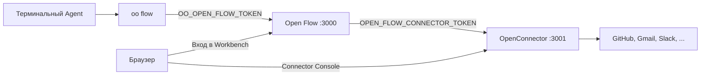

# Использование Open Flow с OpenConnector и oo CLI

[English](README.md) | [简体中文](README.zh-CN.md) | [繁體中文](README.zh-TW.md) | [日本語](README.ja.md) | [한국어](README.ko.md) | [Русский](README.ru.md) | [Français](README.fr.md)

Open Flow может работать сам по себе. Для двух функций нужны другие проекты OOMOL:

- Action и Provider Trigger, которые обращаются к GitHub, Gmail, Slack и похожим сервисам, требуют
  Connector. Самостоятельно установленный
  [OpenConnector](https://github.com/oomol-lab/open-connector) хранит учётные данные провайдеров,
  выполняет Action и отдаёт Connector Console, где пользователи подключают аккаунты.
- Чтобы собирать Flow из терминального Agent вроде Codex или Claude Code, нужен `oo flow`. Команду
  даёт [oo CLI](https://github.com/oomol-lab/oo-cli) и отправляет её в Control API одного Open Flow.

Это руководство запускает все три компонента на одной машине через Docker, соединяет их и создаёт
первый Flow из терминала. Переменные окружения совпадают со
[справочником по доставке контейнера](../container-delivery.md#4-配置). Здесь добавлены только порядок
шагов и значения, которые должны совпадать между проектами.



Задайте эти четыре значения:

| Назначение                                | Где задаётся                                               | Что указать                                                            |
| ----------------------------------------- | ---------------------------------------------------------- | ---------------------------------------------------------------------- |
| От `oo flow` к Control API                | `OO_OPEN_FLOW_URL` и `OO_OPEN_FLOW_TOKEN` в shell          | Origin этого Open Flow и то же значение, что и его `OPEN_FLOW_TOKEN`   |
| От Open Flow к среде выполнения Connector | `OPEN_FLOW_CONNECTOR_ORIGIN` и `OPEN_FLOW_CONNECTOR_TOKEN` | Runtime origin, доступный для Open Flow, и runtime token OpenConnector |
| От браузера к Connector Console           | `OPEN_FLOW_CONNECTOR_CONSOLE_ORIGIN`                       | Публичный origin Web Console OpenConnector                             |
| От браузера и admin API к Console         | `OOMOL_CONNECT_ADMIN_TOKEN` на OpenConnector               | Admin token, который пользователи вводят в Console                     |

## Предварительные требования

- [Docker](https://docs.docker.com/get-docker/) и OpenSSL.
- CLI `oo`. На macOS или Linux:

  ```bash
  curl -fsSL https://cli.oomol.com/install.sh | bash
  ```

  Установка на Windows и другие способы описаны в
  [README oo CLI](https://github.com/oomol-lab/oo-cli#install). Для своего Open Flow не нужны ни
  `oo login`, ни аккаунт OOMOL.

- Для OAuth-провайдеров вроде Gmail или Slack нужны данные OAuth-клиента из приложений, которые вы
  регистрируете у этих провайдеров. GitHub работает с personal access token и подходит как самый
  быстрый первый провайдер. У Connector, который хостит OOMOL, есть готовые OAuth-приложения. У
  самостоятельно установленного OpenConnector их нет.

В примерах OpenConnector публикуется на порт хоста `3001`, Open Flow на порт хоста `3000`, оба
контейнера помещаются в одну сеть Docker, чтобы Open Flow мог достучаться до Connector по имени
контейнера.

## 1. Запуск OpenConnector

```bash
docker network create oomol

export OOMOL_CONNECT_ADMIN_TOKEN="$(openssl rand -hex 32)"
export OOMOL_CONNECT_ENCRYPTION_KEY="$(openssl rand -hex 32)"

docker run -d \
  --name open-connector \
  --network oomol \
  --publish 3001:3000 \
  --volume open-connector-data:/app/data \
  --env OOMOL_CONNECT_ORIGIN="http://localhost:3001" \
  --env OOMOL_CONNECT_ADMIN_TOKEN="$OOMOL_CONNECT_ADMIN_TOKEN" \
  --env OOMOL_CONNECT_ENCRYPTION_KEY="$OOMOL_CONNECT_ENCRYPTION_KEY" \
  ghcr.io/oomol-lab/open-connector:latest

curl http://localhost:3001/health
```

- `OOMOL_CONNECT_ORIGIN` это origin, по которому браузеры открывают OpenConnector. Адреса
  перенаправления OAuth строятся из него, поэтому он должен совпадать с опубликованным портом.
- `OOMOL_CONNECT_ADMIN_TOKEN` защищает admin API, `/docs` и Web Console. Без него любой, кто
  достучится до порта `3001`, сможет читать и менять учётные данные.
- `OOMOL_CONNECT_ENCRYPTION_KEY` шифрует учётные данные на диске.

Откройте `http://localhost:3001`, введите admin token и убедитесь, что Web Console загружается.
PostgreSQL, промежуточное хранилище и остальные переменные описаны в
[справочнике по настройке OpenConnector](https://github.com/oomol-lab/open-connector/blob/main/docs/configuration.md).

## 2. Создание runtime token для Open Flow

Open Flow вызывает runtime API OpenConnector по пути `/v1`: каталог провайдеров и Action,
список Connection, выполнение Action и `POST /v1/proxy/:service` для Poll и Integration Trigger.
Дайте ему долгоживущий runtime token, а не admin token. Его можно создать на странице Access в Web
Console или через admin API:

```bash
curl -s -X POST http://localhost:3001/api/runtime-tokens \
  -H "authorization: Bearer $OOMOL_CONNECT_ADMIN_TOKEN" \
  -H 'content-type: application/json' \
  -d '{"name":"open-flow","allowedActions":[],"blockedActions":[],"allowedProxies":["*"]}'
```

Разрешение proxy `*` нужно для этого локального прохода. В рабочей среде перечислите только нужные
провайдеры.

В ответе поле `token` возвращается только один раз. Сохраните его как `OPEN_FLOW_CONNECTOR_TOKEN`:

```bash
export OPEN_FLOW_CONNECTOR_TOKEN="<token из ответа>"
```

Правила token, важные для Open Flow:

- `allowedProxies` по умолчанию пуст. Долгоживущий token без права proxy не может вызывать
  `/v1/proxy/:service`, поэтому Poll и Integration Trigger завершаются ошибкой. Разрешите `*` или перечислите
  провайдеров, чьи Provider Trigger вы планируете использовать, например `["gmail","github"]`.
- `allowedActions` и `blockedActions` ограничивают, какие Action может выполнять Open Flow. Пустые
  списки разрешают все Action, которые допускает политика развёртывания.
- Не задавайте `allowedConnections`, если не хотите ограничить Open Flow конкретными Connection.
  Connector Node, привязанный к Connection вне списка, завершается с `connector.connection-required`.

Как только появляется хотя бы один долгоживущий token, OpenConnector требует runtime token на каждый
запрос `/v1` и `/mcp`. Другим клиентам того же OpenConnector, например `oo connector` или MCP-хостам,
с этого момента тоже нужны свои token.

## 3. Запуск Open Flow

Соберите образ из корня репозитория и запустите его в той же сети:

```bash
git clone https://github.com/oomol-lab/open-flow.git
cd open-flow

export OPEN_FLOW_TOKEN="$(openssl rand -hex 32)"
docker build --file apps/server/Dockerfile --tag open-flow-server:dev .

docker run -d \
  --name open-flow \
  --network oomol \
  --publish 3000:3000 \
  --volume open-flow-data:/data/open-flow \
  --env OPEN_FLOW_TOKEN="$OPEN_FLOW_TOKEN" \
  --env OPEN_FLOW_CONNECTOR_ORIGIN="http://open-connector:3000" \
  --env OPEN_FLOW_CONNECTOR_TOKEN="$OPEN_FLOW_CONNECTOR_TOKEN" \
  --env OPEN_FLOW_CONNECTOR_CONSOLE_ORIGIN="http://localhost:3001" \
  open-flow-server:dev

ready=0
for i in 1 2 3 4 5 6 7 8 9 10; do
  if curl -sf --max-time 2 http://localhost:3000/readyz; then
    ready=1
    break
  fi
  sleep 1
done
[ "$ready" -eq 1 ]
```

- `OPEN_FLOW_CONNECTOR_ORIGIN` это адрес, которым пользуется процесс Open Flow. В сети `oomol` это имя
  контейнера и порт контейнера, а не опубликованный порт хоста.
- `OPEN_FLOW_CONNECTOR_CONSOLE_ORIGIN` это адрес, который открывают браузеры пользователей. Workbench
  ведёт на `<console origin>/providers/<service>`, когда Connector Node или Provider Trigger нужен
  аккаунт. Обычный HTTP разрешён только для loopback-хостов. Во всех остальных случаях нужен HTTPS
  origin без path.
- `/readyz` возвращает `{"status":"ready"}` только когда Open Flow работает и настроенный Connector
  отвечает на проверку состояния. Код 503 несколько секунд после `docker run -d` это нормально. Если
  он не проходит, runtime origin обычно указан неверно или контейнеры не в одной сети.

Откройте `http://localhost:3000` и войдите с `OPEN_FLOW_TOKEN`. В каталоге Workbench появятся
провайдеры и Action из OpenConnector.

## 4. Подключение аккаунта

Connection хранятся в OpenConnector, а не в Open Flow. Open Flow сохраняет только ID Connection и
никогда не видит учётные данные провайдера.

Для GitHub сохраните personal access token на странице GitHub в Console
`http://localhost:3001/providers/github` или через admin API. После `read -s` вставьте token и
нажмите Enter. На экран он не выводится:

```bash
read -s GITHUB_PAT
curl -s -X PUT http://localhost:3001/api/connections/github \
  -H "authorization: Bearer $OOMOL_CONNECT_ADMIN_TOKEN" \
  -H 'content-type: application/json' \
  --data-binary @- <<EOF
{"authType":"api_key","values":{"apiKey":"${GITHUB_PAT}"}}
EOF
unset GITHUB_PAT
```

Для OAuth-провайдеров сначала настройте OAuth-клиент в Console, затем подключите аккаунт на странице
провайдера. Про OAuth-клиенты, именованные Connection и обновление token см.
[руководство по учётным данным OpenConnector](https://github.com/oomol-lab/open-connector/blob/main/docs/credentials.md).

Проверьте, что Open Flow видит этот Connection:

```bash
export OO_OPEN_FLOW_URL="http://localhost:3000"
export OO_OPEN_FLOW_TOKEN="$OPEN_FLOW_TOKEN"

oo flow connector connections github
```

## 5. Настройка oo CLI на Open Flow

`oo flow` выбирает Open Flow по переменным окружения:

- Если заданы и `OO_OPEN_FLOW_URL`, и `OO_OPEN_FLOW_TOKEN`, `oo flow` подключается напрямую к этому
  Open Flow. Аккаунт OOMOL, Team и `OO_ENDPOINT` не читаются.
- `OO_OPEN_FLOW_TOKEN` должен совпадать с `OPEN_FLOW_TOKEN` этого Open Flow. CLI отправляет его только
  как Bearer token на `/v1/` выбранного origin.
- Если задана только одна из двух переменных, это ошибка. Снимите обе, чтобы вернуться к OOMOL
  Hosted.

```bash
export OO_OPEN_FLOW_URL="http://localhost:3000"
export OO_OPEN_FLOW_TOKEN="$OPEN_FLOW_TOKEN"

oo flow --help
oo flow list
```

Чтобы AI Agent создавал Flow, запускайте Codex, Claude Code или другой терминальный Agent в shell, где
экспортированы обе переменные. Встроенный в CLI skill `oo` учит Agent, когда и как вызывать
`oo flow`. URL Open Flow и token в prompt писать не нужно.

Полный список команд и переменные окружения есть в
[справочнике команд oo CLI](https://github.com/oomol-lab/oo-cli/blob/main/docs/commands.md#open-flow).

## 6. Создание Flow из терминала

Flow можно указывать по ID или точному имени. Команды ниже создают Draft, добавляют Connector Node,
привязанный к GitHub Connection, проверяют, запускают и публикуют его:

```bash
oo flow create "GitHub digest"
oo flow connector search "current user"
oo flow connector add "GitHub digest" github.get_current_user --name me
oo flow check "GitHub digest"
oo flow run "GitHub digest" --wait
oo flow publish "GitHub digest"
oo flow open "GitHub digest"
```

- Если `--connection` не указан, `connector add` привязывает Connection по умолчанию для этого
  Action. Передайте `--connection <alias>`, чтобы выбрать именованный Connection.
- `check` проверяет, корректен ли Revision. Работают ли учётные данные и выполняется ли Action у
  провайдера, проверяет только `run`.
- `run --wait` выполняет Draft через OpenConnector и печатает результат.
  `oo flow runs events <run>` показывает полную историю событий.
- `open` печатает URL Workbench для этого Flow и открывает его в браузере. Operator token в URL не
  попадает. Браузер входит со своей сессией.

Добавьте `--json` к любой команде, чтобы получить машиночитаемый вывод с версией. `oo flow node add`,
`oo flow connect`, `oo flow trigger add` и `oo flow apply --file` нужны для Code Task, Edge, Trigger
и записи Flow из файла. См. `oo flow --help`.

## 7. Необязательно: тот же OpenConnector из oo connector

Тот же OpenConnector можно использовать и для команд `oo connector` вне Open Flow. Для этого нужен
отдельный runtime token. Не используйте token Open Flow повторно:

```bash
oo connector login http://localhost:3001 --token <другой-runtime-token>
oo connector search "send an email"
```

`oo connector login` влияет только на команды connector и хранится отдельно от настроек `oo flow`.
См. [руководство по своему connector](https://github.com/oomol-lab/oo-cli/blob/main/docs/self-hosted-connector.md).

## Замечания для рабочей среды

- Завершайте TLS перед обоими сервисами. `OPEN_FLOW_CONNECTOR_CONSOLE_ORIGIN` и
  `OOMOL_CONNECT_ORIGIN` должны быть публичным HTTPS origin Console, и оба должны совпадать, потому
  что их используют перенаправления OAuth и ссылки Workbench. Runtime origin может оставаться в
  частной сети по HTTP. Если он идёт по недоверенной сети, защитите bearer token с помощью TLS.
- За TLS задайте `OPEN_FLOW_SESSION_COOKIE_SECURE=true`.
- Integration Trigger (обратные вызовы провайдера) также требуют
  `OPEN_FLOW_INTEGRATION_PUBLIC_ORIGIN` и `OPEN_FLOW_INTEGRATION_CALLBACK_KEY`. Без них Publish
  завершается ошибкой.
- Все token передавайте через secrets или env-файл, который может читать только тот, кто
  развёртывает. Когда меняете runtime token OpenConnector на странице Access, сразу обновите
  `OPEN_FLOW_CONNECTOR_TOKEN`.
- У каждого сервиса свои данные: `/data/open-flow` у Open Flow и `/app/data` у OpenConnector.
  Резервные копии делайте отдельно. См.
  [справочник по доставке контейнера](../container-delivery.md#6-持久化与恢复).
- На Fly.io запускайте OpenConnector и Open Flow как два app в одной organization и используйте
  частную сеть Fly для runtime origin, например `http://my-open-connector.internal:3000`. См.
  [руководство по развёртыванию на Fly.io](../fly-io/README.ru.md) и
  [руководство OpenConnector по Fly.io](https://github.com/oomol-lab/open-connector/blob/main/docs/fly-io.md).

## Устранение неполадок

| Симптом                                                                    | Вероятная причина                                                                                                          |
| -------------------------------------------------------------------------- | -------------------------------------------------------------------------------------------------------------------------- |
| `connector.unavailable` в Workbench или CLI                                | Контейнер Open Flow не достучался до `OPEN_FLOW_CONNECTOR_ORIGIN`, или OpenConnector отклонил `OPEN_FLOW_CONNECTOR_TOKEN`. |
| `/readyz` возвращает 503, а `/healthz` возвращает 200                      | Не прошла проверка состояния Connector. Смотрите `docker logs open-flow` и убедитесь, что оба контейнера в одной сети.     |
| `connector.connection-required` при запуске                                | Connection отсутствует, неактивен или исключён `allowedConnections` у token. Подключите аккаунт заново в Console.          |
| Poll или Integration Trigger завершаются ошибкой, а ручные Action работают | У runtime token нет права `allowedProxies` для этого провайдера, или его блокирует `OOMOL_CONNECT_BLOCKED_PROXIES`.        |
| `oo flow` просит войти в OOMOL                                             | Нет `OO_OPEN_FLOW_URL` или `OO_OPEN_FLOW_TOKEN`. Обе переменные нужно задать в одном shell.                                |
| `oo flow` возвращает 401                                                   | `OO_OPEN_FLOW_TOKEN` отличается от `OPEN_FLOW_TOKEN` этого Open Flow.                                                      |
| Ссылка Workbench на Console открывает неверный хост                        | `OPEN_FLOW_CONNECTOR_CONSOLE_ORIGIN` указывает на адрес контейнера, а не на origin, доступный браузеру.                    |
| OAuth возвращает на неверный URL                                           | `OOMOL_CONNECT_ORIGIN` не совпадает с origin, которым браузер открывал Console.                                            |
