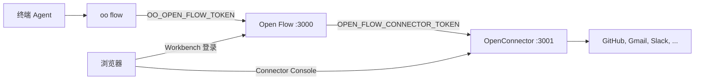

# 用 OpenConnector 和 oo CLI 运行 Open Flow

[English](README.md) | [简体中文](README.zh-CN.md) | [繁體中文](README.zh-TW.md) | [日本語](README.ja.md) | [한국어](README.ko.md) | [Русский](README.ru.md) | [Français](README.fr.md)

Open Flow 可以单独运行。下面两类功能还需要另外两个项目：

- 调用 GitHub、Gmail、Slack 等服务的 Action 和 Provider Trigger 需要 Connector。自行部署的
  [OpenConnector](https://github.com/oomol-lab/open-connector) 保存账号凭据、执行 Action，并提供用户授权账号的
  Connector Console。
- 在 Codex、Claude Code 这类终端 Agent 里编写 Flow，要经过 `oo flow`。`oo flow` 由
  [oo CLI](https://github.com/oomol-lab/oo-cli) 提供，并连到某一套 Open Flow 的 Control API。

本文用 Docker 在同一台机器上启动这三者，把它们连起来，再从终端创建第一个 Flow。环境变量与
[容器交付参考](../container-delivery.md#4-配置)相同。这里只补充操作顺序，以及各项目之间必须一致的值。



需要设置这四组值：

| 用途                          | 写在哪里                                                    | 填什么                                                                  |
| ----------------------------- | ----------------------------------------------------------- | ----------------------------------------------------------------------- |
| `oo flow` 到 Control API      | shell 中的 `OO_OPEN_FLOW_URL` 和 `OO_OPEN_FLOW_TOKEN`       | Open Flow origin，以及与这套 Open Flow 的 `OPEN_FLOW_TOKEN` 相同的值    |
| Open Flow 到 Connector 运行时 | `OPEN_FLOW_CONNECTOR_ORIGIN` 和 `OPEN_FLOW_CONNECTOR_TOKEN` | Open Flow 能访问的 runtime origin，以及一个 OpenConnector runtime token |
| 浏览器到 Connector Console    | `OPEN_FLOW_CONNECTOR_CONSOLE_ORIGIN`                        | OpenConnector Web Console 的公网 origin                                 |
| 浏览器和管理 API 到 Console   | OpenConnector 侧的 `OOMOL_CONNECT_ADMIN_TOKEN`              | 用户在 Console 中输入的管理 token                                       |

## 前置条件

- [Docker](https://docs.docker.com/get-docker/) 和 OpenSSL。
- `oo` CLI。macOS 或 Linux：

  ```bash
  curl -fsSL https://cli.oomol.com/install.sh | bash
  ```

  Windows 及其他安装方式见 [oo CLI README](https://github.com/oomol-lab/oo-cli#install)。使用自己部署的 Open Flow 不需要
  `oo login`，也不需要 OOMOL 账号。

- 对于 Gmail、Slack 等 OAuth Provider，需要你在这些 Provider 处注册应用得到的 OAuth client 凭据。GitHub 可以用 personal
  access token，是最快能跑通的第一个 Provider。OOMOL 托管的 Connector 自带托管 OAuth 应用，自行部署的 OpenConnector 没有。

示例把 OpenConnector 发布到宿主机端口 `3001`，Open Flow 发布到宿主机端口 `3000`，并把两个容器放进同一个 Docker 网络，
这样 Open Flow 可以通过容器名访问 Connector。

## 1. 启动 OpenConnector

```bash
docker network create oomol

export OOMOL_CONNECT_ADMIN_TOKEN="$(openssl rand -hex 32)"
export OOMOL_CONNECT_ENCRYPTION_KEY="$(openssl rand -hex 32)"

docker run -d \
  --name open-connector \
  --network oomol \
  --publish 3001:3000 \
  --volume open-connector-data:/app/data \
  --env OOMOL_CONNECT_ORIGIN="http://localhost:3001" \
  --env OOMOL_CONNECT_ADMIN_TOKEN="$OOMOL_CONNECT_ADMIN_TOKEN" \
  --env OOMOL_CONNECT_ENCRYPTION_KEY="$OOMOL_CONNECT_ENCRYPTION_KEY" \
  ghcr.io/oomol-lab/open-connector:latest

curl http://localhost:3001/health
```

- `OOMOL_CONNECT_ORIGIN` 是浏览器访问 OpenConnector 的 origin。OAuth 回调地址由它生成，所以必须与发布的端口一致。
- `OOMOL_CONNECT_ADMIN_TOKEN` 保护管理 API、`/docs` 和 Web Console。不设置的话，任何能访问 `3001` 端口的人都能读取和修改凭据。
- `OOMOL_CONNECT_ENCRYPTION_KEY` 用于加密保存在磁盘上的凭据。

打开 `http://localhost:3001`，输入管理 token，确认 Web Console 能正常加载。PostgreSQL、中转存储和其余变量见
[OpenConnector 配置参考](https://github.com/oomol-lab/open-connector/blob/main/docs/configuration.md)。

## 2. 为 Open Flow 创建 runtime token

Open Flow 调用 OpenConnector 位于 `/v1` 的运行时 API：Provider 与 Action 目录、Connection 列表、Action 执行，以及供
Poll 和 Integration Trigger 使用的 `POST /v1/proxy/:service`。给它一个长期使用的 runtime token，不要用管理 token。可以在 Web
Console 的 Access 页面创建，也可以通过管理 API 创建：

```bash
curl -s -X POST http://localhost:3001/api/runtime-tokens \
  -H "authorization: Bearer $OOMOL_CONNECT_ADMIN_TOKEN" \
  -H 'content-type: application/json' \
  -d '{"name":"open-flow","allowedActions":[],"blockedActions":[],"allowedProxies":["*"]}'
```

`*` 只用于这次本机走通。生产环境请只列出你实际要用的 Provider。

响应中的 `token` 字段只会返回这一次。把它保存为 `OPEN_FLOW_CONNECTOR_TOKEN`：

```bash
export OPEN_FLOW_CONNECTOR_TOKEN="<响应中的 token>"
```

与 Open Flow 相关的 token 规则：

- `allowedProxies` 默认为空。没有 proxy 权限的长期 token 无法调用 `/v1/proxy/:service`，Poll 和 Integration Trigger
  会因此失败。允许 `*`，或列出你打算使用 Provider Trigger 的 Provider，例如 `["gmail","github"]`。
- `allowedActions` 和 `blockedActions` 限制 Open Flow 可执行的 Action。空列表表示允许部署策略放行的全部 Action。
- 除非要把 Open Flow 限定到特定 Connection，否则不要设置 `allowedConnections`。绑定到列表之外 Connection 的 Connector
  Node 会以 `connector.connection-required` 失败。

只要创建过长期 token，OpenConnector 就会要求每个 `/v1` 和 `/mcp` 请求都带 runtime token。同一套 OpenConnector 的其他调用方，例如
`oo connector` 或 MCP host，从此也需要各自的 token。

## 3. 启动 Open Flow

在仓库根目录构建镜像，并在同一网络中启动：

```bash
git clone https://github.com/oomol-lab/open-flow.git
cd open-flow

export OPEN_FLOW_TOKEN="$(openssl rand -hex 32)"
docker build --file apps/server/Dockerfile --tag open-flow-server:dev .

docker run -d \
  --name open-flow \
  --network oomol \
  --publish 3000:3000 \
  --volume open-flow-data:/data/open-flow \
  --env OPEN_FLOW_TOKEN="$OPEN_FLOW_TOKEN" \
  --env OPEN_FLOW_CONNECTOR_ORIGIN="http://open-connector:3000" \
  --env OPEN_FLOW_CONNECTOR_TOKEN="$OPEN_FLOW_CONNECTOR_TOKEN" \
  --env OPEN_FLOW_CONNECTOR_CONSOLE_ORIGIN="http://localhost:3001" \
  open-flow-server:dev

ready=0
for i in 1 2 3 4 5 6 7 8 9 10; do
  if curl -sf --max-time 2 http://localhost:3000/readyz; then
    ready=1
    break
  fi
  sleep 1
done
[ "$ready" -eq 1 ]
```

- `OPEN_FLOW_CONNECTOR_ORIGIN` 是 Open Flow 进程使用的地址。在 `oomol` 网络内它是容器名加容器端口，而不是发布到宿主机的端口。
- `OPEN_FLOW_CONNECTOR_CONSOLE_ORIGIN` 是用户浏览器打开的地址。当 Connector Node 或 Provider Trigger 需要账号时，Workbench
  会链接到 `<console origin>/providers/<service>`。只有 loopback 主机可以使用明文 HTTP，其余情况必须是不带 path 的 HTTPS origin。
- 只有当 Open Flow 在运行且配置的 Connector 通过健康检查时，`/readyz` 才返回 `{"status":"ready"}`。`docker run -d` 之后几秒内出现
  503 是正常的。如果一直 503，通常是 runtime origin 写错，或容器不在同一网络。

打开 `http://localhost:3000`，用 `OPEN_FLOW_TOKEN` 登录。Workbench 的目录中现在会列出 OpenConnector 的 Provider 和 Action。

## 4. 授权账号

Connection 保存在 OpenConnector 中，而不是 Open Flow 中。Open Flow 只保存 Connection 的 ID，永远接触不到 Provider 凭据。

对于 GitHub，可以在 Console 的 GitHub 页面 `http://localhost:3001/providers/github` 保存 personal access token，也可以通过管理 API。
`read -s` 后粘贴 token 再按 Enter，屏幕上不会显示：

```bash
read -s GITHUB_PAT
curl -s -X PUT http://localhost:3001/api/connections/github \
  -H "authorization: Bearer $OOMOL_CONNECT_ADMIN_TOKEN" \
  -H 'content-type: application/json' \
  --data-binary @- <<EOF
{"authType":"api_key","values":{"apiKey":"${GITHUB_PAT}"}}
EOF
unset GITHUB_PAT
```

对于 OAuth Provider，先在 Console 中配置 OAuth client，再从 Provider 页面授权账号。OAuth client、命名 Connection 和 token
刷新见 [OpenConnector 凭据指南](https://github.com/oomol-lab/open-connector/blob/main/docs/credentials.md)。

确认 Open Flow 能看到这个 Connection：

```bash
export OO_OPEN_FLOW_URL="http://localhost:3000"
export OO_OPEN_FLOW_TOKEN="$OPEN_FLOW_TOKEN"

oo flow connector connections github
```

## 5. 把 oo CLI 指向 Open Flow

`oo flow` 根据环境变量选择 Open Flow：

- 同时设置 `OO_OPEN_FLOW_URL` 和 `OO_OPEN_FLOW_TOKEN` 时，`oo flow` 直接连到这套 Open Flow，不读取 OOMOL 账号、Team 或
  `OO_ENDPOINT`。
- `OO_OPEN_FLOW_TOKEN` 必须等于这套 Open Flow 的 `OPEN_FLOW_TOKEN`。CLI 只把它作为 Bearer token 发送到所选 origin 的 `/v1/`。
- 只设置其中一个变量会报错。两个都取消设置即可回到 OOMOL Hosted。

```bash
export OO_OPEN_FLOW_URL="http://localhost:3000"
export OO_OPEN_FLOW_TOKEN="$OPEN_FLOW_TOKEN"

oo flow --help
oo flow list
```

要让 AI Agent 创建 Flow，在已导出这两个变量的 shell 中启动 Codex、Claude Code 或其他终端 Agent。CLI 自带的 `oo` skill
会教 Agent 何时以及如何调用 `oo flow`，不需要在 prompt 里写 Open Flow 的 URL 或 token。

完整命令列表和环境变量见 [oo CLI 命令参考](https://github.com/oomol-lab/oo-cli/blob/main/docs/commands.md#open-flow)。

## 6. 从终端创建 Flow

Flow 可以用 ID 或精确名称引用。下面的命令创建一个 Draft，添加一个绑定到 GitHub Connection 的 Connector Node，检查、运行并发布：

```bash
oo flow create "GitHub digest"
oo flow connector search "current user"
oo flow connector add "GitHub digest" github.get_current_user --name me
oo flow check "GitHub digest"
oo flow run "GitHub digest" --wait
oo flow publish "GitHub digest"
oo flow open "GitHub digest"
```

- 省略 `--connection` 时，`connector add` 绑定该 Action 的默认 Connection。传 `--connection <alias>` 可选择命名 Connection。
- `check` 检查 Revision 是否合法。账号是否可用、会不会在 Provider 上真正执行，只有 `run` 才会碰到。
- `run --wait` 通过 OpenConnector 执行 Draft 并打印结果。`oo flow runs events <run>` 显示完整事件历史。
- `open` 打印该 Flow 的 Workbench URL 并在浏览器中打开。operator token 不会放进 URL，浏览器用自己的 session 登录。

给任意命令加上 `--json` 可得到带版本的机器可读输出。`oo flow node add`、`oo flow connect`、`oo flow trigger add` 和
`oo flow apply --file` 分别用于 Code Task、Edge、Trigger，以及从文件写入 Flow，见 `oo flow --help`。

## 7. 可选：在 oo connector 中复用同一套 OpenConnector

同一个 OpenConnector 也可以在 Open Flow 之外给 `oo connector` 命令用。这需要另一个 runtime token。不要复用 Open Flow 的 token：

```bash
oo connector login http://localhost:3001 --token <另一个 runtime token>
oo connector search "send an email"
```

`oo connector login` 只影响 connector 命令，其配置与 `oo flow` 的设置分开保存。见
[自行部署 connector 指南](https://github.com/oomol-lab/oo-cli/blob/main/docs/self-hosted-connector.md)。

## 生产环境注意事项

- 在两个服务前面终止 TLS。`OPEN_FLOW_CONNECTOR_CONSOLE_ORIGIN` 和 `OOMOL_CONNECT_ORIGIN` 必须是 Console 的公网 HTTPS
  origin，且两者必须是同一个 origin，因为 OAuth 回调和 Workbench 链接都使用它。runtime origin 可以留在私网走 HTTP。
  跨不受信任网络时必须用 TLS 保护 bearer token。
- TLS 之后设置 `OPEN_FLOW_SESSION_COOKIE_SECURE=true`。
- Integration Trigger (Provider 回调) 还需要 `OPEN_FLOW_INTEGRATION_PUBLIC_ORIGIN` 和
  `OPEN_FLOW_INTEGRATION_CALLBACK_KEY`。缺少时 Publish 会失败。
- 所有 token 都通过 secret 或只有部署者可读的 env file 注入。在 Access 页面更换 OpenConnector runtime token 时，要同步更新
  `OPEN_FLOW_CONNECTOR_TOKEN`。
- 每个服务拥有自己的数据：Open Flow 在 `/data/open-flow`，OpenConnector 在 `/app/data`。分别备份，见
  [容器交付参考](../container-delivery.md#6-持久化与恢复)。
- 在 Fly.io 上，把 OpenConnector 和 Open Flow 作为同一 organization 下的两个 app 运行，runtime origin 使用 Fly 私网，例如
  `http://my-open-connector.internal:3000`。见 [Fly.io 部署指南](../fly-io/README.zh-CN.md) 和
  [OpenConnector Fly.io 指南](https://github.com/oomol-lab/open-connector/blob/main/docs/fly-io.md)。

## 故障排查

| 现象                                                | 可能原因                                                                                                   |
| --------------------------------------------------- | ---------------------------------------------------------------------------------------------------------- |
| Workbench 或 CLI 出现 `connector.unavailable`       | Open Flow 容器访问不到 `OPEN_FLOW_CONNECTOR_ORIGIN`，或 OpenConnector 拒绝了 `OPEN_FLOW_CONNECTOR_TOKEN`。 |
| `/readyz` 返回 503 而 `/healthz` 返回 200           | Connector 健康检查失败。查看 `docker logs open-flow`，并确认两个容器在同一网络。                           |
| 运行时出现 `connector.connection-required`          | Connection 缺失、未激活，或被 token 的 `allowedConnections` 排除。到 Console 重新授权。                    |
| 手动 Action 正常但 Poll 或 Integration Trigger 失败 | runtime token 对该 Provider 没有 `allowedProxies` 权限，或被 `OOMOL_CONNECT_BLOCKED_PROXIES` 阻止。        |
| `oo flow` 要求登录 OOMOL                            | 缺少 `OO_OPEN_FLOW_URL` 或 `OO_OPEN_FLOW_TOKEN`。两者必须在同一个 shell 中设置。                           |
| `oo flow` 返回 401                                  | `OO_OPEN_FLOW_TOKEN` 与这套 Open Flow 的 `OPEN_FLOW_TOKEN` 不一致。                                        |
| Workbench 指向 Console 的链接打开了错误的主机       | `OPEN_FLOW_CONNECTOR_CONSOLE_ORIGIN` 指向了容器地址，而不是浏览器可访问的 origin。                         |
| OAuth 授权跳回了错误的 URL                          | `OOMOL_CONNECT_ORIGIN` 与浏览器打开 Console 时使用的 origin 不一致。                                       |
