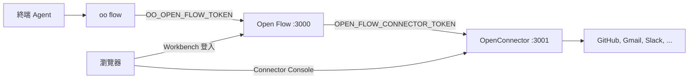

# 用 OpenConnector 和 oo CLI 執行 Open Flow

[English](README.md) | [简体中文](README.zh-CN.md) | [繁體中文](README.zh-TW.md) | [日本語](README.ja.md) | [한국어](README.ko.md) | [Русский](README.ru.md) | [Français](README.fr.md)

Open Flow 可以單獨執行。下面兩類功能還需要另外兩個專案：

- 呼叫 GitHub、Gmail、Slack 等服務的 Action 和 Provider Trigger 需要 Connector。自行部署的
  [OpenConnector](https://github.com/oomol-lab/open-connector) 保存帳號憑證、執行 Action，並提供使用者授權帳號的
  Connector Console。
- 在 Codex、Claude Code 這類終端 Agent 裡編寫 Flow，要經過 `oo flow`。`oo flow` 由
  [oo CLI](https://github.com/oomol-lab/oo-cli) 提供，並連到某一套 Open Flow 的 Control API。

本文用 Docker 在同一台機器上啟動這三者，把它們連起來，再從終端建立第一個 Flow。環境變數與
[容器交付參考](../container-delivery.md#4-配置)相同。這裡只補充操作順序，以及各專案之間必須一致的值。



需要設定這四組值：

| 用途                            | 寫在哪裡                                                    | 填什麼                                                                  |
| ------------------------------- | ----------------------------------------------------------- | ----------------------------------------------------------------------- |
| `oo flow` 到 Control API        | shell 中的 `OO_OPEN_FLOW_URL` 和 `OO_OPEN_FLOW_TOKEN`       | Open Flow origin，以及與這套 Open Flow 的 `OPEN_FLOW_TOKEN` 相同的值    |
| Open Flow 到 Connector 執行環境 | `OPEN_FLOW_CONNECTOR_ORIGIN` 和 `OPEN_FLOW_CONNECTOR_TOKEN` | Open Flow 能連到的 runtime origin，以及一個 OpenConnector runtime token |
| 瀏覽器到 Connector Console      | `OPEN_FLOW_CONNECTOR_CONSOLE_ORIGIN`                        | OpenConnector Web Console 的公開 origin                                 |
| 瀏覽器和管理 API 到 Console     | OpenConnector 端的 `OOMOL_CONNECT_ADMIN_TOKEN`              | 使用者在 Console 中輸入的管理員 token                                   |

## 前提條件

- [Docker](https://docs.docker.com/get-docker/) 和 OpenSSL。
- `oo` CLI。macOS 或 Linux：

  ```bash
  curl -fsSL https://cli.oomol.com/install.sh | bash
  ```

  Windows 及其他安裝方式請參閱 [oo CLI README](https://github.com/oomol-lab/oo-cli#install)。使用自己部署的 Open Flow 不需要
  `oo login`，也不需要 OOMOL 帳號。

- 對於 Gmail、Slack 等 OAuth Provider，需要你在這些 Provider 註冊應用程式後取得的 OAuth client 憑證。GitHub 可以使用 personal
  access token，是最快能跑通的第一個 Provider。OOMOL 託管的 Connector 內建託管 OAuth 應用程式，自行部署的 OpenConnector 則沒有。

範例把 OpenConnector 發布到主機連接埠 `3001`，Open Flow 發布到主機連接埠 `3000`，並把兩個容器放進同一個 Docker 網路，
讓 Open Flow 可以透過容器名稱連到 Connector。

## 1. 啟動 OpenConnector

```bash
docker network create oomol

export OOMOL_CONNECT_ADMIN_TOKEN="$(openssl rand -hex 32)"
export OOMOL_CONNECT_ENCRYPTION_KEY="$(openssl rand -hex 32)"

docker run -d \
  --name open-connector \
  --network oomol \
  --publish 3001:3000 \
  --volume open-connector-data:/app/data \
  --env OOMOL_CONNECT_ORIGIN="http://localhost:3001" \
  --env OOMOL_CONNECT_ADMIN_TOKEN="$OOMOL_CONNECT_ADMIN_TOKEN" \
  --env OOMOL_CONNECT_ENCRYPTION_KEY="$OOMOL_CONNECT_ENCRYPTION_KEY" \
  ghcr.io/oomol-lab/open-connector:latest

curl http://localhost:3001/health
```

- `OOMOL_CONNECT_ORIGIN` 是瀏覽器連到 OpenConnector 所用的 origin。OAuth 回呼網址由它產生，因此必須與發布的連接埠一致。
- `OOMOL_CONNECT_ADMIN_TOKEN` 保護管理 API、`/docs` 和 Web Console。沒有設定時，任何能連到 `3001` 連接埠的人都能讀取和修改憑證。
- `OOMOL_CONNECT_ENCRYPTION_KEY` 用於加密保存在磁碟上的憑證。

開啟 `http://localhost:3001`，輸入管理員 token，確認 Web Console 能正常載入。PostgreSQL、轉送儲存和其餘變數請參閱
[OpenConnector 設定參考](https://github.com/oomol-lab/open-connector/blob/main/docs/configuration.md)。

## 2. 為 Open Flow 建立 runtime token

Open Flow 會呼叫 OpenConnector 位於 `/v1` 的執行環境 API：Provider 與 Action 目錄、Connection 清單、Action 執行，以及供
Poll 和 Integration Trigger 使用的 `POST /v1/proxy/:service`。請給它一個長期使用的 runtime token，不要用管理員 token。可以在 Web
Console 的 Access 頁面建立，也可以透過管理 API 建立：

```bash
curl -s -X POST http://localhost:3001/api/runtime-tokens \
  -H "authorization: Bearer $OOMOL_CONNECT_ADMIN_TOKEN" \
  -H 'content-type: application/json' \
  -d '{"name":"open-flow","allowedActions":[],"blockedActions":[],"allowedProxies":["*"]}'
```

`*` 只用於這次本機走通。正式環境請只列出你實際要用的 Provider。

回應中的 `token` 欄位只會回傳這一次。把它儲存為 `OPEN_FLOW_CONNECTOR_TOKEN`：

```bash
export OPEN_FLOW_CONNECTOR_TOKEN="<回應中的 token>"
```

與 Open Flow 相關的 token 規則：

- `allowedProxies` 預設為空。沒有 proxy 權限的長期 token 無法呼叫 `/v1/proxy/:service`，Poll 和 Integration Trigger
  會因此失敗。允許 `*`，或列出你打算使用 Provider Trigger 的 Provider，例如 `["gmail","github"]`。
- `allowedActions` 和 `blockedActions` 限制 Open Flow 可執行的 Action。空清單表示允許部署原則放行的所有 Action。
- 除非要把 Open Flow 限定在特定 Connection，否則不要設定 `allowedConnections`。綁定到清單之外 Connection 的 Connector
  Node 會以 `connector.connection-required` 失敗。

只要建立過長期 token，OpenConnector 就會要求每個 `/v1` 和 `/mcp` 請求都帶 runtime token。同一套 OpenConnector 的其他呼叫方，例如
`oo connector` 或 MCP host，從此也需要各自的 token。

## 3. 啟動 Open Flow

在儲存庫根目錄建置映像檔，並在同一個網路中啟動：

```bash
git clone https://github.com/oomol-lab/open-flow.git
cd open-flow

export OPEN_FLOW_TOKEN="$(openssl rand -hex 32)"
docker build --file apps/server/Dockerfile --tag open-flow-server:dev .

docker run -d \
  --name open-flow \
  --network oomol \
  --publish 3000:3000 \
  --volume open-flow-data:/data/open-flow \
  --env OPEN_FLOW_TOKEN="$OPEN_FLOW_TOKEN" \
  --env OPEN_FLOW_CONNECTOR_ORIGIN="http://open-connector:3000" \
  --env OPEN_FLOW_CONNECTOR_TOKEN="$OPEN_FLOW_CONNECTOR_TOKEN" \
  --env OPEN_FLOW_CONNECTOR_CONSOLE_ORIGIN="http://localhost:3001" \
  open-flow-server:dev

ready=0
for i in 1 2 3 4 5 6 7 8 9 10; do
  if curl -sf --max-time 2 http://localhost:3000/readyz; then
    ready=1
    break
  fi
  sleep 1
done
[ "$ready" -eq 1 ]
```

- `OPEN_FLOW_CONNECTOR_ORIGIN` 是 Open Flow 程序使用的位址。在 `oomol` 網路內，它是容器名稱加容器連接埠，而不是發布到主機的連接埠。
- `OPEN_FLOW_CONNECTOR_CONSOLE_ORIGIN` 是使用者瀏覽器開啟的位址。當 Connector Node 或 Provider Trigger 需要帳號時，Workbench
  會連結到 `<console origin>/providers/<service>`。只有 loopback 主機可以使用明文 HTTP，其餘情況必須是不帶 path 的 HTTPS origin。
- 只有當 Open Flow 正在執行且設定的 Connector 通過健康檢查時，`/readyz` 才會回傳 `{"status":"ready"}`。`docker run -d` 之後幾秒內出現
  503 是正常的。如果一直 503，通常是 runtime origin 寫錯，或容器不在同一個網路。

開啟 `http://localhost:3000`，用 `OPEN_FLOW_TOKEN` 登入。Workbench 的目錄現在會列出 OpenConnector 的 Provider 和 Action。

## 4. 授權帳號

Connection 保存在 OpenConnector 中，而不是 Open Flow 中。Open Flow 只保存 Connection 的 ID，永遠接觸不到 Provider 憑證。

對於 GitHub，可以在 Console 的 GitHub 頁面 `http://localhost:3001/providers/github` 儲存 personal access token，也可以透過管理 API。
`read -s` 後貼上 token 再按 Enter，螢幕上不會顯示：

```bash
read -s GITHUB_PAT
curl -s -X PUT http://localhost:3001/api/connections/github \
  -H "authorization: Bearer $OOMOL_CONNECT_ADMIN_TOKEN" \
  -H 'content-type: application/json' \
  --data-binary @- <<EOF
{"authType":"api_key","values":{"apiKey":"${GITHUB_PAT}"}}
EOF
unset GITHUB_PAT
```

對於 OAuth Provider，先在 Console 中設定 OAuth client，再從 Provider 頁面授權帳號。OAuth client、具名 Connection 和 token
更新請參閱 [OpenConnector 憑證指南](https://github.com/oomol-lab/open-connector/blob/main/docs/credentials.md)。

確認 Open Flow 能看到這個 Connection：

```bash
export OO_OPEN_FLOW_URL="http://localhost:3000"
export OO_OPEN_FLOW_TOKEN="$OPEN_FLOW_TOKEN"

oo flow connector connections github
```

## 5. 把 oo CLI 指向 Open Flow

`oo flow` 依據環境變數選擇 Open Flow：

- 同時設定 `OO_OPEN_FLOW_URL` 和 `OO_OPEN_FLOW_TOKEN` 時，`oo flow` 會直接連到這套 Open Flow，不會讀取 OOMOL 帳號、Team 或
  `OO_ENDPOINT`。
- `OO_OPEN_FLOW_TOKEN` 必須等於這套 Open Flow 的 `OPEN_FLOW_TOKEN`。CLI 只會把它作為 Bearer token 傳送到所選 origin 的 `/v1/`。
- 只設定其中一個變數會產生錯誤。兩個都取消設定即可回到 OOMOL Hosted。

```bash
export OO_OPEN_FLOW_URL="http://localhost:3000"
export OO_OPEN_FLOW_TOKEN="$OPEN_FLOW_TOKEN"

oo flow --help
oo flow list
```

要讓 AI Agent 建立 Flow，請在已匯出這兩個變數的 shell 中啟動 Codex、Claude Code 或其他終端 Agent。CLI 隨附的 `oo` skill
會教 Agent 何時以及如何呼叫 `oo flow`，不需要在 prompt 中寫入 Open Flow 的 URL 或 token。

完整的命令清單和環境變數請參閱 [oo CLI 命令參考](https://github.com/oomol-lab/oo-cli/blob/main/docs/commands.md#open-flow)。

## 6. 從終端建立 Flow

Flow 可以用 ID 或精確名稱引用。下面的命令會建立一個 Draft，加入一個綁定到 GitHub Connection 的 Connector Node，然後檢查、執行並發布它：

```bash
oo flow create "GitHub digest"
oo flow connector search "current user"
oo flow connector add "GitHub digest" github.get_current_user --name me
oo flow check "GitHub digest"
oo flow run "GitHub digest" --wait
oo flow publish "GitHub digest"
oo flow open "GitHub digest"
```

- 省略 `--connection` 時，`connector add` 會綁定該 Action 的預設 Connection。傳入 `--connection <alias>` 可選擇具名 Connection。
- `check` 檢查 Revision 是否合法。帳號是否可用、會不會在 Provider 上真正執行，只有 `run` 才會碰到。
- `run --wait` 透過 OpenConnector 執行 Draft 並印出結果。`oo flow runs events <run>` 會顯示完整的事件記錄。
- `open` 會印出該 Flow 的 Workbench URL 並在瀏覽器中開啟。operator token 不會放進 URL，瀏覽器以自己的 session 登入。

為任意命令加上 `--json` 可取得有版本的機器可讀輸出。`oo flow node add`、`oo flow connect`、`oo flow trigger add` 和
`oo flow apply --file` 分別用於 Code Task、Edge、Trigger，以及從檔案寫入 Flow，請參閱 `oo flow --help`。

## 7. 選用：在 oo connector 中重複使用同一套 OpenConnector

同一個 OpenConnector 也可以在 Open Flow 之外給 `oo connector` 命令用。這需要另一個 runtime token。不要重複使用 Open Flow 的 token：

```bash
oo connector login http://localhost:3001 --token <另一個 runtime token>
oo connector search "send an email"
```

`oo connector login` 只影響 connector 命令，其設定與 `oo flow` 的設定分開保存。請參閱
[自行部署 connector 指南](https://github.com/oomol-lab/oo-cli/blob/main/docs/self-hosted-connector.md)。

## 正式環境注意事項

- 在兩個服務前面終止 TLS。`OPEN_FLOW_CONNECTOR_CONSOLE_ORIGIN` 和 `OOMOL_CONNECT_ORIGIN` 必須是 Console 的公開 HTTPS
  origin，且兩者必須是同一個 origin，因為 OAuth 回呼和 Workbench 連結都會使用它。runtime origin 可以留在私有網路走 HTTP。
  跨越不受信任的網路時，必須用 TLS 保護 bearer token。
- 位於 TLS 後方時，請設定 `OPEN_FLOW_SESSION_COOKIE_SECURE=true`。
- Integration Trigger (Provider callback) 還需要 `OPEN_FLOW_INTEGRATION_PUBLIC_ORIGIN` 和
  `OPEN_FLOW_INTEGRATION_CALLBACK_KEY`。缺少時 Publish 會失敗。
- 所有 token 都透過 secret 或只有部署者可讀的 env file 注入。在 Access 頁面更換 OpenConnector runtime token 時，要一併更新
  `OPEN_FLOW_CONNECTOR_TOKEN`。
- 每個服務擁有自己的資料：Open Flow 在 `/data/open-flow`，OpenConnector 在 `/app/data`。請分別備份，詳見
  [容器交付參考](../container-delivery.md#6-持久化与恢复)。
- 在 Fly.io 上，把 OpenConnector 和 Open Flow 作為同一個 organization 下的兩個 app 執行，runtime origin 使用 Fly 私有網路，例如
  `http://my-open-connector.internal:3000`。請參閱 [Fly.io 部署指南](../fly-io/README.zh-TW.md) 和
  [OpenConnector Fly.io 指南](https://github.com/oomol-lab/open-connector/blob/main/docs/fly-io.md)。

## 疑難排解

| 現象                                                | 可能原因                                                                                                 |
| --------------------------------------------------- | -------------------------------------------------------------------------------------------------------- |
| Workbench 或 CLI 出現 `connector.unavailable`       | Open Flow 容器連不到 `OPEN_FLOW_CONNECTOR_ORIGIN`，或 OpenConnector 拒絕了 `OPEN_FLOW_CONNECTOR_TOKEN`。 |
| `/readyz` 回傳 503 而 `/healthz` 回傳 200           | Connector 健康檢查失敗。查看 `docker logs open-flow`，並確認兩個容器在同一個網路。                       |
| 執行時出現 `connector.connection-required`          | Connection 不存在、未啟用，或被 token 的 `allowedConnections` 排除。請到 Console 重新授權。              |
| 手動 Action 正常但 Poll 或 Integration Trigger 失敗 | runtime token 沒有該 Provider 的 `allowedProxies` 權限，或被 `OOMOL_CONNECT_BLOCKED_PROXIES` 封鎖。      |
| `oo flow` 要求登入 OOMOL                            | 缺少 `OO_OPEN_FLOW_URL` 或 `OO_OPEN_FLOW_TOKEN`。兩者必須在同一個 shell 中設定。                         |
| `oo flow` 回傳 401                                  | `OO_OPEN_FLOW_TOKEN` 與這套 Open Flow 的 `OPEN_FLOW_TOKEN` 不一致。                                      |
| Workbench 指向 Console 的連結開啟了錯誤的主機       | `OPEN_FLOW_CONNECTOR_CONSOLE_ORIGIN` 指向了容器位址，而不是瀏覽器可連到的 origin。                       |
| OAuth 授權跳回了錯誤的 URL                          | `OOMOL_CONNECT_ORIGIN` 與瀏覽器開啟 Console 時使用的 origin 不一致。                                     |
